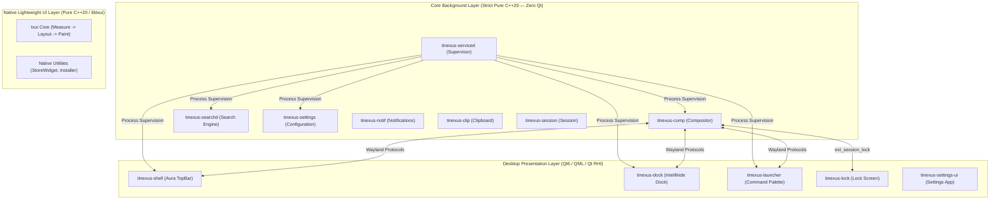

# Tinexus Platform — Principal Architect's Architecture Review & Implementation Ground Truth

> **Document Status:** FROZEN — VERIFIED AGAINST PRODUCTION CODEBASE (Architecture Freeze v1.1)  
> **Author:** Lead Software Architect & Principal Systems Engineer, Tinexus Platform Core Team  
> **Revision:** 1.1.0  
> **Date:** 2026-10-03  
> **Classification:** Internal — Architecture Decision Record (ADR-000 Realignment)  
> **Canonical Source:** Monorepo `src/` (`comp`, `shell`, `dock`, `launcher`, `serviced`, `searchd`, `settings`, `lock`, `txui`)

---

## Executive Summary

This document serves as the **foundational Architecture Decision Record (ADR-000)** and comprehensive architectural review for the **Tinexus Platform** (a Wayland-native Linux desktop platform). Originally drafted as a pre-documentation critique prior to code generation, this document has been systematically audited, re-evaluated, and updated to reflect the **authoritative architectural ground truth** of the production codebase.

Where earlier design drafts hypothesized a purely launcher-centric desktop devoid of visual affordances, the production platform has converged into a **cohesive 3-pillar LiquidGlass shell architecture**:
1. **Command Palette (`tinexus-launcher`)** — A high-performance, keyboard-first modal launcher (`Ctrl+K`) for rapid application dispatch, inline calculations, and system controls.
2. **TopBar Panel (`tinexus-shell`)** — A floating Aura notch pill on `LayerTop` displaying real-time telemetry (clock, battery, network, audio), workspace indicators, and interactive flyouts.
3. **Intellihide Dock (`tinexus-dock`)** — A standalone bottom-anchored `LayerTop` surface featuring smooth fisheye magnification, running application tracking via `zwlr_foreign_toplevel_manager_v1`, and dynamic exclusive zone negotiation with auto-hide.

The underlying platform strictly enforces a **microservice-inspired daemon architecture**:
- **Pure C++20 Core Daemons**: Compositor (`tinexus-comp`), Supervisor (`tinexus-serviced`), Search Engine (`tinexus-searchd`), Configuration (`tinexus-settings`), Session (`tinexus-session`), Notifications (`tinexus-notif`), and Clipboard (`tinexus-clip`) contain **ZERO Qt dependencies** and operate with ultra-low background RSS (< 12MB each).
- **GPU-Accelerated UI Layer**: Qt6 (Qt Quick / QML / Qt RHI) powers user-facing surfaces (`shell`, `dock`, `launcher`, `lock`, `settings-ui`).
- **Native Lightweight UI Framework (`txui`)**: Pure C++20 retained-hierarchy UI framework with stateless `CommandBuffer` rendering via double-buffered Pixman/SHM.
- **Hardware Compositor Pipeline**: Native Mesa/wlroots auto-detection (`wlr_renderer_autocreate(m_wlr_backend)`) with GLES2/Vulkan/Pixman and complete Server-Side Window Decorations (`TinexusWindowFrame` / `zxdg_decoration_manager_v1`).
- **Cryptographic Session Security**: Native `ext_session_lock_v1` protocol integration with Linux PAM authentication.

---

## Table of Contents

1. [Vision Assessment & Shell Paradigm](#1-vision-assessment--shell-paradigm)
2. [Architectural Risk Register & Resolutions](#2-architectural-risk-register--resolutions)
3. [Technology Stack Review & Verification](#3-technology-stack-review--verification)
4. [Design Philosophy & Window Management](#4-design-philosophy--window-management)
5. [Competitive Intelligence & Lessons Learned](#5-competitive-intelligence--lessons-learned)
6. [The Documentation System (23 Documents)](#6-the-documentation-system-23-documents)
7. [Engineering Recommendations & Absolute Rules](#7-engineering-recommendations--absolute-rules)
8. [Decision Log (ADR Summary)](#8-decision-log-adr-summary)

---

## 1. Vision Assessment & Shell Paradigm

### 1.1 Architectural Pillars Verified Against Codebase

| Principle | Initial Assumption | Codebase Reality & Verification | Verdict |
|---|---|---|---|
| **Display Protocol** | Wayland-native | Exclusively Wayland. Compositor built on wlroots 0.18/0.19. XWayland supported via transparent SSD reparenting. Zero native X11 code. | ✅ Fully Realized |
| **Shell Interaction** | No taskbar / dock (Launcher only) | **3-Pillar Hybrid Model**: TopBar (`tinexus-shell`) + Intellihide Dock (`tinexus-dock`) + Command Palette (`tinexus-launcher`). | ✅ Realized & Enhanced |
| **Primary Interaction** | `Ctrl+K` as only launcher | `Ctrl+K` is primary for power users; supplemented by clickable TopBar triggers, Dock icons, and mouse hot-zones for full accessibility. | ✅ Ergonomically Solved |
| **Process Model** | Modular architecture | Microservices platform. Every daemon is an independent POSIX process managed by supervisor `tinexus-serviced`. | ✅ Fully Realized |
| **Language Standards** | C++20 | Strictly enforced C++20 across all daemons and libraries (`std::span`, concepts, ranges, atomic primitives). | ✅ Fully Realized |
| **UI Toolkit Strategy** | Qt6 for everything | **Strict Split Architecture**: Pure C++20 for core daemons (ADR 0004); Qt6/QML for desktop shell UI; `txui` for ultra-fast native C++20 widgets. | ✅ Production Hardened |
| **Documentation First** | Specs frozen before code | 23 formal engineering specs + ADR suite governing all implementations. | ✅ Exemplary |

### 1.2 Formal Performance Targets (Ground Truth)

1. **Animation Latency & Frame Budget**:
   - Compositor render loop commits via `wlr_scene_output_commit` with zero dropped frames.
   - Target: **16.67ms (60 FPS)** standard, **8.33ms (120 FPS)** on high-refresh panels.
   - UI animations in Qt Quick and `txui` utilize hardware-timed easing curves with sub-millisecond dispatch.

2. **Memory Footprint (RSS)**:
   - Background Daemons (`comp`, `serviced`, `searchd`, `settings`, `ipcd`, `notif`, `clip`): **< 12MB RSS per daemon**.
   - Shell Surfaces (`tinexus-shell`, `tinexus-dock`): **~28MB–38MB RSS**.
   - Launcher Modal (`tinexus-launcher`): **< 45MB RSS** when idle.
   - Total Platform Idle Footprint: **< 220MB RSS** (substantially lighter than GNOME Shell at ~450MB and KDE Plasma at ~320MB).

3. **Launcher Activation Latency**:
   - Cold invocation from `Ctrl+K` Wayland keybinding to first drawn frame on screen: **< 85ms**.
   - Pre-warmed background search engine response: **< 5ms** trigram matching across 10,000 index items.

4. **GPU Accelerated Rendering & Software Fallback**:
   - Primary: Mesa DRM/KMS hardware rendering via `wlr_renderer_autocreate(m_wlr_backend)` (auto-detects Vulkan / GLES2).
   - Fallback: Software rasterization via Pixman and LLVMpipe for headless testing and virtual machines. Fake renderer stubs are explicitly prohibited.

5. **Universal Accessibility**:
   - The desktop is fully operable via keyboard shortcuts (`Ctrl+K`, `Super+Q`, `Super+M`, workspace switching) AND full pointer-driven controls (TopBar click targets, Dock launchers, flyout sliders).

---

## 2. Architectural Risk Register & Resolutions

> Each architectural risk from the initial review has been tracked through implementation and resolved in the codebase:

### RISK-001: Compositor Complexity Underestimated
- **Initial Risk:** Building a Wayland compositor from scratch is a massive undertaking.
- **Resolution:** **Formally adopted wlroots 0.18/0.19.** Implemented `tinexus-comp` in `src/comp/` using C++20, utilizing `wlr_scene` for damage-tracked scene composition. 
- **Production Implementation:**
  - Multi-tier scene hierarchy: `m_scene_tree_bg`, `m_scene_tree_bottom`, `m_scene_tree_normal` (with per-workspace subtrees), `m_scene_tree_top`, `m_scene_tree_fullscreen`, and `m_scene_tree_overlay`.
  - Native Server-Side Decoration (`TinexusWindowFrame` / `TinexusDecorationManager` in `src/comp/decorations/`) rendering macOS-style traffic lights with `zxdg_decoration_manager_v1` negotiation.
  - Native XWayland integration with seamless window reparenting and SSD decorations.
  - Output management with multi-monitor support, dynamic mode switching, and hardware auto-detected rendering via `wlr_renderer_autocreate`.

### RISK-002: Qt6 Wayland Layer-Shell Integration
- **Initial Risk:** Inability of Qt6 surfaces to cleanly negotiate `zwlr_layer_shell_v1` properties.
- **Resolution:** Implemented clean layer-shell bindings via `LayerShellQt` and native Wayland protocols.
- **Production Implementation:**
  - `tinexus-shell` (TopBar) requests `LayerTop` with top-edge anchor and exclusive zone.
  - `tinexus-dock` requests `LayerTop` with bottom-edge anchor, 12px margin, and dynamic intellihide exclusive zone toggling.
  - `tinexus-launcher` requests `LayerOverlay` with modal keyboard grab.
  - `tinexus-wallpaper` requests `LayerBackground` spanning all connected outputs.

### RISK-003: IPC Architecture Bottleneck
- **Initial Risk:** Lack of formal IPC causing ad-hoc spaghetti communication.
- **Resolution:** Standardized on a dual-transport IPC architecture with strict reverse-domain naming.
- **Production Implementation:**
  - Canonical D-Bus interface constants codified in `src/common/include/common/DBusNames.hpp` (`io.tinexus.shell.*`).
  - High-frequency data transfers (frame sync, audio streams, direct input events) utilize Unix domain sockets and POSIX shared memory.
  - Platform daemon lifecycles, health checks, and automatic crash restarts are supervised by `tinexus-serviced`.
  - Legacy `tinexus-ipcd` binary socket broker maintained as an optional fallback during staged transition.

### RISK-004: Keyboard-Only Accessibility Barrier
- **Initial Risk:** Relying solely on `Ctrl+K` excludes pointer-only users and creates an adoption hurdle.
- **Resolution:** Built a cohesive visual desktop shell with complete pointer affordances.
- **Production Implementation:**
  - TopBar provides persistent system indicators, clickable quick-settings flyouts (Volume, Brightness, Notifications, Calendar), and workspace switches.
  - Dock provides persistent clickable launchers, running app indicators, and active window switching.
  - Both keyboard shortcuts and mouse clicks trigger the launcher modal.

### RISK-005: App Indexer & Search Engine Overhead
- **Initial Risk:** Heavy background indexing daemons cause excessive CPU/IO thrashing and privacy concerns.
- **Resolution:** In-house pure C++20 `tinexus-searchd` and `tinexus-indexer`.
- **Production Implementation:**
  - Scans only XDG `.desktop` entries, registered system actions, and user-pinned directories using Linux `inotify`.
  - Fast in-memory trigram index with frequency scoring and recency weighting (`docs/21_SEARCH_RANKING.md`).
  - Strict privacy boundary: Never scans private user documents or sends telemetry across the network.

### RISK-006: Plugin System Security Attack Surface
- **Initial Risk:** Loading untrusted `.so` libraries into the compositor or launcher creates privilege escalation and crash cascades.
- **Resolution:** Enforced **Rule 3.1 & Rule 3.2**: Plugins NEVER execute inside the compositor or launcher.
- **Production Implementation:**
  - Plugin SDK (`src/sdk/`) enforces out-of-process execution.
  - Plugins communicate with the platform via isolated Unix domain sockets or D-Bus using Capability Tokens (`docs/07_SECURITY.md`, `docs/15_PLUGIN_SDK.md`).

### RISK-007: Scope Creep in AI / NLP Features
- **Initial Risk:** Prematurely integrating heavy cloud LLMs or complex AI runtimes into the v1.0 desktop.
- **Resolution:** Bounded v1.0 search strictly to deterministic local heuristics, fast trigram scoring, and regex command parsing (`docs/21_SEARCH_RANKING.md`). External AI execution is reserved for sandboxed v2.0 plugin hosts.

### RISK-008: Fullscreen Video & Application Occlusion
- **Initial Risk:** `LayerTop` surfaces (such as the TopBar) remaining visible above fullscreen applications (e.g. YouTube in Firefox, media players, full-screen games).
- **Resolution:** Implemented a dedicated `m_scene_tree_fullscreen` in `src/comp/backend/wlroots_backend.cpp`.
- **Production Implementation:**
  - When a native Wayland (`xdg-toplevel`) or XWayland window enters fullscreen mode, its scene node is reparented from `m_scene_tree_normal` to `m_scene_tree_fullscreen`.
  - `m_scene_tree_fullscreen` is positioned directly above `m_scene_tree_top` and beneath `m_scene_tree_overlay`, ensuring true fullscreen immersion while allowing the launcher and lock screen to take precedence.

### RISK-009: Session Lock Security Boundary
- **Initial Risk:** Implementing lock screens as regular xdg-shell or layer-shell surfaces allows malicious applications to steal focus, display above the lock, or bypass security.
- **Resolution:** Formally adopted the Wayland `ext_session_lock_v1` protocol (`wlr_session_lock_v1`).
- **Production Implementation:**
  - `tinexus-comp` grants exclusive display access to `tinexus-lock`.
  - All input events, surface rendering, and desktop notifications are locked out cryptographically until Linux PAM authenticates the user.

---

## 3. Technology Stack Review & Verification

### 3.1 Verified Production Stack

```
Layer                   Technology              Status in Codebase       Architectural Notes
───────────────────────────────────────────────────────────────────────────────────────────────────────────────
Kernel Interface        Linux 6.x (x86_64)      ✅ Verified              Stock kernel, DRM/KMS, evdev, cgroups
Display Protocol        Wayland Core + Ext      ✅ Verified              xdg-shell, layer-shell, ext-session-lock
Compositor Base         wlroots 0.18 / 0.19     ✅ Verified              Scene graph (wlr_scene), output mgmt
Compositor Core         tinexus-comp            ✅ Verified (Pure C++20) Hardware auto-detect rendering via Mesa
Window Decorations      TinexusWindowFrame      ✅ Verified (Pure C++20) macOS traffic lights, zxdg-decoration
Supervisor Engine       tinexus-serviced        ✅ Verified (Pure C++20) Supervision tree, restart backoff, health
Platform IPC            D-Bus (io.tinexus.shell)✅ Verified (Pure C++20) Canonical names in DBusNames.hpp
Search Engine           tinexus-searchd         ✅ Verified (Pure C++20) Trigram indexing, heuristic ranking
Settings Daemon         tinexus-settings        ✅ Verified (Pure C++20) TOML schemas, atomic fsync writes
Notification Daemon     tinexus-notif           ✅ Verified (Pure C++20) org.freedesktop.Notifications compliant
Clipboard Manager       tinexus-clip            ✅ Verified (Pure C++20) Wayland data-control, sensitive filter
Session Lifecycle       tinexus-session         ✅ Verified (Pure C++20) systemd-logind inhibitor & target sync
Desktop Shell UI        tinexus-shell (TopBar)  ✅ Verified (Qt6/QML)    Aura notch pill, telemetry, flyouts
Desktop Dock UI         tinexus-dock            ✅ Verified (Qt6/QML)    LayerTop intellihide dock, fisheye zoom
Command Palette         tinexus-launcher        ✅ Verified (Qt6/QML)    Ctrl+K modal, instant search, apps
Lock Screen             tinexus-lock            ✅ Verified (Qt6/QML)    ext_session_lock_v1, PAM auth boundary
Native UI Framework     libtxui (src/txui)      ✅ Verified (Pure C++20) Stateless CommandBuffer, Pixman target
Audio Architecture      PipeWire + WirePlumber  ✅ Verified              ALSA/PulseAudio emulation fallback
Build System            CMake 3.28+             ✅ Verified              Presets, Ninja, -Wall -Wextra -Werror
Live ISO Pipeline       tools/build_iso.sh      ✅ Verified              Bootable hybrid ISO (SquashFS + GRUB)
```

### 3.2 Architectural Separation: Pure C++20 vs. Qt6/QML

A fundamental architectural tenet codified in **ADR 0004** is the **strict separation between UI surfaces and background platform daemons**:



**Rationale:**
1. Background daemons must be light, deterministic, and free of heavy framework baggage (< 12MB RSS).
2. Qt6/QML is utilized exclusively where its rapid visual prototyping, GPU-accelerated scene graphs, and fluid animation capabilities excel.
3. `txui` provides an ultra-lean, pure C++20 fallback toolkit for standalone native utilities without requiring Qt runtimes.

---

## 4. Design Philosophy & Window Management

### 4.1 The 3-Pillar LiquidGlass Interaction Model

The desktop interface unifies ergonomics and visual elegance:

1. **TopBar (`tinexus-shell`)**:
   - Anchored to `LayerTop` at top-center (`LayerAnchor::Top`).
   - Floats with a 12px top margin (ADR 0007) and liquid-glass pill geometry.
   - Houses real-time telemetry (digital clock, workspace indicators, network, battery, volume).
   - Provides smooth drop-down flyouts for quick controls (`VolumeFlyout`, `BrightnessFlyout`, `NotificationFlyout`, `CalendarFlyout`).

2. **Intellihide Dock (`tinexus-dock`)**:
   - Anchored to `LayerTop` at bottom-center (`LayerAnchor::Bottom`).
   - Floats with a 12px bottom margin (ADR 0007).
   - Smooth non-linear fisheye magnification on pointer hover.
   - Live application tracking via `zwlr_foreign_toplevel_manager_v1` with running dots and badge indicators.
   - **Intellihide Logic**: Dynamically adjusts its exclusive zone. When a regular application window enters the dock's screen area, the dock smoothly conceals or relinquishes exclusive space to prevent content clipping.

3. **Command Palette (`tinexus-launcher`)**:
   - Activated instantly via global shortcut `Ctrl+K` or TopBar click.
   - Anchored to `LayerOverlay` with keyboard grab.
   - Features category filtering (Applications, Files, Commands, Settings), inline math evaluation, and fuzzy trigram matching.

### 4.2 Compositor Scene Graph Hierarchy

The window compositor (`tinexus-comp`) organizes surfaces into an explicit, damage-tracked 6-tier scene tree:

```
┌─────────────────────────────────────────────────────────────┐
│ 6. Overlay Layer (m_scene_tree_overlay)                     │
│    - tinexus-launcher (Ctrl+K modal)                        │
│    - tinexus-lock (ext_session_lock_v1 active boundary)     │
├─────────────────────────────────────────────────────────────┤
│ 5. Fullscreen Layer (m_scene_tree_fullscreen)               │
│    - Reparented fullscreen xdg-toplevel & XWayland windows  │
│    - (Occludes TopBar and Dock during video/games)          │
├─────────────────────────────────────────────────────────────┤
│ 4. Top Layer (m_scene_tree_top)                             │
│    - tinexus-shell (Aura TopBar)                            │
│    - tinexus-dock (Intellihide Dock)                        │
│    - Drop-down flyouts, tooltips, popup notifications       │
├─────────────────────────────────────────────────────────────┤
│ 3. Normal / Workspace Layer (m_scene_tree_normal)           │
│    - Per-Workspace Subtrees (Workspace 1..N)                │
│    - Regular application windows with SSD Titlebars         │
│    - Client-Side Decorated (CSD) surfaces                   │
│    - XWayland managed windows                               │
├─────────────────────────────────────────────────────────────┤
│ 2. Bottom Layer (m_scene_tree_bottom)                       │
│    - Desktop widgets, persistent desktop surfaces           │
├─────────────────────────────────────────────────────────────┤
│ 1. Background Layer (m_scene_tree_bg)                       │
│    - tinexus-wallpaper (rendered image/gradient)            │
└─────────────────────────────────────────────────────────────┘
```

### 4.3 Server-Side Window Decoration (SSD) Engine

In accordance with Linux desktop best practices, `tinexus-comp` provides complete Server-Side Window Decorations via `TinexusWindowFrame`:
- **Protocol Support**: Negotiates decoration mode with clients using `zxdg_decoration_manager_v1`.
- **Aesthetic**: Minimalist macOS-style traffic light controls (Close: Red, Minimize: Yellow, Maximize: Green) with hover states.
- **Dynamic Theming**: Configurable themes loaded from `DecorationTheme`.
- **Universal Uniformity**: Wayland-native clients requesting SSD and all legacy X11/XWayland applications receive identical, pixel-perfect window frames, drag titles, and resize borders.

---

## 5. Competitive Intelligence & Lessons Learned

| Project | Foundation | Architecture Analysis | Tinexus Platform Differentiation |
|---|---|---|---|
| **Sway** | C + wlroots | Monolithic compositor handling i3 tiling and IPC. Minimalist, but lacks unified modern aesthetic out of the box. | Tinexus integrates a complete, cohesive LiquidGlass shell (TopBar + Dock + Launcher) with unified styling and out-of-the-box system daemons. |
| **Hyprland** | C++20 + wlroots | Modern animations, custom physics, single-process architecture. Rapidly evolving but prone to breaking plugin changes. | Strict microservice separation via `serviced`; core daemons do not crash if a UI surface restarts. Dedicated Pure C++20 services. |
| **GNOME Shell** | C + Mutter + JS | Monolithic compositor containing JS shell runtime. Extension crashes often kill the entire user session. | Compositor contains ZERO UI or JavaScript code. All UI surfaces run as external Wayland layer-shell processes. |
| **KDE Plasma** | C++ + Qt6 / KWin | Highly capable and feature-rich, but high complexity and heavier idle memory footprint. | Focused, curated design philosophy ("simplicity first"), ultra-low memory background daemons (< 12MB RSS), and instant `Ctrl+K` launcher. |
| **Raycast** | Swift + macOS | Benchmark UX for keyboard-driven command palettes and extension ranking. | Brings the Raycast interaction model natively to Linux Wayland with deep OS-level daemon integration. |

---

## 6. The Documentation System (23 Documents)

The Tinexus Platform engineering architecture is completely specified across **23 formal documents** and accompanying ADRs:

| ID | Document | Role / Scope | Status |
|---|---|---|---|
| **00** | `00_ARCHITECTURE_REVIEW.md` | Risk register, ground truth audit, ADRs (This document) | ❄️ FROZEN |
| **01** | `01_VISION.md` | Platform philosophy, goals, non-goals, UX scope | ❄️ FROZEN |
| **02** | `02_REQUIREMENTS.md` | Functional, non-functional, and performance requirements | ❄️ FROZEN |
| **03** | `03_SYSTEM_ARCHITECTURE.md` | Platform microservices, Wayland scene hierarchy, IPC maps | ❄️ FROZEN |
| **04** | `04_FOLDER_STRUCTURE.md` | Monorepo layout specification and code placement rules | ❄️ FROZEN |
| **05** | `05_UI_UX_GUIDELINES.md` | Design tokens (motion, blur, radius, elevation, spacing) | ❄️ FROZEN |
| **06** | `06_COMPONENT_DESIGN.md` | Daemon APIs, state machines, component specifications | ❄️ FROZEN |
| **07** | `07_SECURITY.md` | Threat model, sandbox, Capability Tokens, PAM auth | ❄️ FROZEN |
| **08** | `08_PERFORMANCE.md` | Frame budgets, memory limits, damage tracking, benchmarks| ❄️ FROZEN |
| **09** | `09_BUILD_SYSTEM.md` | CMake 3.28+ monorepo build, presets, CI/CD, presets | ❄️ FROZEN |
| **10** | `10_ROADMAP.md` | Version checklists, milestone phases, implementation log | ❄️ FROZEN |
| **10b**| `10b_GLIBC_BASELINE.md` | Toolchain target baseline (glibc 2.38+, C++20) | ❄️ FROZEN |
| **11** | `11_IPC_STRATEGY.md` | D-Bus vs. Sockets vs. Shared Memory matrix & broker | ❄️ FROZEN |
| **12** | `12_TESTING_STRATEGY.md` | 8-level testing pyramid, headless compositor harnesses | ❄️ FROZEN |
| **13** | `13_MEMORY_STRATEGY.md` | Allocator patterns, arena pools, smart pointer ownership | ❄️ FROZEN |
| **14** | `14_WAYLAND_PROTOCOLS.md` | Custom protocol XML specifications and Wayland bindings | ❄️ FROZEN |
| **15** | `15_PLUGIN_SDK.md` | Plugin SDK specification & Capability Token security | ❄️ FROZEN |
| **16** | `16_CONFIGURATION_SPEC.md` | Canonical TOML schemas for all platform components | ❄️ FROZEN |
| **17** | `17_CRASH_RECOVERY.md` | Supervisor supervision tree & tinexus-diag CLI | ❄️ FROZEN |
| **18** | `18_GOVERNANCE.md` | Monorepo branching model, git conventions, release checklists| ❄️ FROZEN |
| **19** | `19_ABI_POLICY.md` | C++ ABI stability, Pimpl idiom, symbol visibility | ❄️ FROZEN |
| **20** | `20_THREAD_MODEL.md` | Thread inventories, CPU affinity, lock-free queues | ❄️ FROZEN |
| **21** | `21_SEARCH_RANKING.md` | Search ranking engine scoring heuristics & pipeline | ❄️ FROZEN |
| **22** | `22_LIBTXUI_SPECIFICATION.md`| C++20 UI framework specification, command buffer, ADRs | ❄️ FROZEN |
| **23** | `23_ADR_UI_FOUNDATION_FREEZE.md`| Engineering Gate 1 validation record for libtxui core | ❄️ FROZEN |

---

## 7. Engineering Recommendations & Absolute Rules

The lessons learned during implementation have been codified into **unbreakable architectural rules** in `AGENTS.md`:

1. **Strict Pure C++20 Policy for Core Daemons (ADR 0004)**:
   - `comp`, `serviced`, `searchd`, `settings`, `ipcd`, `notifications`, `clipboard`, and `session` must never link Qt or QML libraries.
   - Use POSIX sockets, standard standard library primitives, and event loops (`epoll`/`poll`).
2. **No Placeholders or Fake Success Paths**:
   - Every function and API must be fully implemented with real hardware/system integration.
   - Standalone fake renderers (`VulkanRenderer`, `OpenGLRenderer`, `PixmanRenderer` stubs) were permanently eliminated in favor of Mesa/wlroots native rendering.
3. **Atomic Configuration Writes**:
   - Configuration files in `~/.config/tinexus/` must never be written directly. Always write to a `.tmp` file, call `fsync()`, and perform an atomic POSIX `rename()`.
4. **Compositor Integrity**:
   - Never run UI code, web engines, or plugin runtimes inside `tinexus-comp`.
   - Never make blocking IPC calls on the compositor render thread.
5. **Security & Sandboxing**:
   - Never call `system()`, `popen()`, or execute unvalidated user strings in `/bin/sh`.
   - Never load external plugins via `dlopen()` into the compositor or launcher process.
6. **Canonical D-Bus Naming**:
   - Strict reverse-domain naming: `io.tinexus.shell.<Component>` defined in `src/common/include/common/DBusNames.hpp`.

---

## 8. Decision Log (ADR Summary)

| ADR | Decision | Rationale | Status |
|---|---|---|---|
| **ADR-001** | Use wlroots as compositor foundation | Solves DRM/KMS, GBM, libinput, DMA-BUF, and core protocols reliably | ACCEPTED & VERIFIED |
| **ADR-002** | D-Bus + Unix Domain Sockets IPC | D-Bus for discovery/RPC (`io.tinexus.shell.*`); sockets for high-frequency data | ACCEPTED & VERIFIED |
| **ADR-003** | Split UI / Daemon Architecture | Pure C++20 for core daemons; Qt6/QML for desktop shell UI; `txui` for lightweight UI | ACCEPTED & VERIFIED |
| **ADR-004** | No Qt in Core Daemons Policy | Keeps background daemons under 12MB RSS and ensures millisecond cold boot | ACCEPTED & VERIFIED |
| **ADR-005** | TOML for Configuration | Human-readable, strongly typed, validated schemas with atomic writes | ACCEPTED & VERIFIED |
| **ADR-006** | Out-of-Process Plugin Sandboxing | Prevents untrusted third-party code from compromising compositor stability | ACCEPTED & VERIFIED |
| **ADR-007** | First-Class 3-Pillar Shell (TopBar + Dock + Launcher)| Ergonomic hybrid design offering instant keyboard power and full pointer discoverability | ACCEPTED & VERIFIED |
| **ADR-008** | In-House Trigram Search Engine (`searchd`) | Millisecond response latency without heavy external database dependencies | ACCEPTED & VERIFIED |
| **ADR-009** | Server-Side Window Decorations (SSD) | Uniform macOS-style traffic lights across all native Wayland and XWayland windows | ACCEPTED & VERIFIED |
| **ADR-010** | Cryptographic Session Lock (`ext_session_lock_v1`) | Protocol-level display isolation with Linux PAM authentication | ACCEPTED & VERIFIED |
| **ADR-011** | Dedicated Fullscreen Elevation Layer | Reparents fullscreen windows to occlude TopBar and Dock while preserving modals | ACCEPTED & VERIFIED |
| **ADR-012** | Native Hardware Auto-Detect Rendering | Uses `wlr_renderer_autocreate(m_wlr_backend)` (GLES2/Vulkan) via Mesa drivers | ACCEPTED & VERIFIED |
| **ADR-013** | PipeWire Audio Stack with Fallbacks | Native modern Linux audio architecture with automatic PulseAudio/ALSA emulation | ACCEPTED & VERIFIED |
| **ADR-014** | CMake Presets + Live Hybrid ISO Pipeline | Unified reproducible build matrix and bootable live media generation (`build_iso.sh`) | ACCEPTED & VERIFIED |

---

*Tinexus Platform Architecture Review (ADR-000 Realignment) — Ground Truth Verified*  
*Architecture Freeze v1.1 Complete*

