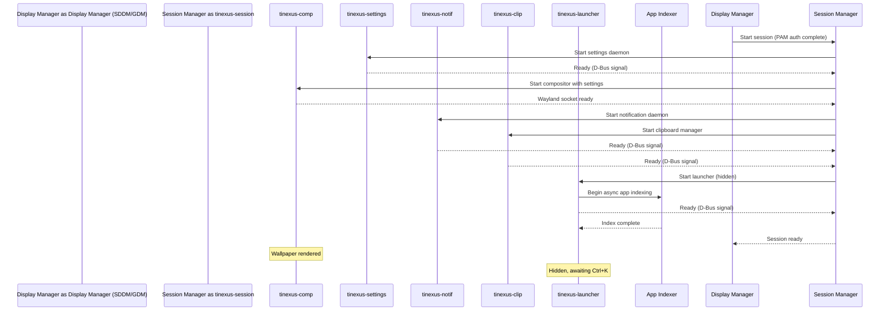
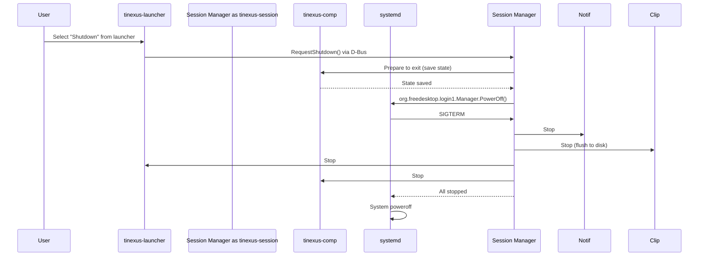

# Tinexus Shell — Requirements Specification

> **Document:** 02_REQUIREMENTS.md  
> **Version:** 1.0.0  
> **Status:** FROZEN  
> **Classification:** Public — Open Source  
> **Depends on:** 01_VISION.md

---

## Table of Contents

1. [Document Conventions](#1-document-conventions)
2. [Functional Requirements](#2-functional-requirements)
3. [Non-Functional Requirements](#3-non-functional-requirements)
4. [Performance Targets](#4-performance-targets)
5. [Security Requirements](#5-security-requirements)
6. [Accessibility Requirements](#6-accessibility-requirements)
7. [Reliability Requirements](#7-reliability-requirements)
8. [Error Handling Requirements](#8-error-handling-requirements)
9. [Resource Limits](#9-resource-limits)
10. [Boot Flow](#10-boot-flow)
11. [Use Cases](#11-use-cases)
12. [User Stories](#12-user-stories)
13. [Acceptance Criteria](#13-acceptance-criteria)

---

## 1. Document Conventions

### 1.1 Requirement Identifiers

All requirements are prefixed by their category:

| Prefix | Category |
|---|---|
| `FR-` | Functional Requirement |
| `NFR-` | Non-Functional Requirement |
| `PERF-` | Performance Requirement |
| `SEC-` | Security Requirement |
| `ACC-` | Accessibility Requirement |
| `REL-` | Reliability Requirement |
| `ERR-` | Error Handling Requirement |
| `RES-` | Resource Limit |

### 1.2 Priority Levels

| Level | Symbol | Meaning |
|---|---|---|
| Must Have | `[M]` | Mandatory for v1.0. Not shipping without this. |
| Should Have | `[S]` | High value. Ship in v1.0 if possible, v1.1 otherwise. |
| Could Have | `[C]` | Nice to have. Ship if time permits. |
| Won't Have | `[W]` | Explicitly out of scope for this version. |

### 1.3 Verification Method

| Method | Code | Description |
|---|---|---|
| Test | `T` | Automated test covers this requirement |
| Inspection | `I` | Code review / design review |
| Demonstration | `D` | Live demo with measurable output |
| Analysis | `A` | Static analysis or theoretical proof |

---

## 2. Functional Requirements

### 2.1 Desktop Shell

| ID | Priority | Requirement | Verification |
|---|---|---|---|
| FR-DS-001 | [M] | The default desktop state MUST display only the wallpaper. No dock, taskbar, icons, or widgets shall be visible by default. | D |
| FR-DS-002 | [M] | The compositor MUST launch automatically when the user session starts via the session manager. | T |
| FR-DS-003 | [M] | The desktop MUST render at native resolution with proper HiDPI scaling on all connected displays. | D |
| FR-DS-004 | [M] | The wallpaper engine MUST support static images (PNG, JPEG, WebP) as wallpaper sources. | T |
| FR-DS-005 | [S] | The wallpaper engine SHOULD support animated wallpapers (GIF, video loop) as an opt-in setting. | D |
| FR-DS-006 | [M] | The compositor MUST manage application windows with support for: maximize, minimize, close, resize, move. | T |
| FR-DS-007 | [M] | The compositor MUST support multiple virtual workspaces (minimum 2, maximum 10). | T |
| FR-DS-008 | [M] | Switching between workspaces MUST be available via keyboard shortcuts. | T |
| FR-DS-009 | [S] | The compositor SHOULD support a tiling layout mode as an opt-in setting. | D |
| FR-DS-010 | [M] | The compositor MUST handle application crashes gracefully — a crashed app must not affect other apps or the compositor. | T |

### 2.2 Launcher (Ctrl+K Interface)

| ID | Priority | Requirement | Verification |
|---|---|---|---|
| FR-LN-001 | [M] | The launcher MUST open when the user presses Ctrl+K from any application or the desktop. | T |
| FR-LN-002 | [M] | The launcher MUST close when: (a) the user presses Escape, (b) the user clicks outside the launcher, (c) an action is executed. | T |
| FR-LN-003 | [M] | The launcher MUST search installed applications by name, description, and executable name. | T |
| FR-LN-004 | [M] | The launcher MUST display at least 5 results by default and support scrolling for more. | T |
| FR-LN-005 | [M] | Application search results MUST show: app icon, name, description. | T |
| FR-LN-006 | [M] | The launcher MUST support fuzzy search — results must be returned even with minor typos. | T |
| FR-LN-007 | [M] | The launcher MUST provide system actions: Lock Screen, Sleep, Restart, Shutdown, Log Out. | T |
| FR-LN-008 | [M] | The launcher MUST provide an inline calculator. Arithmetic expressions typed in the search box MUST display the result instantly. | T |
| FR-LN-009 | [M] | The launcher MUST display recently launched applications in order of recency. | T |
| FR-LN-010 | [S] | The launcher SHOULD display recent files from applications that report them via the freedesktop Recently Used Files specification. | T |
| FR-LN-011 | [M] | The launcher MUST support clipboard history (last 50 entries, text only in v1.0). | T |
| FR-LN-012 | [M] | Keyboard navigation in the launcher MUST use: Arrow keys (navigate), Enter (execute), Tab (cycle sections), Escape (close). | T |
| FR-LN-013 | [S] | The launcher SHOULD support custom keyboard shortcuts for frequently used applications. | T |
| FR-LN-014 | [C] | The launcher COULD support file path navigation (type `/` to browse filesystem). | D |
| FR-LN-015 | [M] | The launcher MUST appear on top of all windows, including fullscreen applications. | T |
| FR-LN-016 | [M] | The launcher search field MUST be auto-focused when the launcher opens. | T |
| FR-LN-017 | [S] | The launcher SHOULD support search result categories that can be filtered with keyboard shortcuts. | T |
| FR-LN-018 | [M] | The launcher MUST be accessible via a pointer (right-click on desktop, or optional hot-corner trigger). | D |

### 2.3 Window Management

| ID | Priority | Requirement | Verification |
|---|---|---|---|
| FR-WM-001 | [M] | Windows MUST be moved by dragging the title bar or via Meta+drag. | T |
| FR-WM-002 | [M] | Windows MUST be resized by dragging the border or via Meta+Right-Click drag. | T |
| FR-WM-003 | [M] | Windows MUST support snap zones: snap to left half, right half, top half, bottom half. | T |
| FR-WM-004 | [M] | Fullscreen mode MUST be supported for all applications. | T |
| FR-WM-005 | [M] | Alt+Tab MUST cycle between open windows. | T |
| FR-WM-006 | [M] | The compositor MUST support xdg-shell for standard Wayland applications. | T |
| FR-WM-007 | [M] | XWayland MUST be supported for legacy X11 applications. | T |
| FR-WM-008 | [S] | The compositor SHOULD support layer-shell (zwlr_layer_shell_v1) for shell components. | I |
| FR-WM-009 | [S] | The compositor SHOULD support window decorations via xdg-decoration-unstable-v1. | T |
| FR-WM-010 | [C] | Window gap/padding settings for tiling mode SHOULD be configurable via settings. | D |

### 2.4 Notification System

| ID | Priority | Requirement | Verification |
|---|---|---|---|
| FR-NT-001 | [M] | The notification daemon MUST implement the org.freedesktop.Notifications D-Bus interface. | T |
| FR-NT-002 | [M] | Notifications MUST appear in the top-right corner by default. | D |
| FR-NT-003 | [M] | Notifications MUST auto-dismiss after a configurable timeout (default: 5 seconds). | T |
| FR-NT-004 | [M] | Notifications MUST support: title, body, app icon, urgency levels (low, normal, critical). | T |
| FR-NT-005 | [S] | Critical notifications MUST NOT auto-dismiss. They MUST require explicit user action. | T |
| FR-NT-006 | [M] | Notifications MUST be accessible via a notification center in the launcher. | T |
| FR-NT-007 | [M] | A Do Not Disturb mode MUST suppress all non-critical notifications. | T |
| FR-NT-008 | [S] | Notification grouping by application SHOULD be supported. | D |
| FR-NT-009 | [M] | Notification history MUST persist within a session (cleared on logout). | T |
| FR-NT-010 | [C] | Persistent notification history across sessions COULD be stored in `~/.local/share/Tinexus Shell/notifications.db`. | D |

### 2.5 Settings System

| ID | Priority | Requirement | Verification |
|---|---|---|---|
| FR-ST-001 | [M] | A settings application MUST be accessible from the launcher (search "settings"). | D |
| FR-ST-002 | [M] | Settings MUST be stored in TOML files in `~/.config/Tinexus Shell/`. | I |
| FR-ST-003 | [M] | Settings MUST include: display configuration, wallpaper, keyboard shortcuts, theme, launcher. | D |
| FR-ST-004 | [M] | Settings changes MUST take effect immediately without requiring a restart. | T |
| FR-ST-005 | [M] | A default settings profile MUST exist in `/etc/Tinexus Shell/defaults/`. | I |
| FR-ST-006 | [S] | Settings SHOULD validate all user-provided values and display meaningful error messages for invalid input. | T |
| FR-ST-007 | [C] | A command-line settings tool (`tinexus-settings`) COULD allow scripted configuration. | T |

### 2.6 Session Management

| ID | Priority | Requirement | Verification |
|---|---|---|---|
| FR-SM-001 | [M] | The session manager MUST integrate with systemd-logind via D-Bus. | T |
| FR-SM-002 | [M] | Session start MUST launch all required daemons in the correct dependency order. | T |
| FR-SM-003 | [M] | Lock screen MUST activate on: (a) user request from launcher, (b) system suspend, (c) idle timeout. | T |
| FR-SM-004 | [M] | The lock screen MUST prevent access to all applications and data. | T |
| FR-SM-005 | [M] | PAM-based authentication MUST be used for lock screen unlock. | T |
| FR-SM-006 | [M] | Shutdown, restart, and sleep actions from the launcher MUST call systemd via D-Bus. | T |
| FR-SM-007 | [S] | Session restoration SHOULD save and restore open application positions on login. | D |
| FR-SM-008 | [M] | The compositor MUST handle VT switching (switch to a virtual terminal). | T |

### 2.7 Clipboard Manager

| ID | Priority | Requirement | Verification |
|---|---|---|---|
| FR-CB-001 | [M] | The clipboard manager MUST intercept clipboard events and store the last 50 text entries. | T |
| FR-CB-002 | [M] | Clipboard history MUST be searchable from the launcher. | T |
| FR-CB-003 | [M] | Clipboard entries MUST persist across application restarts but NOT across session logout. | T |
| FR-CB-004 | [M] | Clipboard entries containing sensitive data (detected by regex: passwords, tokens) MUST be flagged and not stored. | T |
| FR-CB-005 | [S] | Image clipboard entries SHOULD show a thumbnail in history. | D |

---

## 3. Non-Functional Requirements

### 3.1 Maintainability

| ID | Priority | Requirement | Verification |
|---|---|---|---|
| NFR-MT-001 | [M] | All public APIs MUST have Doxygen documentation. | A |
| NFR-MT-002 | [M] | Test coverage MUST be ≥80% for all non-UI logic modules. | A |
| NFR-MT-003 | [M] | No compiler warnings permitted in Release builds (treat warnings as errors). | A |
| NFR-MT-004 | [M] | All code MUST pass clang-tidy with the project's defined check set. | A |
| NFR-MT-005 | [M] | No global mutable state except where explicitly documented. | I |

### 3.2 Scalability

| ID | Priority | Requirement | Verification |
|---|---|---|---|
| NFR-SC-001 | [M] | The launcher MUST remain performant with ≥5,000 installed applications indexed. | T |
| NFR-SC-002 | [M] | The compositor MUST handle ≥50 simultaneously open windows without degraded frame rate. | T |
| NFR-SC-003 | [S] | Clipboard history SHOULD handle entries of up to 1MB each without performance degradation. | T |

### 3.3 Portability

| ID | Priority | Requirement | Verification |
|---|---|---|---|
| NFR-PO-001 | [M] | Tinexus Shell MUST run on any Linux distribution with kernel ≥6.1. | T |
| NFR-PO-002 | [M] | Tinexus Shell MUST support x86_64 and aarch64 CPU architectures. | T |
| NFR-PO-003 | [S] | Tinexus Shell SHOULD support RISC-V (riscv64) as a community-supported architecture. | A |
| NFR-PO-004 | [M] | Tinexus Shell MUST support Mesa (open source GPU drivers) as the primary GPU driver family. | D |

### 3.4 Interoperability

| ID | Priority | Requirement | Verification |
|---|---|---|---|
| NFR-IO-001 | [M] | All standard Wayland protocols supported by wlroots MUST be implemented. | I |
| NFR-IO-002 | [M] | org.freedesktop.Notifications D-Bus interface MUST be implemented fully. | T |
| NFR-IO-003 | [M] | XDG Base Directory Specification MUST be followed for all file paths. | I |
| NFR-IO-004 | [M] | Freedesktop Desktop Entry Specification MUST be used for application indexing. | T |
| NFR-IO-005 | [S] | org.freedesktop.portal.* interfaces SHOULD be implemented for sandboxed app support. | T |

---

## 4. Performance Targets

> These targets are hard requirements, not aspirations. Any component that cannot meet its target must be redesigned before shipping.

### 4.1 Frame Timing

| Metric | Target | Hard Limit | Method |
|---|---|---|---|
| Compositor frame time (60Hz) | ≤ 16.67ms | 20ms | Measured via DRM timestamp |
| Compositor frame time (120Hz) | ≤ 8.33ms | 10ms | Measured via DRM timestamp |
| Launcher animation frame time | ≤ 16.67ms | 16.67ms | Qt Scene Graph profiler |
| Dropped frame rate (steady state) | 0% | ≤0.1% | DRM vblank miss counter |

### 4.2 Launcher Performance

| Metric | Target | Hard Limit | Method |
|---|---|---|---|
| Time-to-visible (Ctrl+K to first render) | ≤ 80ms | 100ms | Measured from keypress |
| Time-to-first-result (after typing) | ≤ 30ms | 50ms | Instrumented search path |
| Full result refresh (after keystroke) | ≤ 50ms | 80ms | Instrumented search path |
| Calculator result latency | ≤ 5ms | 10ms | Instrumented eval path |
| Clipboard history open | ≤ 50ms | 80ms | Instrumented path |

### 4.3 Session Performance

| Metric | Target | Hard Limit | Method |
|---|---|---|---|
| Session start (login to compositor ready) | ≤ 2.0s | 3.0s | systemd-analyze |
| Session start (compositor to launcher ready) | ≤ 500ms | 1.0s | D-Bus ready signal timestamp |
| App launch time (terminal) | ≤ 200ms | 400ms | Launcher to app window visible |
| App launch time (heavy app, e.g., browser) | ≤ 1.5s | 2.5s | Launcher to app first paint |

### 4.4 Memory Performance

| Component | Target Idle RAM | Hard Limit |
|---|---|---|
| tinexus-comp (compositor) | ≤ 50MB | 80MB |
| tinexus-launcher | ≤ 40MB (hidden) | 60MB |
| tinexus-notif (notification daemon) | ≤ 15MB | 25MB |
| tinexus-session (session manager) | ≤ 10MB | 20MB |
| tinexus-settings (daemon) | ≤ 15MB | 25MB |
| tinexus-clip (clipboard manager) | ≤ 10MB | 20MB |
| **Total system (all daemons)** | **≤ 150MB** | **230MB** |

---

## 5. Security Requirements

| ID | Priority | Requirement | Verification |
|---|---|---|---|
| SEC-001 | [M] | The compositor process MUST NOT execute arbitrary shell commands on behalf of applications. | I |
| SEC-002 | [M] | All D-Bus interfaces MUST validate caller identity using polkit or D-Bus peer credentials. | I |
| SEC-003 | [M] | Plugin processes MUST run as a separate user or in a separate namespace with reduced privileges. | I |
| SEC-004 | [M] | Clipboard contents MUST NOT be shared between applications without explicit user consent. | T |
| SEC-005 | [M] | The lock screen MUST use PAM authentication. Bypass of the lock screen is a critical security bug. | T |
| SEC-006 | [M] | Settings files MUST NOT be executable. They are data files. | I |
| SEC-007 | [M] | No hardcoded credentials, API keys, or tokens anywhere in the codebase. | A |
| SEC-008 | [M] | All external inputs (theme files, plugin manifests, config files) MUST be validated before use. | T |
| SEC-009 | [S] | Sensitive clipboard entries (password-pattern matched) SHOULD be encrypted at rest. | A |
| SEC-010 | [M] | Address Sanitizer and UBSan MUST be enabled in all Debug builds. | A |
| SEC-011 | [M] | The project MUST have a defined security vulnerability disclosure process before v0.1 release. | I |
| SEC-012 | [M] | No world-writable files or directories created by Tinexus Shell. | A |

---

## 6. Accessibility Requirements

| ID | Priority | Requirement | Verification |
|---|---|---|---|
| ACC-001 | [M] | All keyboard shortcuts MUST be user-configurable. | T |
| ACC-002 | [M] | The launcher MUST be keyboard-navigable without a mouse. | T |
| ACC-003 | [S] | The launcher MUST support pointer-based triggering (hot corner or right-click menu). | D |
| ACC-004 | [M] | Color contrast ratios MUST meet WCAG 2.1 AA (4.5:1 for normal text, 3:1 for large text). | A |
| ACC-005 | [S] | High contrast themes SHOULD be available. | D |
| ACC-006 | [M] | All interactive elements MUST have accessible names (AT-SPI2 accessibility tree). | T |
| ACC-007 | [M] | Font sizes MUST be configurable, with a minimum size of 8pt and maximum of 36pt. | T |
| ACC-008 | [S] | Screen reader support (via AT-SPI2) SHOULD be implemented for the launcher. | D |
| ACC-009 | [C] | Motion reduction mode COULD disable all non-essential animations for users with vestibular disorders. | D |
| ACC-010 | [M] | All launcher results MUST display text labels, not icons alone. | I |

---

## 7. Reliability Requirements

| ID | Priority | Requirement | Verification |
|---|---|---|---|
| REL-001 | [M] | The compositor MUST recover from a crashed application without itself crashing. | T |
| REL-002 | [M] | If the launcher process crashes, it MUST be automatically restarted by the session manager within 2 seconds. | T |
| REL-003 | [M] | If the notification daemon crashes, it MUST be automatically restarted. | T |
| REL-004 | [M] | If the settings daemon crashes, the compositor MUST continue operating with cached settings. | T |
| REL-005 | [M] | A corrupted configuration file MUST cause Tinexus Shell to fall back to defaults, NOT to crash. | T |
| REL-006 | [M] | The compositor MUST handle GPU driver crashes/hangs by attempting recovery before killing the session. | T |
| REL-007 | [S] | Mean Time Between Failures (MTBF) for the compositor should be ≥30 days of continuous operation. | A |
| REL-008 | [M] | All daemon processes MUST log structured logs (JSON) to systemd journal. | T |
| REL-009 | [M] | No daemon process shall consume 100% CPU for more than 100ms without a watchdog killing it. | T |

---

## 8. Error Handling Requirements

| ID | Priority | Requirement | Verification |
|---|---|---|---|
| ERR-001 | [M] | All errors MUST be logged with: timestamp, severity, component, error code, human-readable message. | I |
| ERR-002 | [M] | User-visible errors MUST display actionable messages (not raw error codes). | D |
| ERR-003 | [M] | Failed app launches MUST display a notification: "{App} failed to start. Check logs for details." | T |
| ERR-004 | [M] | An application that cannot be found MUST show a clear message in the launcher. | T |
| ERR-005 | [M] | GPU driver initialization failure MUST fall back to software rendering (LLVMpipe) and notify the user. | T |
| ERR-006 | [M] | A plugin that fails to load MUST be disabled automatically with an error notification. It MUST NOT crash the launcher. | T |
| ERR-007 | [M] | Network errors (future: AI providers) MUST fail gracefully with user notification. | T |
| ERR-008 | [M] | All C++ exceptions in daemon code MUST be caught at process boundary — no unhandled exception terminates a daemon. | T |
| ERR-009 | [M] | Configuration parse errors MUST log the file, line number, and error description. | T |

---

## 9. Resource Limits

### 9.1 Per-Process Limits

| Process | Max RAM | Max CPU (avg) | Max CPU (peak) | Max Open Files |
|---|---|---|---|---|
| tinexus-comp | 80MB | 5% | 80% (during animation) | 512 |
| tinexus-launcher | 60MB | 2% (hidden) | 30% (open+search) | 256 |
| tinexus-notif | 25MB | 0.5% | 10% | 64 |
| tinexus-session | 20MB | 0.5% | 5% | 128 |
| tinexus-clip | 20MB | 0.5% | 5% | 64 |
| tinexus-settings | 25MB | 0.5% | 10% | 128 |
| Plugin host | 50MB per plugin | 5% per plugin | 30% per plugin | 128 per plugin |

### 9.2 Disk Usage

| Item | Limit | Notes |
|---|---|---|
| Installed size (core) | ≤ 100MB | Excluding Qt libraries (shared) |
| Config files | ≤ 10MB | Per user |
| Cache directory | ≤ 200MB | App index, thumbnail cache; purgeable |
| Log files | ≤ 100MB | Rotated via logrotate |
| Clipboard database | ≤ 50MB | 50 entries × 1MB max each |
| Notification history | ≤ 10MB | Session-only in v1.0 |

### 9.3 Network Usage

| Metric | Limit | Notes |
|---|---|---|
| Bandwidth at idle | 0 bytes/s | No network activity at idle in v1.0 |
| Bandwidth during operation | 0 bytes/s | Entirely offline in v1.0 |
| DNS queries | 0 | No external DNS |

---

## 10. Boot Flow

### 10.1 Session Start Sequence

### 10.2 Shutdown Sequence

---

## 11. Use Cases

### UC-001: Launch an Application

**Actor:** User  
**Precondition:** Tinexus Shell session is running. Desktop is showing wallpaper.  
**Main Success Scenario:**
1. User presses Ctrl+K
2. Launcher opens with search field focused
3. User types application name (e.g., "fire" for Firefox)
4. Launcher displays fuzzy-matched results
5. First result is highlighted
6. User presses Enter
7. Launcher closes
8. Application launches and its window appears

**Alternative Flows:**
- 3a. Application not installed → Launcher shows "No results found. Press Alt+Enter to search the web for 'fire'."
- 6a. User presses Down arrow, selects different result → execution continues from step 7

### UC-002: Perform System Action

**Actor:** User  
**Precondition:** Session is running.  
**Main Success Scenario:**
1. User presses Ctrl+K
2. Launcher opens
3. User types "sleep"
4. "Sleep" system action appears as top result
5. User presses Enter
6. Launcher closes
7. System enters sleep state

### UC-003: View Clipboard History

**Actor:** User  
**Precondition:** User has copied text in the current session.  
**Main Success Scenario:**
1. User presses Ctrl+K
2. Launcher opens
3. User types "clip" or presses Tab to navigate to Clipboard section
4. Recent clipboard entries are displayed
5. User selects an entry with arrow keys
6. User presses Enter
7. Selected entry is pasted to the active application (or copied to clipboard)

### UC-004: Change Settings

**Actor:** User  
**Precondition:** Session is running.  
**Main Success Scenario:**
1. User presses Ctrl+K
2. Types "wallpaper"
3. "Change Wallpaper" appears as a result
4. User presses Enter
5. Settings application opens to wallpaper section
6. User selects a new wallpaper image
7. Wallpaper updates immediately on desktop

### UC-005: Multi-Monitor Setup

**Actor:** User (with two monitors connected)  
**Precondition:** Both monitors are detected by DRM/KMS.  
**Main Success Scenario:**
1. User connects second monitor
2. Compositor detects new output via DRM hotplug
3. Display Settings notification appears
4. Compositor extends desktop to new monitor with default layout
5. User opens Settings to configure arrangement and resolution

---

## 12. User Stories

### US-01: Developer Focus Mode

> *As a software developer, I want my desktop to show nothing but my wallpaper when I start work, so that I can begin my focused work session without visual distractions.*

**Acceptance Criteria:** AC-US01

---

### US-02: Fast App Switching

> *As a power user, I want to launch any application within two keystrokes and one search query, so that my workflow is never interrupted by navigating menus or docks.*

**Acceptance Criteria:** AC-US02

---

### US-03: Clipboard Recall

> *As a developer, I want to search my clipboard history by content, so that I can recall code snippets I copied earlier in my session without losing them.*

**Acceptance Criteria:** AC-US03

---

### US-04: System Power Management

> *As a user, I want to shut down, restart, sleep, or lock my computer from the same launcher I use for everything else, so that I don't need to remember a separate shutdown sequence.*

**Acceptance Criteria:** AC-US04

---

### US-05: Distraction-Free Notifications

> *As a user in deep focus, I want notifications to appear briefly and disappear automatically, so that they inform me without breaking my concentration.*

**Acceptance Criteria:** AC-US05

---

### US-06: Consistent Performance

> *As a user, I want every animation and interaction to feel smooth and instantaneous, so that the desktop never feels slow or unresponsive.*

**Acceptance Criteria:** AC-US06

---

### US-07: Keyboard-First Accessibility

> *As a user with limited mouse mobility, I want every action in Tinexus Shell to be reachable via keyboard, so that I can be fully productive without a pointing device.*

**Acceptance Criteria:** AC-US07

---

### US-08: Customizable Theme

> *As a user with personal aesthetic preferences, I want to change the color scheme of the launcher and shell, so that the desktop reflects my style.*

**Acceptance Criteria:** AC-US08

---

## 13. Acceptance Criteria

### AC-US01: Developer Focus Mode

- [ ] Default session starts with no visible UI elements on the desktop
- [ ] No taskbar, dock, desktop icons, or widgets visible
- [ ] Only wallpaper image is rendered on the desktop
- [ ] System is still fully functional (launcher accessible via Ctrl+K)

### AC-US02: Fast App Switching

- [ ] Ctrl+K opens launcher within 100ms
- [ ] Typing 3 characters returns relevant app results within 50ms
- [ ] Pressing Enter launches the selected app
- [ ] App window appears within 400ms for terminal-class apps

### AC-US03: Clipboard Recall

- [ ] Clipboard history stores last 50 text entries
- [ ] Clipboard entries are searchable from the launcher
- [ ] Selecting a clipboard entry copies it back to the active clipboard
- [ ] Clipboard entries persist across app restarts but not session logout

### AC-US04: System Power Management

- [ ] "Shutdown", "Restart", "Sleep", "Lock Screen", and "Log Out" are accessible from the launcher
- [ ] Each action executes correctly via systemd D-Bus
- [ ] Shutdown shows a 5-second cancellation window for accidental execution

### AC-US05: Distraction-Free Notifications

- [ ] Non-critical notifications auto-dismiss after 5 seconds (configurable)
- [ ] Critical notifications require user action to dismiss
- [ ] Do Not Disturb mode suppresses all non-critical notifications
- [ ] Notifications do not cover the full screen or block the active application's controls

### AC-US06: Consistent Performance

- [ ] Compositor maintains ≥60fps on reference hardware during normal use
- [ ] Launcher open animation completes within 100ms
- [ ] No dropped frames during window move/resize operations on reference hardware
- [ ] Idle RAM usage ≤150MB for all core daemons combined

### AC-US07: Keyboard-First Accessibility

- [ ] All launcher functions reachable via keyboard (no mouse required)
- [ ] Arrow keys navigate launcher results
- [ ] Tab cycles between launcher sections
- [ ] Escape closes launcher
- [ ] All keyboard shortcuts are configurable

### AC-US08: Customizable Theme

- [ ] Theme changes apply immediately without session restart
- [ ] At least 3 built-in themes provided (Dark, Light, High Contrast)
- [ ] Custom accent color can be set
- [ ] Font family and size configurable

---

*Document End: 02_REQUIREMENTS.md*  
*Next: 03_SYSTEM_ARCHITECTURE.md*
