# Tinexus Shell — System Architecture

> **Document:** 03_SYSTEM_ARCHITECTURE.md  
> **Version:** 1.0.0  
> **Status:** FROZEN  
> **Classification:** Public — Open Source  
> **Depends on:** 01_VISION.md, 02_REQUIREMENTS.md, ADR-000

---

## Table of Contents

1. [Architectural Overview](#1-architectural-overview)
2. [Layered Architecture](#2-layered-architecture)
3. [Component Inventory](#3-component-inventory)
4. [Module Interaction Map](#4-module-interaction-map)
5. [Rendering Pipeline](#5-rendering-pipeline)
6. [Wayland Integration](#6-wayland-integration)
7. [Launcher Architecture](#7-launcher-architecture)
8. [Wallpaper Engine](#8-wallpaper-engine)
9. [Notification Engine](#9-notification-engine)
10. [Window Management Architecture](#10-window-management-architecture)
11. [Search Engine Architecture](#11-search-engine-architecture)
12. [Session Manager Architecture](#12-session-manager-architecture)
13. [Settings Architecture](#13-settings-architecture)
2. [Process Ownership & Technology Stack](#2-process-ownership--technology-stack)
3. [Layered Architecture Diagram](#3-layered-architecture-diagram)
4. [Supervisor & IPC Architecture (`serviced` & `ipcd`)](#4-supervisor--ipc-architecture-serviced--ipcd)
5. [Compositor Subsystem (`tinexus-comp`)](#5-compositor-subsystem-tinexus-comp)
6. [Search Engine Subsystem (`tinexus-searchd`)](#6-search-engine-subsystem-tinexus-searchd)
7. [Workspace Manager Architecture](#7-workspace-manager-architecture)
8. [Rendering Pipeline (Vulkan & Qt RHI)](#8-rendering-pipeline-vulkan--qt-rhi)

---

## 1. Architectural Overview

Tinexus Platform follows a **microservice-inspired platform process architecture**. Every subsystem is an independent, replaceable daemon communicating via `tinexus-ipcd` (IPC Broker) and D-Bus (`io.tinexus.shell.*`).

Process isolation is strictly enforced. The compositor contains ZERO UI code, ZERO plugin runtime logic, and ZERO network code.

### 1.1 Core Architectural Principles

1. **Process Isolation** — Each subsystem is a separate process. A crash in the notification daemon cannot affect the compositor.
2. **Interface Stability** — All inter-process communication is done through stable, versioned D-Bus interfaces.
3. **No Shared Memory Between Services** — Services share data only through explicit IPC. No shared memory regions between daemons.
4. **The Compositor is Sacred** — The compositor process has the least code and the fewest dependencies. It never loads plugins. It never executes user-defined code.
5. **Pluggable Search Providers** — The launcher's search system is designed as a registry of providers. Providers are isolated processes.

---

## 2. Layered Architecture

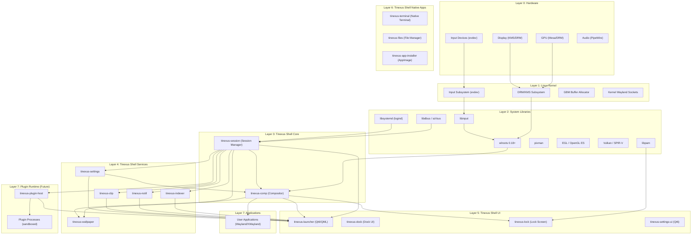

---

## 3. Component Inventory

| Component | Process Name | Language | Framework | Role |
|---|---|---|---|---|
| Compositor | `tinexus-comp` | C++20 | wlroots | Wayland compositor, window manager, rendering |
| Session Manager | `tinexus-session` | C++20 | libsystemd | Session lifecycle, daemon supervision |
| Launcher | `tinexus-launcher` | C++20 + QML | Qt6 | Primary user interface, command palette |
| Notification Daemon | `tinexus-notif` | C++20 | Qt6 (headless) | org.freedesktop.Notifications implementation |
| Settings Daemon | `tinexus-settings` | C++20 | — | Configuration read/write, change events |
| Settings UI | `tinexus-settings-ui` | C++20 + QML | Qt6 | Settings graphical interface |
| Clipboard Manager | `tinexus-clip` | C++20 | — | Clipboard history, Wayland clipboard protocol |
| App Indexer | `tinexus-indexer` | C++20 | — | .desktop file parsing, search index build |
| Wallpaper Engine | `tinexus-wallpaper` | C++20 | Qt6/OpenGL | Wallpaper rendering as wlr-layer-shell surface |
| Lock Screen | `tinexus-lock` | C++20 + QML | Qt6 + PAM | Screen lock, PAM authentication |
| Dock | `tinexus-dock` | C++20 | txui | macOS-style bottom dock with spring physics |
| Terminal | `tinexus-terminal` | C++20 | txui | Custom Wayland-native PTY terminal emulator |
| File Manager | `tinexus-files` | C++20 | txui | Miller-column native file manager |
| App Installer | `tinexus-app-installer` | C++20 | txui | ISO / AppImage / package installer GUI |
| Plugin Host | `tinexus-plugin-host` | C++20 | — | Plugin process supervisor (future) |

---

## 4. Module Interaction Map

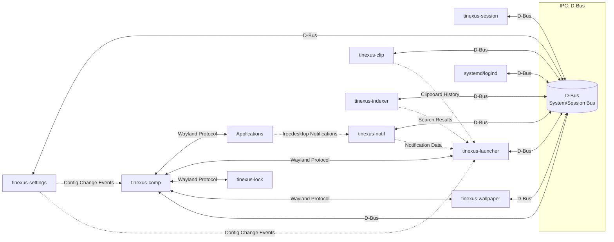

### 4.1 Key Interaction Contracts

| Interaction | Protocol | Interface Name |
|---|---|---|
| Launcher ↔ Compositor (global shortcut) | D-Bus | `io.Tinexus Shell.Compositor.Shortcuts` |
| App → Notification Daemon | D-Bus | `org.freedesktop.Notifications` |
| Launcher ↔ App Indexer | D-Bus | `io.Tinexus Shell.Indexer` |
| Launcher ↔ Clipboard | D-Bus | `io.Tinexus Shell.Clipboard` |
| Session → Systemd | D-Bus | `org.freedesktop.login1.Manager` |
| Settings Daemon → All | D-Bus | `io.Tinexus Shell.Settings` |
| Lock Screen ↔ Session | D-Bus | `io.Tinexus Shell.Session` |

---

## 5. Rendering Pipeline

### 5.1 Frame Production Pipeline

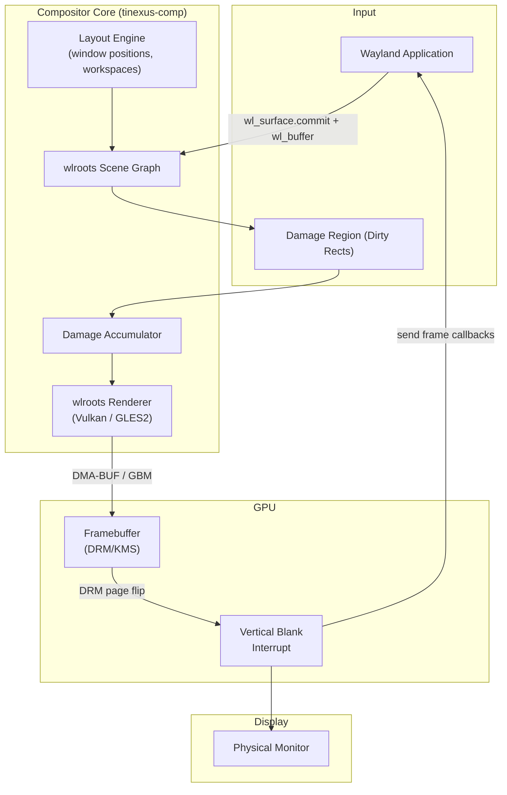

### 5.2 Rendering Backend Strategy

| Backend | Status | Use Case |
|---|---|---|
| **Vulkan** | Primary (v1.0) | Modern discrete and integrated GPUs |
| **OpenGL ES 3.2** | Fallback (v1.0) | Older hardware, virtual machines |
| **LLVMpipe (Software)** | Emergency Fallback | No GPU, CI testing, VMs |

### 5.3 Frame Scheduling

Tinexus Shell uses **vblank-synchronized frame scheduling**:

1. Compositor registers for DRM vblank interrupt
2. At each vblank, compositor scans accumulated damage from all surfaces
3. Only damaged regions are re-rendered (scissor optimization)
4. Frame is submitted via DRM page flip (atomic or legacy)
5. `wl_surface.frame` callbacks are sent to clients after flip confirmation

This ensures **tear-free rendering** and **minimal GPU work** (only damaged regions processed).

---

## 6. Wayland Integration

### 6.1 Supported Wayland Protocols

| Protocol | Status | Notes |
|---|---|---|
| `xdg-shell` | ✅ Required | Application windows |
| `xdg-decoration-unstable-v1` | ✅ Required | Window decorations |
| `wlr-layer-shell-unstable-v1` | ✅ Required | Launcher, lock screen, wallpaper |
| `zwp-idle-inhibit-unstable-v1` | ✅ Required | Prevent sleep during fullscreen video |
| `wlr-output-management-unstable-v1` | ✅ Required | Display configuration |
| `zwlr-screencopy-v1` | ✅ Required | Screenshot utility support |
| `xdg-output-unstable-v1` | ✅ Required | Output info for multi-monitor |
| `zwp-input-method-unstable-v2` | ✅ Required | Input method (IME) support |
| `wp-cursor-shape-v1` | ✅ Required | Cursor theming |
| `xdg-foreign-unstable-v2` | [S] Recommended | Cross-process surface parenting |
| `zwlr-virtual-pointer-unstable-v1` | [C] Optional | Virtual pointer for accessibility |
| `xwayland` | ✅ Required | Legacy X11 app support |
| `ext-session-lock-v1` | ✅ Required | Session lock protocol |

### 6.2 wlroots Integration Points

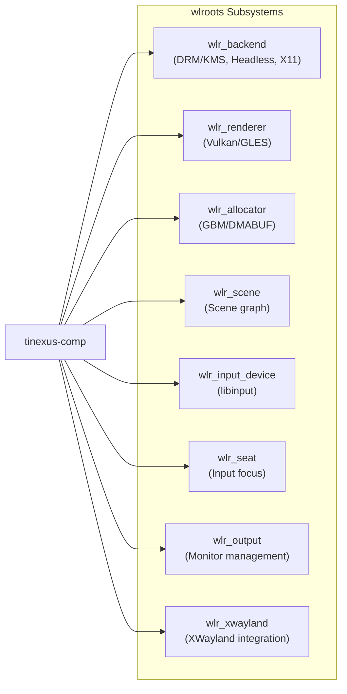

### 6.3 Compositor Process Isolation Rule

> **CRITICAL RULE (enforced via code review):** The compositor process (`tinexus-comp`) MUST NOT:
> - Load any user-provided shared libraries (.so files)
> - Execute any shell commands
> - Load plugin code
> - Open network connections
> - Parse complex user-provided data (except settings via the settings daemon)

The compositor's attack surface must remain minimal.

---

## 7. Launcher Architecture

### 7.1 Launcher Process Architecture

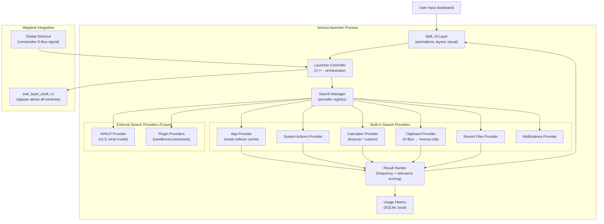

### 7.2 Search Provider Interface

All search providers implement the `ISearchProvider` interface:

```
interface ISearchProvider {
    name()          → string
    icon()          → string (icon name)
    priority()      → int (lower = higher priority)
    canHandle(query: string)  → bool
    search(query: string, maxResults: int) → SearchResultList
    activate(result: SearchResult) → void
}
```

This interface is the **most critical architectural contract** in the launcher. All future providers (AI, plugins) must implement this interface exactly.

### 7.3 Result Ranking Algorithm

```
score = base_relevance_score
      + (launch_frequency_bonus × log(launches + 1))
      + (recency_bonus × (1 / days_since_last_use))
      + (exact_match_bonus × is_exact_match)
      + (prefix_match_bonus × is_prefix_match)
```

Results are sorted by `score` descending. The ranking algorithm is:
1. **Deterministic** — Same query always produces same ordering (no randomness)
2. **Personalizable** — Frequency/recency bonuses adapt to user behavior
3. **Category-aware** — System actions always appear before app results for action-typed queries

### 7.4 Launcher Open/Close Animation Sequence

```
Ctrl+K pressed
  ↓
Compositor detects global shortcut
  ↓
D-Bus signal: io.Tinexus Shell.Compositor.Shortcuts.Activated("ctrl+k")
  ↓
tinexus-launcher receives signal (< 5ms)
  ↓
QML: opacity: 0 → 1 (80ms, ease-out cubic)
QML: scale: 0.95 → 1.0 (80ms, ease-out cubic)
QML: blur: 0 → 40px backdrop-filter (80ms)
  ↓
Launcher visible, search field focused
  ↓
User types
  ↓
Search providers queried (< 50ms)
  ↓
Results rendered with stagger animation (20ms per item, max 100ms total)
```

---

## 8. Wallpaper Engine

### 8.1 Architecture

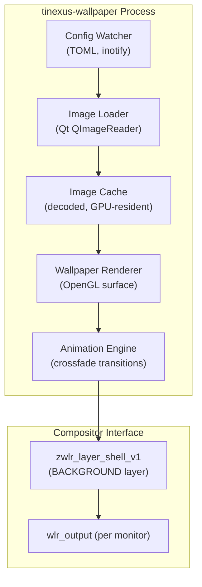

### 8.2 Wallpaper Surface Properties

- **Layer:** `ZWLR_LAYER_SHELL_V1_LAYER_BACKGROUND` (below all windows)
- **Anchor:** All edges (fills entire output)
- **Exclusive Zone:** 0 (no space reserved — full screen)
- **One surface per output** — independent wallpaper per monitor is supported

### 8.3 Wallpaper Change Transition

When a new wallpaper is selected:
1. New image loaded and decoded to GPU texture (async, off render thread)
2. Crossfade animation: 600ms ease-in-out opacity transition
3. Old texture released after transition complete

---

## 9. Notification Engine

### 9.1 Architecture

```mermaid
graph TD
    subgraph "Applications"
        APP1["App 1"]
        APP2["App 2"]
        APP3["App N"]
    end

    DBUS_IFACE["D-Bus: org.freedesktop.Notifications"]

    subgraph "tinexus-notif Process"
        NOTIF_SRV["Notification Server\n(D-Bus service)"]
        NOTIF_QUEUE["Notification Queue\n(priority-sorted)"]
        NOTIF_HIST["Notification History\n(session-scoped)"]
        NOTIF_RULES["Suppression Rules\n(DND, per-app)"]
    end

    NOTIF_SURFACE["Notification Surface\n(QML, layer-shell OVERLAY)"]

    APP1 -->|D-Bus Notify()| DBUS_IFACE
    APP2 -->|D-Bus Notify()| DBUS_IFACE
    APP3 -->|D-Bus Notify()| DBUS_IFACE

    DBUS_IFACE --> NOTIF_SRV
    NOTIF_SRV --> NOTIF_RULES
    NOTIF_RULES --> NOTIF_QUEUE
    NOTIF_QUEUE --> NOTIF_HIST
    NOTIF_QUEUE --> NOTIF_SURFACE
```

### 9.2 Notification Priority Handling

| Urgency | Auto-dismiss | DND Override | Position |
|---|---|---|---|
| Low | 3 seconds | Suppressed in DND | Top-right |
| Normal | 5 seconds | Suppressed in DND | Top-right |
| Critical | Never | Always shown | Top-right, red accent |

### 9.3 Notification Surface Properties

- **Layer:** `ZWLR_LAYER_SHELL_V1_LAYER_OVERLAY` (above all windows, below lock screen)
- **Anchor:** Top + Right
- **Exclusive Zone:** Notification height (pushes content down)
- **One notification stack per output**

---

## 10. Window Management Architecture

### 10.1 Window Manager State Machine

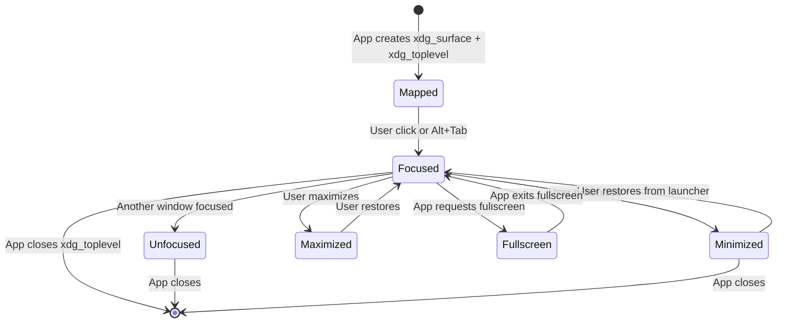

### 10.2 Workspace Model

```
Workspace Array (dynamic, 1–10)
│
├── Workspace 1 (default)
│   ├── Window: Firefox
│   ├── Window: Terminal
│   └── Window: VSCode (focused)
│
├── Workspace 2
│   └── Window: Slack
│
└── Workspace N (...)
```

**Workspace Rules:**
- Workspaces are created on demand (first window sent to new workspace)
- Empty workspaces are automatically removed (except the last one)
- Workspace switch animations: slide left/right, 200ms ease-in-out

### 10.3 Window Decoration Strategy

- Default: Server-side decorations (compositor draws title bar)
- Per-app override: Client-side decorations for GTK/Qt apps that prefer it
- Title bar design: Minimal (title text, close/min/max buttons)
- Title bar height: 32px (scaled for HiDPI)

---

## 11. Search Engine Architecture

### 11.1 App Index Structure

```
AppIndex {
    entries: HashMap<AppId, AppEntry>
    trigram_index: TrigramIndex<AppId>
    display_order: Vec<AppId>
}

AppEntry {
    id: AppId (e.g., "org.mozilla.firefox")
    name: String
    description: String
    exec: String
    icon_name: String
    categories: Vec<String>
    launch_count: u32
    last_launched: Timestamp
}
```

### 11.2 Trigram Search Algorithm

Tinexus Shell uses **trigram decomposition with edit-distance scoring** for search:

```
Query: "fire"
Trigrams: ["fir", "ire"]

For each AppEntry:
  entry_trigrams = decompose(entry.name + entry.description)
  intersection = query_trigrams ∩ entry_trigrams
  score = |intersection| / |query_trigrams|  (Jaccard similarity)
  
If score > threshold: candidate
Sort candidates by: score DESC, frequency DESC, recency DESC
```

**Why not a full-text search library (Xapian)?**
- Xapian is excellent but is an additional dependency
- Our search corpus is small (≤10,000 apps)
- Custom trigram index fits entirely in L2 cache
- No disk I/O during search (index is RAM-resident)
- Re-evaluate at v2.0 if AI/NLP integration requires more sophisticated indexing

### 11.3 Index Rebuild Strategy

| Trigger | Action |
|---|---|
| Startup | Full rebuild in background thread |
| New .desktop file detected (inotify) | Incremental update (add/remove) |
| .desktop file modified (inotify) | Update that entry |
| App launched | Update frequency counter (async) |

---

## 12. Session Manager Architecture

### 12.1 Session Manager Responsibilities

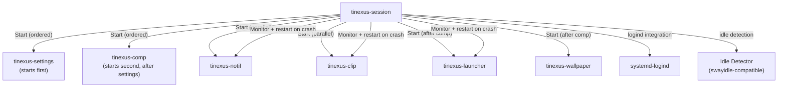

### 12.2 Daemon Supervision

Each daemon registers with the session manager via D-Bus at startup. The session manager:
1. Tracks each daemon's PID
2. Monitors process health via SIGCHLD / D-Bus watchdog heartbeats
3. Attempts restart (up to 3 times in 60 seconds) on crash
4. After 3 failures, marks daemon as "failed" and shows notification
5. If compositor fails: session is abandoned (cannot recover from compositor crash safely)

---

## 13. Settings Architecture

### 13.1 Settings Storage

```
~/.config/Tinexus Shell/
├── compositor.toml     # Display, workspaces, keybindings
├── launcher.toml       # Launcher behavior, search settings
├── theme.toml          # Color tokens, font, animation speed
├── wallpaper.toml      # Wallpaper path, fit, per-monitor
├── notifications.toml  # Per-app rules, DND schedule
└── session.toml        # Startup apps, idle timeout
```

### 13.2 Settings Change Flow

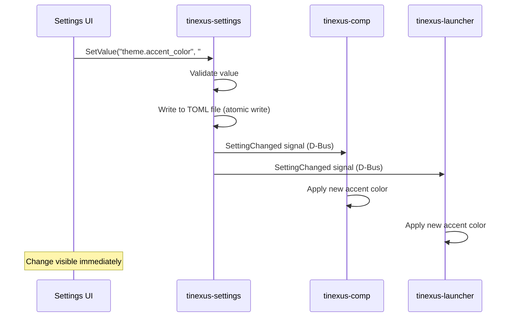

### 13.3 Atomic Settings Write

To prevent settings corruption:
1. Write new config to `filename.toml.tmp`
2. fsync `filename.toml.tmp`
3. Rename `filename.toml.tmp` → `filename.toml` (atomic on POSIX)
4. Never write directly to the live file

---

## 14. IPC Design

### 14.1 D-Bus Service Registry

| Bus Name | Type | Service |
|---|---|---|
| `io.Tinexus Shell.Compositor` | Session | tinexus-comp |
| `io.Tinexus Shell.Session` | Session | tinexus-session |
| `io.Tinexus Shell.Launcher` | Session | tinexus-launcher |
| `io.Tinexus Shell.Settings` | Session | tinexus-settings |
| `io.Tinexus Shell.Notifications` | Session | tinexus-notif |
| `io.Tinexus Shell.Clipboard` | Session | tinexus-clip |
| `io.Tinexus Shell.Indexer` | Session | tinexus-indexer |
| `org.freedesktop.Notifications` | Session | tinexus-notif (alias) |

### 14.2 High-Frequency IPC: Unix Domain Sockets

For interactions that require sub-millisecond latency and high message frequency (e.g., compositor → launcher frame sync, real-time search result streaming), use Unix domain sockets with a custom binary protocol:

**Socket locations:**
- `/run/user/{uid}/Tinexus Shell/compositor.sock`
- `/run/user/{uid}/Tinexus Shell/launcher.sock`
- `/run/user/{uid}/Tinexus Shell/indexer.sock`

**Message format (binary, little-endian):**
```
[4 bytes: message type]
[4 bytes: payload length]
[N bytes: payload (MessagePack encoded)]
```

### 14.3 IPC Security

- All D-Bus services use **Unix socket peer credentials** for caller identification
- Services check UID of caller before executing privileged operations
- `polkit` used for system-level actions (shutdown, restart) requiring privilege escalation
- No network sockets — all IPC is local only

---

## 15. Thread Model

### 15.1 tinexus-comp Thread Model

| Thread | Name | Role |
|---|---|---|
| Main | `comp-main` | Wayland event loop, protocol handling |
| Render | `comp-render` | GPU rendering, frame submission |
| Input | `comp-input` | libinput event processing |
| Backend | `comp-backend` | DRM/KMS, hotplug detection |

**Rule:** No UI work on non-main threads. No GPU calls outside the render thread.

### 15.2 tinexus-launcher Thread Model

| Thread | Name | Role |
|---|---|---|
| Main/UI | `launcher-ui` | Qt event loop, QML rendering |
| Search | `launcher-search` | Search provider queries (async) |
| Indexer Client | `launcher-idx` | D-Bus communication with indexer |
| D-Bus | `launcher-dbus` | D-Bus event handling (Qt D-Bus) |

**Rule:** All search is performed off the UI thread. Results are delivered to UI thread via Qt signals.

### 15.3 tinexus-indexer Thread Model

| Thread | Name | Role |
|---|---|---|
| Main | `indexer-main` | D-Bus event loop, result serving |
| FS Watcher | `indexer-watch` | inotify event processing |
| Index Builder | `indexer-build` | Background index construction/update |

---

## 16. Memory Strategy

### 16.1 C++ Memory Management Rules

1. **No raw `new`/`delete`** in Tinexus Shell code (except RAII wrappers for C library types)
2. **Ownership:** Use `std::unique_ptr<T>` for exclusive ownership
3. **Shared ownership:** Use `std::shared_ptr<T>` only when truly required; document why
4. **C library handles:** Always wrapped in RAII:
   ```cpp
   struct WlrOutputDeleter {
       void operator()(wlr_output* o) { wlr_output_destroy(o); }
   };
   using UniqueOutput = std::unique_ptr<wlr_output, WlrOutputDeleter>;
   ```
5. **Compositor buffers:** Buffer lifecycle managed by wlroots. Never hold references across frame boundaries.

### 16.2 GPU Memory Management

- Wallpaper textures: Load on demand, release on wallpaper change
- App icon textures: Loaded into GPU on first display, cached in GPU memory (LRU, max 64MB)
- Launcher blur texture: Recomputed when launcher opens (or cached if compositor provides snapshot)

### 16.3 App Index Memory Budget

| Component | Memory Target |
|---|---|
| Raw app index (10,000 entries) | ≤ 5MB |
| Trigram index | ≤ 3MB |
| Icon name cache | ≤ 1MB |
| Frequency/recency data | ≤ 512KB |
| **Total indexer** | **≤ 10MB** |

---

## 17. Caching Strategy

### 17.1 Cache Taxonomy

| Cache | Location | Persistence | Eviction |
|---|---|---|---|
| App index | RAM (tinexus-indexer) | Rebuilt on start | N/A — full rebuild |
| Icon cache | `~/.cache/Tinexus Shell/icons/` | Persistent | LRU, max 200MB |
| Thumbnail cache | `~/.cache/Tinexus Shell/thumbnails/` | Persistent | LRU, max 500MB |
| Clipboard history | `~/.local/share/Tinexus Shell/clipboard.db` | Session (cleared on logout) | 50 entries FIFO |
| Usage history | `~/.local/share/Tinexus Shell/usage.db` | Persistent | Never — small by design |
| Wallpaper texture | GPU VRAM | Session | Replaced on change |

### 17.2 Cache Invalidation Rules

- **App index:** Invalidated by inotify events on `/usr/share/applications/` and `~/.local/share/applications/`
- **Icon cache:** Invalidated by mtime change on source icon file
- **Thumbnail cache:** Invalidated by mtime change on source file

---

## 18. Future AI Layer

> This section documents the architecture for the v2.0 AI Layer to ensure v1.0 design does not preclude it.

### 18.1 Design Constraints

1. AI must run entirely **locally** (no cloud API calls)
2. AI model must use **≤2GB RAM** and **≤2GB disk**
3. AI response time target: **≤500ms** for command parsing
4. AI must be implemented as a **search provider plugin** — no changes to launcher core
5. AI model loading must be **lazy** (only when user first uses AI feature)

### 18.2 AI Provider Architecture

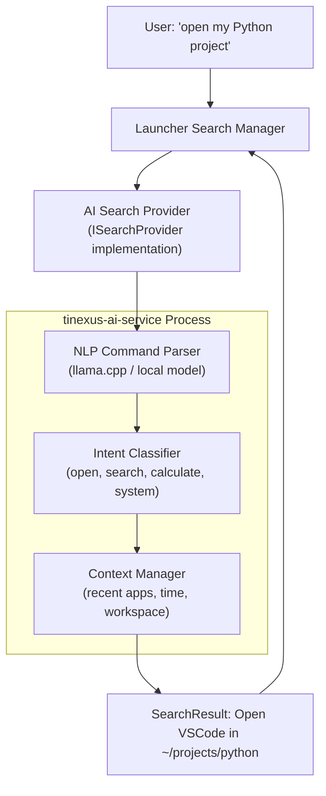

### 18.3 v1.0 AI Preparation Checklist

These items in v1.0 must be designed to support the future AI layer without modifications:

- [ ] `ISearchProvider` interface must be finalized and stable
- [ ] Launcher search manager must support **async providers** with timeout
- [ ] Result type system must support **AI-generated actions** (not just app launches)
- [ ] Usage history API must be accessible to the AI context manager

---

## 19. Future Plugin Layer

### 19.1 Plugin Architecture Philosophy

> Plugins MUST NOT run in the compositor or launcher process. Ever.

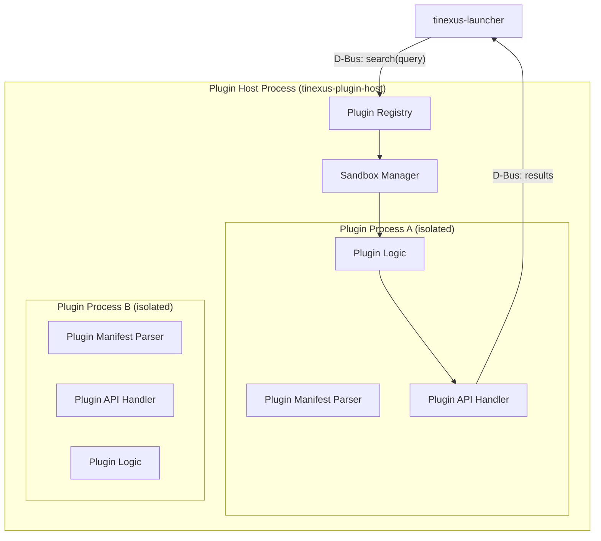

### 19.2 Plugin Security Model

- Plugin process has restricted filesystem access (only its own data directory)
- Plugin process cannot call `exec()` or `fork()` (seccomp-bpf filter)
- Plugin process has no network access by default (requires explicit permission grant)
- Plugin communication with launcher: JSON over Unix domain socket (timeout: 200ms)
- Plugin crash: Plugin host marks it failed, notifies launcher, continues operating

### 19.3 Plugin Manifest Format (v2.0 Draft)

```toml
[plugin]
id = "io.example.MyPlugin"
name = "My Plugin"
version = "1.0.0"
author = "Example Developer"
description = "Does something useful"
min_Tinexus Shell_version = "2.0.0"

[permissions]
network = false
filesystem = ["~/.local/share/my-plugin"]
clipboard_read = false
clipboard_write = false

[search]
provides_search = true
query_prefix = "!my"  # optional, narrows when this plugin is queried

[executable]
binary = "my-plugin-binary"
```

---

## 20. Lifecycle Diagram

### 20.1 Component Lifecycle

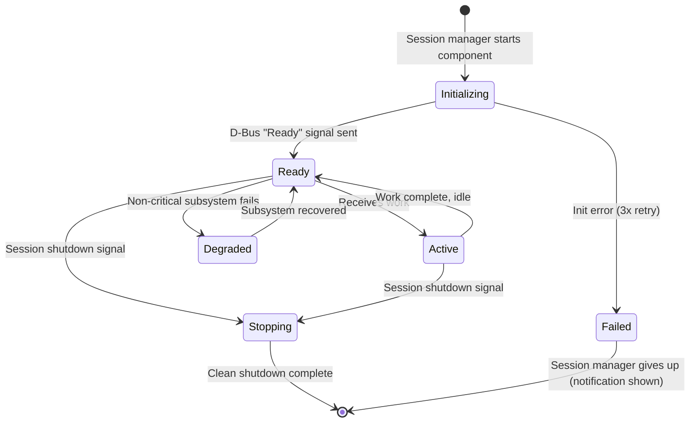

### 20.2 Full Session Lifecycle

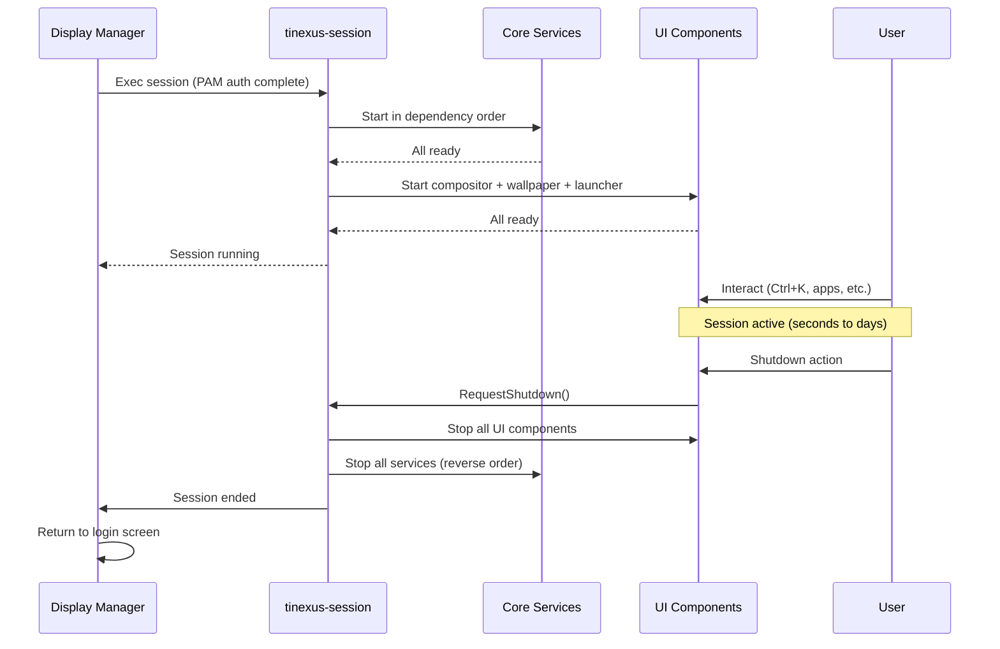

---

*Document End: 03_SYSTEM_ARCHITECTURE.md*  
*Next: 04_FOLDER_STRUCTURE.md*
