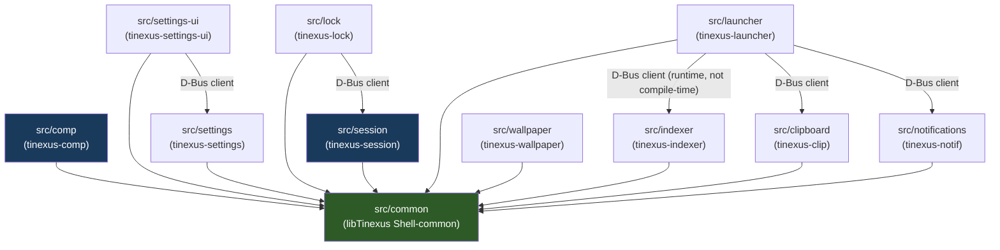

# Tinexus Platform — Monorepo Folder Structure

> **Document:** 04_FOLDER_STRUCTURE.md  
> **Version:** 1.1.0  
> **Status:** FROZEN  
> **Classification:** Public — Open Source  
> **Depends on:** 03_SYSTEM_ARCHITECTURE.md, 09_BUILD_SYSTEM.md

---

## Table of Contents

**P3: Separation of Interface from Implementation** — Public headers (`.hpp`) live in `include/`. Implementation files (`.cpp`) live in `src/`. This enforces API discipline.

**P4: No Circular Dependencies** — The folder structure enforces the dependency hierarchy. `core/` components may not include headers from `ui/`. `comp/` (compositor) may not include headers from `launcher/`.

**P5: Buildability** — Every subdirectory containing source code has its own `CMakeLists.txt`. The top-level `CMakeLists.txt` only calls `add_subdirectory()`.

---

## 2. Repository Root Layout

```
Tinexus Platform/
│
├── 📁 src/                     # All source code (see Section 3)
├── 📁 include/                 # Public headers (exported API)
├── 📁 docs/                    # Project documentation (see Section 4)
├── 📁 tests/                   # All tests (see Section 5)
├── 📁 cmake/                   # CMake modules and helper scripts
├── 📁 packaging/               # Distribution packaging specs
├── 📁 assets/                  # Icons, wallpapers, QML resources
├── 📁 scripts/                 # Developer scripts
├── 📁 .github/                 # CI/CD workflows
├── 📁 third_party/             # Vendored dependencies (minimal)
│
├── 📄 CMakeLists.txt           # Root CMake entry point
├── 📄 CMakePresets.json        # Build presets (debug, release, ci)
├── 📄 .clang-format            # Clang-format style definition
├── 📄 .clang-tidy              # Clang-tidy check configuration
├── 📄 .editorconfig            # Editor config (tabs, line endings)
├── 📄 .gitignore               # Git ignore rules
├── 📄 CHANGELOG.md             # Version-by-version changelog
├── 📄 CONTRIBUTING.md          # Contributor guide
├── 📄 LICENSE                  # License file (GPL-2+ / Apache-2.0)
├── 📄 README.md                # Project overview
├── 📄 SECURITY.md              # Security disclosure policy
└── 📄 VERSION                  # Current version string (e.g., "0.1.0")
```

---

## 3. Source Directory Breakdown (`src/`)

```
src/
│
├── 📁 common/                  # Shared core library (libtinexus-common)
│   ├── 📁 include/common/      # Public shared headers
│   │   ├── version.hpp
│   │   ├── result.hpp
│   │   ├── logger.hpp
│   │   ├── lockfree_queue.hpp
│   │   ├── small_object_pool.hpp
│   │   ├── arena_allocator.hpp
│   │   ├── string_interner.hpp
│   │   └── peer_credentials.hpp
│   ├── logger.cpp
│   ├── string_interner.cpp
│   ├── peer_credentials.cpp
│   └── CMakeLists.txt
│
├── 📁 serviced/                # Platform Supervisor (tinexus-serviced)
│   ├── main.cpp
│   └── CMakeLists.txt
│
├── 📁 ipcd/                    # Central IPC Router & Broker (tinexus-ipcd)
│   ├── main.cpp
│   └── CMakeLists.txt
│
├── 📁 searchd/                 # Search Engine Daemon (tinexus-searchd)
│   ├── 📁 ranking/             # Search Ranking Engine
│   ├── 📁 providers/           # Built-in Search Providers
│   ├── main.cpp
│   └── CMakeLists.txt
│
├── 📁 comp/                    # Wayland Compositor (tinexus-comp)
│   ├── 📁 backend/             # DRM/KMS, headless backend abstraction
│   ├── 📁 input/               # libinput event handling, seat management
│   ├── 📁 output/              # Monitor/output management, HiDPI
│   ├── 📁 render/              # Vulkan rendering pipeline
│   ├── 📁 window/              # Workspace manager & window state machine
│   ├── main.cpp
│   └── CMakeLists.txt
│
├── 📁 launcher/                # Command Palette UI (tinexus-launcher)
│   ├── 📁 qml/                 # QML user interface components
│   ├── main.cpp
│   └── CMakeLists.txt
│
├── 📁 settings/                # Settings Daemon (tinexus-settings)
│   ├── config_store.cpp
│   ├── main.cpp
│   └── CMakeLists.txt
│
├── 📁 settings-ui/             # Settings Graphical App (tinexus-settings-ui)
│   ├── main.cpp
│   └── CMakeLists.txt
│
├── 📁 notifications/           # Notification Daemon (tinexus-notif)
│   ├── main.cpp
│   └── CMakeLists.txt
│
├── 📁 clipboard/               # Clipboard Manager (tinexus-clip)
│   ├── main.cpp
│   └── CMakeLists.txt
│
├── 📁 indexer/                 # App Indexer (tinexus-indexer)
│   ├── main.cpp
│   └── CMakeLists.txt
│
├── 📁 wallpaper/               # Wallpaper Engine (tinexus-wallpaper)
│   ├── main.cpp
│   └── CMakeLists.txt
│
├── 📁 lock/                    # Lock Screen (tinexus-lock)
│   ├── main.cpp
│   └── CMakeLists.txt
│
└── 📁 sdk/                     # Plugin SDK Library & Headers
    ├── 📁 include/sdk/
    └── CMakeLists.txt
```dexer/
│   ├── desktop_parser.cpp      # .desktop file parser (XDG compliant)
│   ├── app_index.cpp           # In-memory index structure
│   ├── trigram_index.cpp       # Trigram search index
│   ├── fs_watcher.cpp          # inotify watcher for app directories
│   ├── indexer_service.cpp     # D-Bus service
│   ├── main.cpp
│   └── CMakeLists.txt
│
├── 📁 wallpaper/               # Wallpaper engine (tinexus-wallpaper)
│   ├── image_loader.cpp        # Image loading (Qt QImageReader)
│   ├── wallpaper_surface.cpp   # Layer-shell surface management
│   ├── crossfade_animator.cpp  # Transition animation
│   ├── config_watcher.cpp      # TOML config watcher
│   ├── main.cpp
│   └── CMakeLists.txt
│
├── 📁 lock/                    # Lock screen (tinexus-lock)
│   ├── 📁 qml/
│   │   ├── LockScreen.qml
│   │   └── PasswordPrompt.qml
│   ├── pam_authenticator.cpp   # PAM challenge/response
│   ├── lock_surface.cpp        # ext-session-lock-v1 surface
│   ├── main.cpp
│   └── CMakeLists.txt
│
└── 📁 common/                  # Shared library used by all components
    ├── 📁 include/common/
    │   ├── dbus_utils.hpp      # D-Bus helper functions (STABLE)
    │   ├── logging.hpp         # Structured logging API (STABLE)
    │   ├── config_types.hpp    # Shared config type definitions (STABLE)
    │   ├── result.hpp          # std::expected-like Result<T,E> type (STABLE)
    │   └── version.hpp         # Version constants (generated by CMake)
    ├── dbus_utils.cpp
    ├── logging.cpp             # spdlog-based structured logger → systemd journal
    └── CMakeLists.txt
```

---

## 4. Documentation Directory (`docs/`)

```
docs/
│
├── 📁 adr/                     # Architecture Decision Records
│   ├── ADR-000-architecture-review.md
│   ├── ADR-001-wlroots-compositor.md
│   ├── ADR-002-dbus-ipc.md
│   ├── ADR-003-qt6-ui.md
│   ├── ADR-004-toml-config.md
│   ├── ADR-005-plugin-isolation.md
│   ├── ADR-006-search-providers.md
│   ├── ADR-007-optional-dock.md
│   ├── ADR-008-semver.md
│   ├── ADR-009-cmake-presets.md
│   └── ADR-010-local-ai-only.md
│
├── 📁 api/                     # Generated API documentation (Doxygen)
│   └── (generated, not committed)
│
├── 📁 protocols/               # Custom Wayland protocol XML files
│   └── Tinexus Shell-compositor-v1.xml
│
├── 00_ARCHITECTURE_REVIEW.md
├── 01_VISION.md
├── 02_REQUIREMENTS.md
├── 03_SYSTEM_ARCHITECTURE.md
├── 04_FOLDER_STRUCTURE.md      # This document
├── 05_UI_UX_GUIDELINES.md
├── 06_COMPONENT_DESIGN.md
├── 07_SECURITY.md
├── 08_PERFORMANCE.md
├── 09_BUILD_SYSTEM.md
└── 10_ROADMAP.md
```

### ADR File Template

Every `docs/adr/ADR-NNN-title.md` must follow this template:

```markdown
# ADR-NNN: [Title]

**Status:** [PROPOSED | ACCEPTED | DEPRECATED | SUPERSEDED by ADR-XXX]
**Date:** YYYY-MM-DD
**Author:** [Name / Role]

## Context
[Why this decision was needed]

## Decision
[What was decided]

## Consequences
[What becomes easier / harder as a result]

## Alternatives Considered
[What else was evaluated and why it was rejected]
```

---

## 5. Tests Directory (`tests/`)

```
tests/
│
├── 📁 unit/                    # Unit tests (no hardware, no D-Bus)
│   ├── 📁 comp/
│   │   ├── test_window_state_machine.cpp
│   │   └── test_output_layout.cpp
│   ├── 📁 launcher/
│   │   ├── test_search_manager.cpp
│   │   ├── test_result_ranker.cpp
│   │   ├── test_calculator_provider.cpp
│   │   └── test_fuzzy_search.cpp
│   ├── 📁 indexer/
│   │   ├── test_desktop_parser.cpp
│   │   └── test_trigram_index.cpp
│   ├── 📁 clipboard/
│   │   ├── test_sensitive_detector.cpp
│   │   └── test_history_store.cpp
│   ├── 📁 common/
│   │   ├── test_result_type.cpp
│   │   └── test_config_types.cpp
│   └── CMakeLists.txt
│
├── 📁 integration/             # Integration tests (real D-Bus, headless compositor)
│   ├── 📁 session/
│   │   ├── test_daemon_start_stop.cpp
│   │   └── test_crash_recovery.cpp
│   ├── 📁 launcher/
│   │   ├── test_launcher_open_close.cpp
│   │   └── test_search_end_to_end.cpp
│   ├── 📁 notifications/
│   │   └── test_notification_flow.cpp
│   └── CMakeLists.txt
│
├── 📁 performance/             # Performance regression tests
│   ├── bench_search_latency.cpp
│   ├── bench_launcher_open_time.cpp
│   └── CMakeLists.txt
│
├── 📁 mocks/                   # Shared mock objects
│   ├── mock_search_provider.hpp
│   ├── mock_dbus_service.hpp
│   └── CMakeLists.txt
│
└── CMakeLists.txt
```

### Test Naming Convention

| Type | File Name Pattern | Example |
|---|---|---|
| Unit test | `test_{component}_{function}.cpp` | `test_trigram_index_search.cpp` |
| Integration test | `test_{flow}.cpp` | `test_launcher_open_close.cpp` |
| Benchmark | `bench_{metric}.cpp` | `bench_search_latency.cpp` |

---

## 6. Build Infrastructure (`cmake/`)

```
cmake/
│
├── modules/
│   ├── FindWlroots.cmake       # Locate wlroots via pkg-config
│   ├── FindWaylandProtocols.cmake
│   ├── FindLibinput.cmake
│   └── WaylandProtocol.cmake  # Helper to generate protocol bindings
│
├── options.cmake               # All CMake option() declarations
├── version.cmake               # Version string generation from VERSION file
├── sanitizers.cmake            # ASan/UBSan/TSan setup
├── warnings.cmake              # Compiler warning flags (-Wall, -Wextra, etc.)
└── install_rules.cmake         # install() targets for all components
```

---

## 7. Packaging Directory (`packaging/`)

```
packaging/
│
├── 📁 flatpak/
│   └── io.Tinexus Shell.Launcher.yaml    # Flatpak manifest (launcher only, for non-native install)
│
├── 📁 debian/
│   ├── control
│   ├── rules
│   ├── Tinexus Shell-core.install
│   └── changelog
│
├── 📁 rpm/
│   └── Tinexus Shell.spec
│
├── 📁 arch/
│   └── PKGBUILD
│
└── 📁 systemd/
    ├── Tinexus Shell-session.service       # systemd user service
    ├── Tinexus Shell-comp.service
    ├── Tinexus Shell-notif.service
    ├── Tinexus Shell-settings.service
    └── Tinexus Shell-clip.service
```

---

## 8. Assets Directory (`assets/`)

```
assets/
│
├── 📁 icons/
│   ├── 📁 Tinexus Shell/           # App icon theme (hicolor compatible)
│   │   ├── 16x16/
│   │   ├── 32x32/
│   │   ├── 48x48/
│   │   ├── 128x128/
│   │   └── scalable/           # SVG icons (preferred)
│   └── index.theme
│
├── 📁 wallpapers/
│   ├── Tinexus Shell-default.jpg   # Default dark wallpaper
│   └── Tinexus Shell-light.jpg     # Light variant
│
├── 📁 fonts/
│   └── (bundled fonts, if any; prefer system fonts)
│
├── 📁 sounds/
│   └── (notification sounds, v1.1+)
│
└── 📁 themes/
    ├── dark.toml               # Dark theme token file
    ├── light.toml              # Light theme token file
    └── high-contrast.toml      # High contrast theme
```

---

## 9. Scripts Directory (`scripts/`)

```
scripts/
│
├── setup-dev.sh                # One-command dev environment setup
├── build.sh                    # Build wrapper (calls cmake --preset)
├── run-tests.sh                # Run all tests with coverage
├── generate-protocols.sh       # Regenerate Wayland protocol bindings
├── check-style.sh              # Run clang-format + clang-tidy
├── generate-docs.sh            # Run Doxygen
└── create-release.sh           # Tag + generate changelog
```

---

## 10. CI/CD Directory (`.github/`)

```
.github/
│
├── 📁 workflows/
│   ├── ci.yml                  # Main CI: build + test on push/PR
│   ├── release.yml             # Release pipeline: tag → packages
│   ├── docs.yml                # Documentation generation
│   └── security.yml            # Dependency audit, CodeQL scan
│
├── 📁 ISSUE_TEMPLATE/
│   ├── bug_report.md
│   ├── feature_request.md
│   └── security_report.md      # Points to SECURITY.md
│
└── PULL_REQUEST_TEMPLATE.md
```

---

## 11. Configuration Files at Root

| File | Purpose |
|---|---|
| `CMakeLists.txt` | Root build file — calls `add_subdirectory()` only |
| `CMakePresets.json` | Debug, Release, CI build presets |
| `.clang-format` | LLVM-based style with project modifications |
| `.clang-tidy` | Enabled checks: cppcoreguidelines, modernize, performance, readability |
| `.editorconfig` | Spaces (4), UTF-8, LF line endings |
| `VERSION` | Single source of truth for version string |

### `.clang-format` Key Settings

```yaml
BasedOnStyle: LLVM
IndentWidth: 4
ColumnLimit: 100
PointerAlignment: Left
AllowShortFunctionsOnASingleLine: None
BraceWrapping:
  AfterFunction: true
  AfterClass: true
```

---

## 12. Naming Conventions

### 12.1 File Naming

| Type | Convention | Example |
|---|---|---|
| C++ source file | `snake_case.cpp` | `window_manager.cpp` |
| C++ header file | `snake_case.hpp` | `window_manager.hpp` |
| QML file | `PascalCase.qml` | `LauncherWindow.qml` |
| CMake file | `CMakeLists.txt` or `name.cmake` | `sanitizers.cmake` |
| Documentation | `NN_TITLE.md` | `03_SYSTEM_ARCHITECTURE.md` |
| ADR | `ADR-NNN-slug.md` | `ADR-001-wlroots-compositor.md` |
| Test file | `test_what_it_tests.cpp` | `test_trigram_search.cpp` |
| Config file | `component.toml` | `compositor.toml` |
| Service file | `Tinexus Shell-name.service` | `Tinexus Shell-notif.service` |

### 12.2 C++ Naming Conventions

| Entity | Convention | Example |
|---|---|---|
| Class | `PascalCase` | `SearchManager` |
| Method | `camelCase` | `searchAsync()` |
| Member variable | `m_camelCase` | `m_searchResults` |
| Static variable | `s_camelCase` | `s_instance` |
| Constant | `UPPER_SNAKE_CASE` | `MAX_RESULTS` |
| Namespace | `Tinexus Shell::module` | `Tinexus Shell::launcher` |
| Interface class | `IName` | `ISearchProvider` |
| Enum class | `PascalCase` | `WindowState::Maximized` |
| Template parameter | `TName` | `TResult` |

### 12.3 QML Naming Conventions

| Entity | Convention | Example |
|---|---|---|
| Component id | `camelCase` | `id: searchBar` |
| Property | `camelCase` | `property var resultModel` |
| Signal | `camelCase` | `signal resultSelected(var result)` |
| JavaScript function | `camelCase` | `function openLauncher()` |

### 12.4 D-Bus Interface Naming

Pattern: `io.Tinexus Shell.ComponentName.InterfaceName`

| Interface | Full Name |
|---|---|
| Compositor control | `io.Tinexus Shell.Compositor` |
| Shortcut events | `io.Tinexus Shell.Compositor.Shortcuts` |
| Settings management | `io.Tinexus Shell.Settings` |
| Launcher control | `io.Tinexus Shell.Launcher` |
| Clipboard service | `io.Tinexus Shell.Clipboard` |
| Indexer service | `io.Tinexus Shell.Indexer` |
| Session control | `io.Tinexus Shell.Session` |

---

## 13. Component Ownership Matrix

| Component | Directory | Process Binary | Team Owner |
|---|---|---|---|
| Compositor | `src/comp/` | `tinexus-comp` | Core Team |
| Launcher | `src/launcher/` | `tinexus-launcher` | UI Team |
| Session Manager | `src/session/` | `tinexus-session` | Core Team |
| Settings Daemon | `src/settings/` | `tinexus-settings` | Core Team |
| Settings UI | `src/settings-ui/` | `tinexus-settings-ui` | UI Team |
| Notification Daemon | `src/notifications/` | `tinexus-notif` | Services Team |
| Clipboard Manager | `src/clipboard/` | `tinexus-clip` | Services Team |
| App Indexer | `src/indexer/` | `tinexus-indexer` | Services Team |
| Wallpaper Engine | `src/wallpaper/` | `tinexus-wallpaper` | UI Team |
| Lock Screen | `src/lock/` | `tinexus-lock` | Security Team |
| Common Library | `src/common/` | `libTinexus Shell-common.so` | Core Team |

### Ownership Rules

1. A PR modifying code in a component **must** be reviewed by that component's owner
2. A PR modifying `src/common/` or `include/` **must** be reviewed by the Core Team
3. A PR modifying any `include/*/` public header requires **two approvals** (breaking changes)
4. No component may include headers from a component it does not depend on

---

## 14. Dependency Graph



**Dependency Rules:**
- `src/common` has **zero** dependencies on other `src/` directories
- `src/comp` has **zero** dependencies on `src/launcher` or any UI component
- Compile-time dependencies are minimal — prefer runtime D-Bus communication
- No circular dependencies between any source directories

---

*Document End: 04_FOLDER_STRUCTURE.md*  
*Next: 05_UI_UX_GUIDELINES.md*
