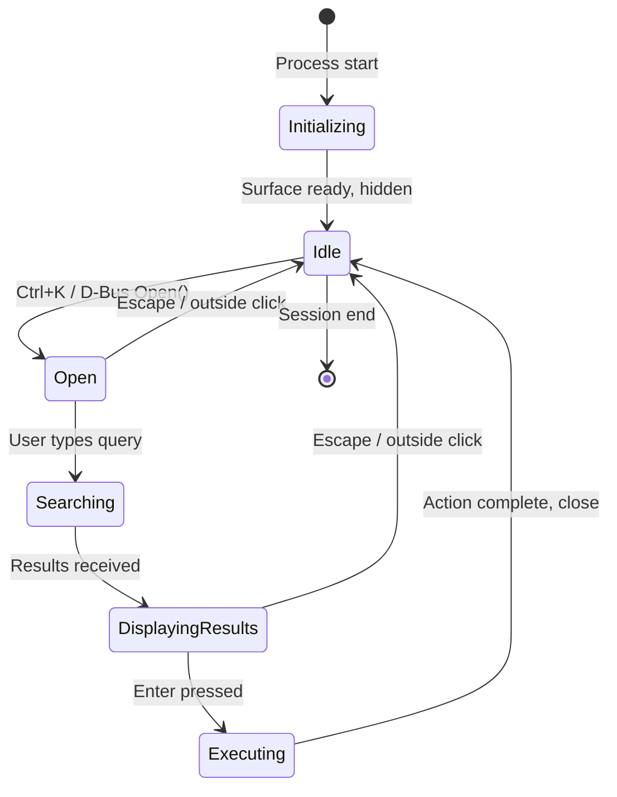
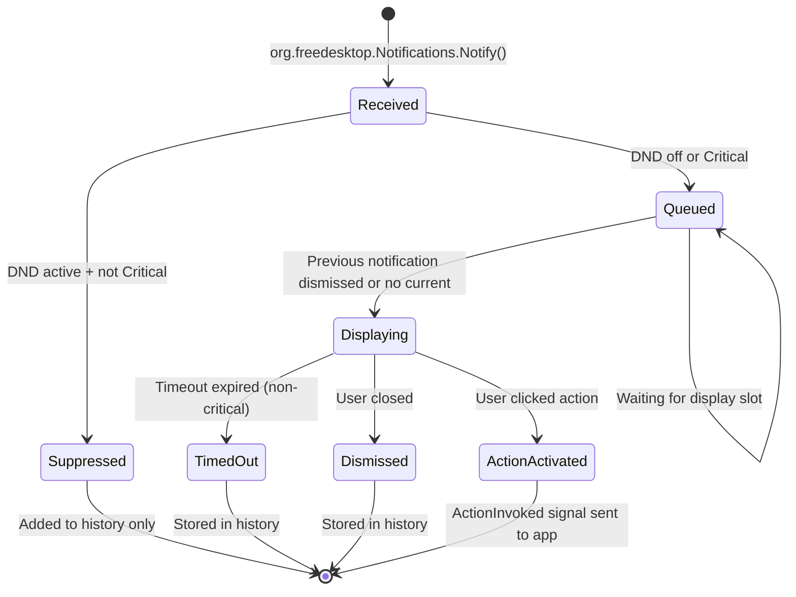

# Tinexus Shell — Component Design Specification

> **Document:** 06_COMPONENT_DESIGN.md  
> **Version:** 1.0.0  
> **Status:** FROZEN  
> **Classification:** Public — Open Source  
> **Depends on:** 03_SYSTEM_ARCHITECTURE.md, 05_UI_UX_GUIDELINES.md

---

## Table of Contents

1. [Component Design Principles](#1-component-design-principles)
2. [Launcher Component](#2-launcher-component)
3. [Wallpaper Engine Component](#3-wallpaper-engine-component)
4. [Search Engine Component](#4-search-engine-component)
5. [Power/Session Component](#5-powersession-component)
6. [Notification Component](#6-notification-component)
7. [Settings Component](#7-settings-component)
8. [Animation Component](#8-animation-component)
9. [Theme Component](#9-theme-component)
10. [App Indexer Component](#10-app-indexer-component)
11. [Shortcut Manager Component](#11-shortcut-manager-component)
12. [Window Controller Component](#12-window-controller-component)
13. [Clipboard Component](#13-clipboard-component)
14. [Plugin System Component](#14-plugin-system-component)
15. [Future AI Component](#15-future-ai-component)

---

## 1. Component Design Principles

### 1.1 Component Contract

Every Tinexus Shell component must:

1. **Have a clear single responsibility** — Components that do two things should be two components
2. **Expose a stable D-Bus interface** — Internal implementation may change; the D-Bus interface must not change without a version bump
3. **Be testable in isolation** — Every component must work without other components being available (graceful degradation)
4. **Produce structured logs** — All logs go to systemd journal in JSON format
5. **Respect its resource budget** — Memory and CPU budgets from `08_PERFORMANCE.md` are enforced

### 1.2 Component Documentation Template

Each component section follows this structure:
- **Responsibility** — What this component does and only this
- **Process model** — How it runs
- **Public API** — D-Bus interface
- **Internal design** — Key data structures and algorithms
- **State machine** — Lifecycle states
- **Dependencies** — What it needs to function
- **Error handling** — What can go wrong and how it's handled
- **Testing strategy** — How to verify it works

---

## 2. Launcher Component

### 2.1 Responsibility

The Launcher component (`tinexus-launcher`) is the **primary user interface** of Tinexus Shell. It is a Wayland surface that appears as an overlay on top of all applications when triggered. It provides:
- Application search and launch
- System action execution
- Clipboard history access
- Recent files access
- Inline calculation
- Notification history access

### 2.2 Process Model

```
tinexus-launcher (process)
├── Main Thread (Qt event loop)
│   ├── QML engine
│   ├── D-Bus server (io.Tinexus Shell.Launcher)
│   └── Wayland surface management (layer-shell)
├── Search Thread
│   ├── Query processing
│   ├── Provider fan-out
│   └── Result aggregation → Main thread via Qt signal
└── D-Bus Client Thread
    ├── Compositor shortcut subscription
    ├── Indexer client
    └── Clipboard client
```

### 2.3 D-Bus Interface

```xml
<!-- io.Tinexus Shell.Launcher -->
<interface name="io.Tinexus Shell.Launcher">

  <!-- Methods -->
  <method name="Open">
    <!-- Opens the launcher surface -->
  </method>
  
  <method name="Close">
    <!-- Closes/hides the launcher surface -->
  </method>
  
  <method name="OpenWithQuery">
    <arg name="query" type="s" direction="in"/>
    <!-- Opens launcher with pre-filled query -->
  </method>
  
  <!-- Signals -->
  <signal name="LauncherOpened"/>
  <signal name="LauncherClosed"/>
  <signal name="AppLaunched">
    <arg name="app_id" type="s"/>
    <arg name="exec_path" type="s"/>
  </signal>
  
  <!-- Properties -->
  <property name="IsVisible" type="b" access="read"/>
  <property name="CurrentQuery" type="s" access="read"/>
  
</interface>
```

### 2.4 Internal Design

#### 2.4.1 LauncherController Class

```
LauncherController
├── m_waylandSurface: LayerShellSurface
├── m_searchManager: SearchManager
├── m_resultRanker: ResultRanker
├── m_usageHistory: UsageHistory
├── m_dbusService: LauncherDBusService
│
├── open() → triggers surface visibility + focus
├── close() → hides surface, clears query
├── onQueryChanged(query: str) → triggers async search
├── onResultActivated(result: SearchResult) → executes result
└── onShortcutReceived() → D-Bus slot from compositor
```

#### 2.4.2 Search Flow

```
User types "fire"
    ↓
[Main Thread] LauncherController::onQueryChanged("fire")
    ↓
[Main Thread] SearchManager::searchAsync("fire")
    ↓
[Search Thread] Fan out to all providers (parallel):
    ├── AppProvider::search("fire")          → [Firefox, Firebird, ...]
    ├── SystemActionsProvider::search("fire") → []
    ├── CalculatorProvider::canHandle("fire") → false
    └── ClipboardProvider (only if tab = Clipboard) → skipped
    ↓
[Search Thread] All results collected
    ↓
[Search Thread] ResultRanker::rank(all_results, "fire", usage_history)
    ↓
[Main Thread via signal] QML receives ranked results
    ↓
QML renders result list with stagger animation
```

#### 2.4.3 Layer-Shell Surface Setup

```cpp
// Pseudocode: how launcher surface is configured
surface.setLayer(ZWLR_LAYER_SHELL_V1_LAYER_OVERLAY);
surface.setAnchor(ZWLR_LAYER_SURFACE_V1_ANCHOR_TOP |
                  ZWLR_LAYER_SURFACE_V1_ANCHOR_BOTTOM |
                  ZWLR_LAYER_SURFACE_V1_ANCHOR_LEFT |
                  ZWLR_LAYER_SURFACE_V1_ANCHOR_RIGHT);
surface.setKeyboardInteractivity(ZWLR_LAYER_SURFACE_V1_KEYBOARD_INTERACTIVITY_ON_DEMAND);
surface.setSize(0, 0);  // Full screen passthrough (rendering handled by QML)
surface.setExclusiveZone(-1);  // Does not push other surfaces
```

### 2.5 State Machine



### 2.6 Dependencies

| Dependency | Type | Required? | Fallback |
|---|---|---|---|
| `tinexus-comp` | D-Bus (shortcut signal) | Yes | Cannot open without compositor |
| `tinexus-indexer` | D-Bus (search results) | Yes | App search disabled, show empty |
| `tinexus-clip` | D-Bus (clipboard data) | No | Clipboard section hidden |
| `tinexus-settings` | D-Bus (theme, config) | No | Use built-in defaults |
| `org.freedesktop.Notifications` | D-Bus | No | Notification section hidden |

### 2.7 Error Handling

| Error | Behavior |
|---|---|
| Indexer not available | Show "Search unavailable" in result area |
| Search timeout (>200ms) | Show loading spinner, cancel after 500ms |
| App launch fails | Notification: "{App} failed to launch" |
| Layer-shell not supported | Fall back to regular window (center of screen) |

---

## 3. Wallpaper Engine Component

### 3.1 Responsibility

`tinexus-wallpaper` renders the desktop background as a Wayland layer-shell surface at the `BACKGROUND` layer. It handles:
- Loading and decoding wallpaper images
- Rendering at correct resolution and scaling mode
- Crossfade transitions when wallpaper changes
- Per-monitor wallpaper configuration

### 3.2 Process Model

```
tinexus-wallpaper (process)
├── Main Thread
│   ├── Wayland event loop
│   ├── Layer-shell surface per monitor
│   └── D-Bus service (io.Tinexus Shell.Wallpaper)
├── Loader Thread
│   ├── Image decode (Qt QImageReader)
│   └── GPU texture upload
└── Config Watcher Thread
    └── inotify on wallpaper.toml
```

### 3.3 D-Bus Interface

```xml
<interface name="io.Tinexus Shell.Wallpaper">
  <method name="SetWallpaper">
    <arg name="path" type="s" direction="in"/>
    <arg name="output_name" type="s" direction="in"/> <!-- empty = all monitors -->
    <arg name="mode" type="s" direction="in"/> <!-- fill/fit/stretch/center/tile -->
  </method>
  
  <method name="GetCurrentWallpaper">
    <arg name="output_name" type="s" direction="in"/>
    <arg name="path" type="s" direction="out"/>
  </method>
  
  <signal name="WallpaperChanged">
    <arg name="output_name" type="s"/>
    <arg name="new_path" type="s"/>
  </signal>
</interface>
```

### 3.4 Image Loading Pipeline

```
File path received
    ↓
[Loader Thread] Validate path (exists, readable, valid image format)
    ↓
[Loader Thread] Decode with QImageReader (streaming decode for large files)
    ↓
[Loader Thread] Scale to monitor resolution (maintaining aspect ratio)
    ↓
[Main Thread] Upload to GPU texture (QSGTexture / OpenGL)
    ↓
[Main Thread] Crossfade animation: old_texture → new_texture
    ↓
[Main Thread] Release old texture
```

### 3.5 Performance Optimization

- Wallpaper texture is GPU-resident for the session duration (no re-uploading)
- If monitor resolution changes (mode change, DPI change), texture is re-rendered
- Image decode is never on the render thread (prevents frame drops)
- Large images (>4K) are downsampled before GPU upload if monitor is smaller

---

## 4. Search Engine Component

### 4.1 Responsibility

The Search Engine is an internal component of `tinexus-launcher`. It manages the `ISearchProvider` registry, fans queries out to providers, collects results, and delivers them to the `ResultRanker`.

### 4.2 ISearchProvider Interface (STABLE API)

This is the most critical interface in Tinexus Shell. It must be stable from v1.0.

```cpp
namespace Tinexus Shell::launcher {

// SearchResult type
struct SearchResult {
    std::string id;           // Unique ID (e.g., "app:org.mozilla.firefox")
    std::string title;        // Display name
    std::string subtitle;     // Description / hint
    std::string icon_name;    // Icon name (from icon theme)
    std::string icon_path;    // Absolute path (alternative to icon_name)
    std::string provider_id;  // Which provider produced this
    float base_score;         // Initial relevance score (0.0 - 1.0)
    std::map<std::string, std::string> metadata;  // Provider-specific data
};

// ISearchProvider interface
class ISearchProvider {
public:
    virtual ~ISearchProvider() = default;
    
    // Provider identity
    virtual std::string id() const = 0;         // e.g., "apps"
    virtual std::string displayName() const = 0; // e.g., "Applications"
    virtual std::string iconName() const = 0;    // Section icon
    virtual int priority() const = 0;            // Lower = higher priority
    
    // Query handling
    virtual bool canHandle(const std::string& query) const = 0;
    virtual std::vector<SearchResult> search(
        const std::string& query,
        int maxResults
    ) = 0;
    
    // Result activation
    virtual void activate(const SearchResult& result) = 0;
    
    // Secondary action (Alt+Enter)
    virtual bool hasSecondaryAction(const SearchResult& result) const;
    virtual void activateSecondary(const SearchResult& result);
    
    // Optional: async search support
    virtual bool supportsAsync() const { return false; }
    virtual void searchAsync(
        const std::string& query,
        int maxResults,
        std::function<void(std::vector<SearchResult>)> callback
    ) {}
};

} // namespace Tinexus Shell::launcher
```

### 4.3 Built-in Providers

#### AppProvider

```
Data source: tinexus-indexer (D-Bus, cached locally)
Algorithm: Trigram search + frequency bonus
Result type: App launch
Activation: Calls app's Exec field via GLib app launch API
```

#### SystemActionsProvider

```
Data source: Hardcoded list (translatable)
Actions: Lock, Sleep, Hibernate, Restart, Shutdown, Log Out
Algorithm: Fuzzy match on action names
Activation: D-Bus call to io.Tinexus Shell.Session
```

#### CalculatorProvider

```
Data source: None (in-process evaluation)
Detection: Query matches arithmetic pattern [0-9+\-*/().%^ ]+
Algorithm: tinyexpr library (lightweight, no dependencies)
Result type: Computed value (shown, not launched)
Activation: Copies result to clipboard
```

#### ClipboardProvider

```
Data source: tinexus-clip (D-Bus)
Algorithm: Substring search on clipboard text entries
Result type: Text entry
Activation: Sets clipboard to selected entry + closes launcher
Only active: When user has selected "Clipboard" tab in launcher
```

#### RecentFilesProvider

```
Data source: ~/.local/share/recently-used.xbel (XDG spec)
Algorithm: Fuzzy match on filename
Result type: File open
Activation: Opens file with default application (xdg-open equivalent)
Only active: When user has selected "Files" tab
```

---

## 5. Power/Session Component

### 5.1 Responsibility

`tinexus-session` manages the lifecycle of the Tinexus Shell session. Responsibilities:
- Starting all daemons in dependency order
- Monitoring daemon health and restarting crashed daemons
- Handling system power events (shutdown, sleep, hibernate)
- Integrating with systemd-logind

### 5.2 D-Bus Interface

```xml
<interface name="io.Tinexus Shell.Session">
  <!-- System power actions -->
  <method name="RequestShutdown">
    <arg name="delay_seconds" type="u" direction="in"/> <!-- confirmation delay -->
  </method>
  <method name="RequestRestart"/>
  <method name="RequestSuspend"/>
  <method name="RequestHibernate"/>
  <method name="RequestLogout"/>
  <method name="CancelPowerAction"/>
  
  <!-- Lock screen -->
  <method name="LockScreen"/>
  <method name="UnlockScreen">
    <arg name="auth_token" type="s" direction="in"/>
    <arg name="success" type="b" direction="out"/>
  </method>
  
  <!-- Daemon management -->
  <method name="GetDaemonStatus">
    <arg name="daemon_name" type="s" direction="in"/>
    <arg name="status" type="s" direction="out"/> <!-- running/stopped/failed -->
  </method>
  
  <!-- Signals -->
  <signal name="SessionLocked"/>
  <signal name="SessionUnlocked"/>
  <signal name="ShutdownImminent">
    <arg name="seconds_remaining" type="u"/>
  </signal>
  <signal name="DaemonStatusChanged">
    <arg name="daemon_name" type="s"/>
    <arg name="new_status" type="s"/>
  </signal>
</interface>
```

### 5.3 Daemon Supervision Engine

```
DaemonSupervisor
├── m_daemons: Map<name, DaemonState>
│   └── DaemonState { pid, status, restartCount, lastRestartTime }
├── Start(name, cmd, deps) → fork + exec with dependency wait
├── Stop(name) → SIGTERM + 5s timeout + SIGKILL
├── OnChildDied(pid, status) → determine if restart needed
│   └── RestartPolicy:
│       └── max 3 restarts in 60 seconds
│       └── Exponential backoff: 0s, 2s, 8s
│       └── After 3 failures: mark FAILED, send notification
└── Watchdog: daemons send heartbeat D-Bus signal every 30s
    └── If no heartbeat in 60s: treat as crashed
```

### 5.4 Shutdown Flow

```
1. RequestShutdown(5) called
2. ShutdownImminent signal emitted every second (5, 4, 3, 2, 1)
3. CancelPowerAction() can abort during countdown
4. After countdown: save session state
5. Stop all daemons (reverse start order):
   - tinexus-launcher → stop
   - tinexus-wallpaper → stop
   - tinexus-notif → stop (flush pending)
   - tinexus-clip → stop (flush history)
   - tinexus-indexer → stop
   - tinexus-settings → stop (flush pending writes)
   - tinexus-comp → stop
6. Call org.freedesktop.login1.Manager.PowerOff() via D-Bus
7. systemd handles actual shutdown
```

---

## 6. Notification Component

### 6.1 Responsibility

`tinexus-notif` implements `org.freedesktop.Notifications` D-Bus interface. Applications send notifications to this service. It manages the display queue, applies suppression rules, and renders notifications as a Wayland layer-shell surface.

### 6.2 Notification Data Model

```cpp
struct Notification {
    uint32_t id;                    // Unique ID (returned to sender)
    std::string app_name;           // Sending application name
    std::string app_icon;           // Icon name or path
    std::string summary;            // Title (required)
    std::string body;               // Body text (optional)
    std::vector<Action> actions;    // Button actions
    Urgency urgency;                // Low / Normal / Critical
    int32_t timeout_ms;            // -1 = use default, 0 = no timeout
    std::chrono::time_point<> received_at;
};

enum class Urgency { Low = 0, Normal = 1, Critical = 2 };

struct Action {
    std::string key;        // Action identifier (sent back to app)
    std::string label;      // Display text
};
```

### 6.3 Notification Lifecycle



### 6.4 Suppression Rules Engine

```toml
# notifications.toml
[dnd]
enabled = false
schedule_enabled = true
schedule_start = "22:00"  # 10 PM
schedule_end = "08:00"    # 8 AM

[[per_app_rules]]
app_name = "Signal"
allowed_in_dnd = true     # Critical + Signal always shown

[[per_app_rules]]
app_name = "Spotify"
max_urgency = "low"       # Downgrade all Spotify notifications to Low
```

---

## 7. Settings Component

### 7.1 Responsibility

`tinexus-settings` is the **single source of truth** for all Tinexus Shell configuration. It provides:
- Atomic read/write of TOML config files
- Config schema validation
- Change event broadcasting via D-Bus
- Default config generation for first-run

### 7.2 Settings Schema System

Every config key has a schema entry:

```cpp
struct SettingSchema {
    std::string key;              // Dot-separated key path (e.g., "theme.accent_color")
    std::string type;             // "string" | "int" | "float" | "bool" | "color"
    std::variant<...> default_value;
    std::optional<Validator> validator;  // Range check, regex, enum values
    std::string description;      // Human-readable description
    std::string since_version;    // When this setting was introduced
};
```

### 7.3 Atomic Write Algorithm

```cpp
void ConfigStore::writeAtomic(const std::string& path, const std::string& content) {
    std::string tmp_path = path + ".tmp." + std::to_string(getpid());
    
    // Write to temp file
    writeFile(tmp_path, content);
    
    // fsync to ensure kernel flushes to disk
    fsync(tmp_path);
    
    // Atomic rename (POSIX guarantee: rename is atomic within same filesystem)
    rename(tmp_path, path);
    
    // Notify watchers
    emitChangeSignal(path);
}
```

### 7.4 First-Run Behavior

On first launch (no config directory exists):
1. Create `~/.config/Tinexus Shell/`
2. Copy system defaults from `/etc/Tinexus Shell/defaults/` to user config
3. If system defaults don't exist, use compiled-in defaults
4. Emit `io.Tinexus Shell.Settings.FirstRun` signal

---

## 8. Animation Component

### 8.1 Responsibility

The Animation Component is **not a separate process** — it is a shared QML animation library used by the Launcher, Notification surface, Lock Screen, and Settings UI.

### 8.2 Animation Library Structure

```
src/launcher/qml/animations/
├── TxAnimation.qml          # Base animation component (wraps QML animations)
├── TxFadeIn.qml            # Opacity: 0→1 with ease-decelerate
├── TxFadeOut.qml           # Opacity: 1→0 with ease-accelerate
├── TxScaleIn.qml           # Scale: 0.97→1.0 with ease-decelerate
├── TxScaleOut.qml          # Scale: 1.0→0.97 with ease-accelerate
├── TxSlideInFromTop.qml    # translateY: -20px → 0
├── TxStagger.qml           # Staggered animation for lists
├── TxShake.qml             # Horizontal shake for error states
└── TxCrossfade.qml         # Crossfade between two states
```

### 8.3 Animation QML API Example

```qml
// Usage in Launcher.qml:
TxFadeIn {
    id: launcherFadeIn
    target: launcherContainer
    duration: Theme.motion.durationSlow  // 400ms
    easing: "decelerate"
    onStarted: launcherContainer.visible = true
}

// Usage in result list:
TxStagger {
    id: resultStagger
    model: resultListView.model
    itemDelay: 20       // 20ms per item
    maxDelay: 100       // Max 100ms total delay
    animation: TxFadeIn {}
}
```

### 8.4 Reduced Motion Handling

```qml
// All animation components check Theme.motion.reducedMotion
TxFadeIn {
    duration: Theme.motion.reducedMotion ? 0 : Theme.motion.durationSlow
}
```

---

## 9. Theme Component

### 9.1 Responsibility

The Theme Component provides the `Theme` singleton to all QML files. It loads the active theme file and exposes all tokens as QML-accessible properties.

### 9.2 Theme Singleton Design

```qml
// Theme.qml (QML singleton, auto-imported)
pragma Singleton
import QtQuick 2.0

QtObject {
    id: root
    
    // Color tokens
    readonly property var color: ({
        background: {
            desktop: "#0A0A0E",
            surface: "#13131A",
            surface_alt: "#1A1A24",
            overlay: "#0A0A0E99",
            input: "#1E1E2A"
        },
        text: {
            primary: "#F0F0F8",
            secondary: "#9090A8",
            disabled: "#505060"
        },
        accent: {
            primary: accentColor,  // from user settings
            hover: Qt.lighter(accentColor, 1.15),
            pressed: Qt.darker(accentColor, 1.15)
        }
        // ...
    })
    
    // User-configurable accent
    property color accentColor: "#6B8CEF"
    
    // Typography
    readonly property var typography: ({
        fontFamily: "Inter",
        monoFontFamily: "JetBrains Mono",
        titleMd: { size: 17, weight: Font.SemiBold, lineHeight: 24 },
        bodyMd: { size: 14, weight: Font.Normal, lineHeight: 20 }
        // ...
    })
    
    // Spacing
    readonly property var spacing: ({
        s1: 4, s2: 8, s3: 12, s4: 16, s5: 20, s6: 24
    })
    
    // Motion
    readonly property var motion: ({
        durationFast: 80,
        durationNormal: 150,
        durationMedium: 250,
        durationSlow: 400,
        durationXSlow: 600,
        reducedMotion: false,
        easingStandard: Easing.Bezier,
        easingDecelerate: Easing.Bezier
    })
    
    // Radius
    readonly property var radius: ({
        xs: 4, sm: 6, md: 8, lg: 12, xl: 16, xxl: 24, full: 999
    })
    
    // Called when theme file changes
    function reload(themeData) {
        // Update all properties from new theme data
    }
}
```

### 9.3 Theme Change Propagation

```
Settings changed: theme.accent_color
    ↓
tinexus-settings emits D-Bus signal: SettingChanged("theme.accent_color", "#FF6B35")
    ↓
ThemeManager C++ class receives signal
    ↓
ThemeManager updates Theme QML singleton property
    ↓
QML bindings auto-update (Qt property system)
    ↓
All visible components re-render with new color
Total propagation time: < 16ms (one frame)
```

---

## 10. App Indexer Component

### 10.1 Responsibility

`tinexus-indexer` maintains the searchable index of all installed applications. It:
- Parses `.desktop` files from XDG application directories
- Builds a trigram search index
- Monitors directories for changes via inotify
- Serves search queries via D-Bus

### 10.2 XDG Application Directories

The indexer watches (in priority order):
1. `~/.local/share/applications/` (user-installed apps)
2. `/usr/local/share/applications/` (locally installed apps)
3. `/usr/share/applications/` (system apps)
4. `$XDG_DATA_DIRS/applications/` (distro-specified directories)

### 10.3 .desktop File Parsing

Tinexus Shell implements its own `.desktop` parser (freedesktop.org specification):

```
Keys parsed:
  Name            → display name
  GenericName     → category/generic name (bonus search weight)
  Comment         → description (subtitle in launcher)
  Exec            → execution command (sanitized before use)
  Icon            → icon name or path
  Categories      → semicolon-separated categories
  Keywords        → additional search terms
  NoDisplay       → if true: exclude from launcher
  Hidden          → if true: exclude
  OnlyShowIn      → if set and not "Tinexus Shell": exclude
  NotShowIn       → if "Tinexus Shell": exclude
  
Keys ignored (for security):
  TryExec         → not executed at index time
  Path            → working directory (handled at launch time)
```

### 10.4 D-Bus Interface

```xml
<interface name="io.Tinexus Shell.Indexer">
  <method name="Search">
    <arg name="query" type="s" direction="in"/>
    <arg name="max_results" type="u" direction="in"/>
    <arg name="results" type="aa{sv}" direction="out"/>
    <!-- results: array of dicts with keys: id, name, description, icon, exec, score -->
  </method>
  
  <method name="GetApp">
    <arg name="app_id" type="s" direction="in"/>
    <arg name="app_data" type="a{sv}" direction="out"/>
  </method>
  
  <method name="RecordLaunch">
    <arg name="app_id" type="s" direction="in"/>
  </method>
  
  <method name="GetRecentApps">
    <arg name="count" type="u" direction="in"/>
    <arg name="app_ids" type="as" direction="out"/>
  </method>
  
  <signal name="IndexUpdated">
    <arg name="change_type" type="s"/> <!-- "added" | "removed" | "modified" -->
    <arg name="app_id" type="s"/>
  </signal>
</interface>
```

---

## 11. Shortcut Manager Component

### 11.1 Responsibility

The Shortcut Manager is an internal component of `tinexus-comp`. It handles global keyboard shortcuts — shortcuts that work regardless of which application has focus.

### 11.2 Shortcut Registration

Other components register shortcuts via the compositor's D-Bus interface:

```xml
<interface name="io.Tinexus Shell.Compositor.Shortcuts">
  <method name="Register">
    <arg name="shortcut_id" type="s" direction="in"/>    <!-- "ctrl+k" -->
    <arg name="description" type="s" direction="in"/>
    <arg name="owner_service" type="s" direction="in"/>  <!-- D-Bus service name -->
  </method>
  
  <method name="Unregister">
    <arg name="shortcut_id" type="s" direction="in"/>
  </method>
  
  <signal name="ShortcutActivated">
    <arg name="shortcut_id" type="s"/>
    <arg name="timestamp" type="t"/>  <!-- ms since epoch -->
  </signal>
</interface>
```

### 11.3 Shortcut Processing Flow

```
libinput keyboard event
    ↓
Compositor input handler receives raw key + modifiers
    ↓
ShortcutManager::processKey(key, modifiers, time)
    ↓
Check against registered shortcuts (hash map lookup, O(1))
    ↓
If match: emit D-Bus signal ShortcutActivated to registered owner
If no match: forward to focused surface via wlr_seat_keyboard_notify_key()
```

### 11.4 Shortcut Conflict Resolution

- First-registered shortcut wins
- System shortcuts (Ctrl+K, Super+L) are pre-registered at startup and cannot be overridden by plugins
- User configuration can rebind system shortcuts only to other keys, not to no-key (cannot disable)

---

## 12. Window Controller Component

### 12.1 Responsibility

The Window Controller is the component within `tinexus-comp` that manages the state of all application windows. It:
- Tracks all xdg-toplevel surfaces
- Manages window positions and sizes
- Implements window snap zones
- Manages workspace assignment
- Handles window focus transitions

### 12.2 Window State

```cpp
struct Window {
    wlr_xdg_toplevel* xdg_surface;
    
    struct {
        int x, y;           // Position in output coordinates
        int width, height;  // Size in logical pixels
    } geometry;
    
    WindowState state;          // Normal, Maximized, Fullscreen, Minimized
    uint32_t workspace_id;      // Which workspace
    bool focused;
    
    std::string app_id;         // From xdg-toplevel (e.g., "org.mozilla.firefox")
    std::string title;          // Window title
};

enum class WindowState {
    Normal,
    Maximized,
    Fullscreen,
    Minimized,
    Snapped_Left,
    Snapped_Right,
    Snapped_TopLeft,    // Future: quadrant snapping
    Snapped_TopRight,
    Snapped_BottomLeft,
    Snapped_BottomRight
};
```

### 12.3 Snap Zone Detection

When a window is dragged to a screen edge:

```
Edge detection zones (16px from edge):
├── Left edge → Snap Left (50% width)
├── Right edge → Snap Right (50% width)
├── Top edge → Maximize
├── Top-left corner → Snap Top-Left (25% width, 50% height)
└── Top-right corner → Snap Top-Right

Visual feedback: Ghost overlay shows target position while dragging
```

---

## 13. Clipboard Component

### 13.1 Responsibility

`tinexus-clip` monitors clipboard state and maintains a searchable history. It:
- Intercepts Wayland clipboard events
- Stores the last 50 text entries
- Detects sensitive data patterns
- Provides history via D-Bus

### 13.2 Wayland Clipboard Integration

Tinexus Shell uses the `wl_data_device_manager` protocol to monitor clipboard changes. When a client sets clipboard data, the compositor receives `wl_data_source` events, which `tinexus-clip` observes via its compositor D-Bus interface.

### 13.3 Sensitive Data Detection

```cpp
// Regex patterns for sensitive data (not stored)
static const std::vector<std::regex> SENSITIVE_PATTERNS = {
    std::regex(R"((?i)password\s*[:=]\s*\S+)"),
    std::regex(R"([A-Za-z0-9+/]{40,}={0,2})"),  // Base64 (tokens)
    std::regex(R"((?i)bearer\s+[A-Za-z0-9._-]+)"),  // Bearer tokens
    std::regex(R"(\b[A-Z0-9]{20,}\b)"),           // AWS keys (heuristic)
    std::regex(R"(-----BEGIN\s+(?:RSA\s+)?PRIVATE\s+KEY-----)"),  // PEM keys
};

bool isSensitive(const std::string& text) {
    for (const auto& pattern : SENSITIVE_PATTERNS) {
        if (std::regex_search(text, pattern)) {
            return true;  // Log warning, do not store
        }
    }
    return false;
}
```

### 13.4 D-Bus Interface

```xml
<interface name="io.Tinexus Shell.Clipboard">
  <method name="GetHistory">
    <arg name="max_entries" type="u" direction="in"/>
    <arg name="entries" type="aa{sv}" direction="out"/>
    <!-- each entry: { id, text_preview (first 200 chars), timestamp } -->
  </method>
  
  <method name="GetEntry">
    <arg name="entry_id" type="s" direction="in"/>
    <arg name="text" type="s" direction="out"/>
  </method>
  
  <method name="ClearHistory"/>
  
  <method name="DeleteEntry">
    <arg name="entry_id" type="s" direction="in"/>
  </method>
  
  <signal name="HistoryChanged"/>
</interface>
```

---

## 14. Plugin System Component

### 14.1 Responsibility

`tinexus-plugin-host` (v2.0) manages the lifecycle of plugin processes. It:
- Loads plugin manifests
- Validates plugin permissions
- Spawns isolated plugin processes
- Proxies search queries to plugin processes
- Monitors plugin health

### 14.2 Plugin Isolation Architecture

```
tinexus-plugin-host process
│
├── PluginRegistry: loaded plugin manifests
├── PluginSandbox: per-plugin process management
│
└── Per plugin:
    ├── Plugin Process (separate binary, separate UID preferred)
    │   ├── Seccomp filter: no fork(), no exec(), no network (unless permitted)
    │   ├── Filesystem: only plugin's data directory + declared paths
    │   └── IPC: Unix domain socket to plugin-host
    │
    └── PluginProxy (in plugin-host):
        ├── Forwards search queries (JSON) to plugin process
        ├── Receives results with 200ms timeout
        └── If timeout: return empty results (never block launcher)
```

### 14.3 Plugin API (v2.0 Draft)

Plugins receive and send JSON messages over a Unix domain socket:

**Incoming: Search request**
```json
{
  "type": "search",
  "query": "github",
  "max_results": 5,
  "request_id": "abc123"
}
```

**Outgoing: Search response**
```json
{
  "type": "search_response",
  "request_id": "abc123",
  "results": [
    {
      "id": "plugin:io.example.MyPlugin:github-open",
      "title": "Open GitHub",
      "subtitle": "Go to github.com",
      "icon_name": "web-browser",
      "score": 0.9
    }
  ]
}
```

**Incoming: Activate**
```json
{
  "type": "activate",
  "result_id": "plugin:io.example.MyPlugin:github-open"
}
```

---

## 15. Future AI Component

### 15.1 Responsibility

The AI Component (v2.0) adds natural language understanding to the launcher. It is implemented as a search provider plugin and a separate `tinexus-ai-service` process.

### 15.2 Architecture Decision: Local-Only AI

All AI functionality must run on the user's hardware. Requirements:
- Model size: ≤2GB (quantized GGUF format)
- RAM usage: ≤2GB loaded, 0MB when not in use (lazy loading)
- Response time: ≤500ms for intent classification + result generation
- Privacy: No data leaves the machine

**Recommended model:** `Phi-3-mini-4k-instruct-q4.gguf` (1.7GB, ~4B params)

### 15.3 AI Query Prefix

To prevent AI being triggered on every query:
- Prefix: `?` or natural language detected by fast heuristic

```
"fire"    → Normal search (no AI)
"? open my code editor"  → AI search
"? what time is it in tokyo"  → AI search (system info query)
```

### 15.4 Intent Classification Pipeline

```
User query: "? open my Python project from last week"
    ↓
[Fast heuristic] Is this a simple app name? No → route to AI
    ↓
[tinexus-ai-service] NLP tokenization + intent classification
    ├── Intent: OPEN_APP
    ├── Modifiers: {project_type: "Python", recency: "last week"}
    └── Confidence: 0.87
    ↓
[tinexus-ai-service] Query builder
    └── Build app + file search query: app=vscode OR app=pycharm, 
        recent_files=*.py modified:>7days_ago
    ↓
[ISearchProvider] Execute structured query
    ↓
Return ranked results to launcher
```

### 15.5 v1.0 Preparation

The following must be true in v1.0 for the AI layer to be addable in v2.0 without core changes:

- [ ] `ISearchProvider::searchAsync()` is implemented and tested
- [ ] Result types support `metadata["ai_generated"] = "true"` 
- [ ] Launcher search manager handles provider timeouts gracefully
- [ ] The `?` prefix is reserved (no built-in provider uses it)
- [ ] `tinexus-indexer` exposes a `GetRecentFiles()` D-Bus method

---

*Document End: 06_COMPONENT_DESIGN.md*  
*Next: 07_SECURITY.md*
