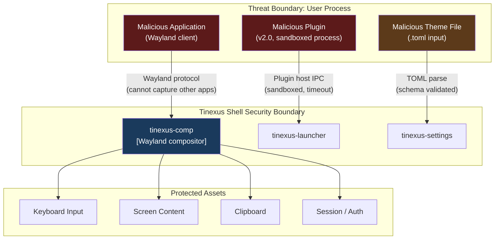
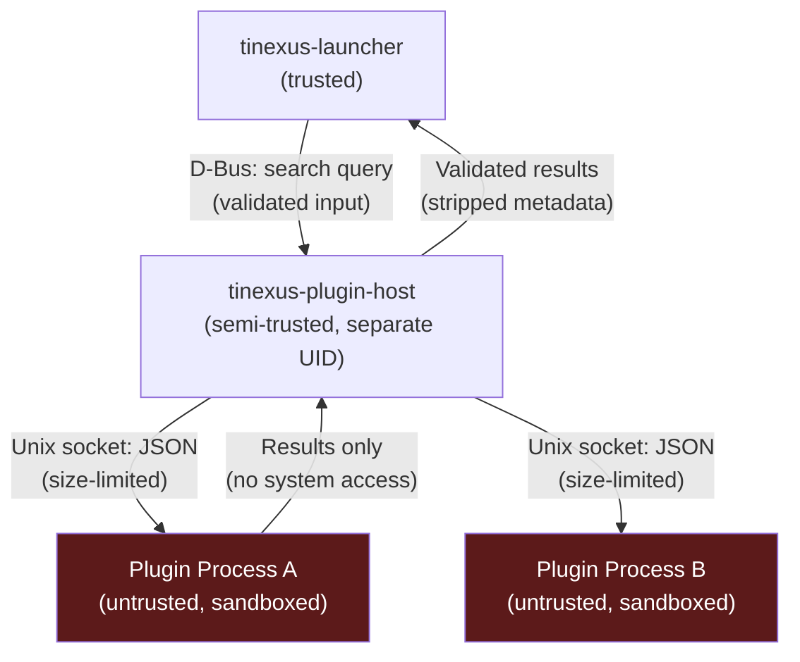

# Tinexus Shell — Security Architecture

> **Document:** 07_SECURITY.md  
> **Version:** 1.0.0  
> **Status:** FROZEN  
> **Classification:** Public — Open Source  
> **Depends on:** 01_VISION.md, 02_REQUIREMENTS.md, 03_SYSTEM_ARCHITECTURE.md

---

## Table of Contents

1. [Security Philosophy](#1-security-philosophy)
2. [Threat Model](#2-threat-model)
3. [Security Principles](#3-security-principles)
4. [Attack Surface Analysis](#4-attack-surface-analysis)
5. [Compositor Security](#5-compositor-security)
6. [Sandbox Architecture](#6-sandbox-architecture)
7. [Permission Model](#7-permission-model)
8. [Input Validation](#8-input-validation)
9. [No Arbitrary Shell Execution](#9-no-arbitrary-shell-execution)
10. [Privilege Separation](#10-privilege-separation)
11. [Plugin Security](#11-plugin-security)
12. [Authentication — Lock Screen](#12-authentication--lock-screen)
13. [Clipboard Security](#13-clipboard-security)
14. [IPC Security](#14-ipc-security)
15. [Terminal Isolation](#15-terminal-isolation)
16. [Secure Defaults](#16-secure-defaults)
17. [Vulnerability Disclosure Process](#17-vulnerability-disclosure-process)
18. [Recovery Procedures](#18-recovery-procedures)
19. [Audit Checklist](#19-audit-checklist)

---

## 1. Security Philosophy

Tinexus Shell approaches security with the following core convictions:

**"The compositor is the trusted kernel of the user interface."**

Just as the Linux kernel must remain uncompromised for system security, the Tinexus Shell compositor must remain uncompromised for session security. Any code that runs in the compositor's process has access to all keyboard input, all display output, and all window positions — equivalent to ring-0 access in the UI layer.

**Three Security Commitments:**

1. **Privacy by default** — No telemetry, no cloud, no data leaves the machine
2. **Principle of least privilege** — Every component has the minimum permissions needed to function
3. **Defense in depth** — Multiple independent security controls, not one silver bullet

---

## 2. Threat Model

### 2.1 Assets to Protect

| Asset | Sensitivity | Description |
|---|---|---|
| **Keyboard input** | CRITICAL | All keystrokes (including passwords) pass through the compositor |
| **Screen content** | HIGH | Compositor has full access to all pixels rendered |
| **Clipboard contents** | HIGH | May contain passwords, tokens, sensitive data |
| **Session credentials** | CRITICAL | Lock screen auth, PAM tokens |
| **User files** | HIGH | Desktop environment should not access files without permission |
| **Running app list** | MEDIUM | Which apps the user has open |
| **Config files** | MEDIUM | User preferences and settings |

### 2.2 Threat Actors

| Actor | Capability | Motivation |
|---|---|---|
| **Malicious application** | Runs as user, standard Wayland client | Key logging, screen capture, clipboard theft |
| **Malicious plugin** | Runs as plugin process (v2.0) | Same as app, plus launcher UI injection |
| **Malicious theme file** | User-loaded .toml file | Code injection, data exfiltration (via config parsing bugs) |
| **Local privilege escalation** | Exploit in compositor/daemon | Gain root access |
| **Physical attacker** | Physical access to locked screen | Bypass lock screen |
| **Supply chain attacker** | Compromise a dependency | Backdoor in wlroots, Qt, or other library |

### 2.3 Threat Model Diagram



### 2.4 Security Non-Goals

| Non-Goal | Reason |
|---|---|
| Protecting against root-level attackers | If attacker has root, all bets are off |
| Protecting against kernel exploits | Out of scope (kernel responsibility) |
| Protecting against hardware keyloggers | Physical layer — not a software problem |
| Protecting against malicious Wayland compositors | User must trust their compositor |

---

## 3. Security Principles

### SP-1: Compositor Code Minimization

**The compositor process must have the absolute minimum code surface.**

Every line of code in `tinexus-comp` is a potential vulnerability in the highest-privilege UI process. Rules:
- No user-loaded plugins in the compositor
- No dynamic library loading after startup
- No parsing of complex user-provided data formats (except the settings daemon protocol)
- No network code
- No shell execution

### SP-2: Privilege Separation

Every daemon runs with the minimum privilege needed:
- No daemon requires root
- `polkit` used for the few system actions that require privilege escalation
- systemd-logind handles power management (runs as system service)
- No SUID binaries created by Tinexus Shell

### SP-3: Input Validation Everywhere

**Never trust input from any source, including other Tinexus Shell daemons.**

- D-Bus messages: validate type and value before processing
- Config files: strict schema validation, reject unknown keys
- Plugin data: treat as completely untrusted
- Environment variables: never used for security decisions

### SP-4: Secure Failure

When a security decision cannot be made safely, fail closed:
- If lock screen PAM fails: do NOT unlock. Log and retry.
- If settings validation fails: reject and use default. Do not crash.
- If plugin times out: return empty results. Do not crash.

### SP-5: Auditability

All security-relevant events must be logged to the systemd journal:
- Session lock/unlock attempts (success and failure)
- Privilege escalation requests (via polkit)
- Plugin load/unload events
- Startup of all daemons

---

## 4. Attack Surface Analysis

### 4.1 Wayland Protocol Attack Surface

The Wayland protocol itself is the largest attack surface. Every message from every application passes through the compositor.

| Protocol | Attack Vectors | Mitigations |
|---|---|---|
| `wl_surface.commit` | Buffer overflow in DMA-BUF | wlroots validates all buffer parameters |
| `xdg_toplevel.set_title` | Long title string | Compositor truncates at 256 bytes |
| `xdg_toplevel.move` | Rapid move requests (DoS) | Rate limiting in input handler |
| `zwlr_layer_shell_v1` | Overlay attacks | Only shell components can use this |
| `wl_clipboard` | Clipboard access | Read-only; compositor controls what app sees |

**Layer-Shell Restriction:** Only processes with the correct D-Bus service name (`io.Tinexus Shell.*`) may request layer-shell surfaces above BOTTOM layer. The compositor verifies this via D-Bus peer credentials before allowing higher layers.

### 4.2 D-Bus Attack Surface

| Interface | Risk | Mitigation |
|---|---|---|
| `io.Tinexus Shell.Session` | Shutdown/restart without auth | polkit policy required for power actions |
| `io.Tinexus Shell.Clipboard` | Read all clipboard history | Only accessible to same UID |
| `io.Tinexus Shell.Compositor.Shortcuts` | Register fake shortcuts | Caller UID verified |
| `org.freedesktop.Notifications` | Notification spam | Rate limit: 10 notifications per app per second |

### 4.3 Config File Attack Surface

Maliciously crafted config files could:
- Cause unbounded memory allocation (very long strings)
- Trigger path traversal (in wallpaper path)
- Inject shell commands (in Exec field parsing)

**Mitigations:**
- TOML parser used is `toml++` (well-tested, bounds-checked)
- All string values are capped at 4096 bytes
- File paths are canonicalized and validated (no `..` traversal)
- Exec fields are NEVER passed to `system()` or `popen()` — only to `execv()` family with explicit argument splitting

---

## 5. Compositor Security

### 5.1 Keyboard Input Security

The compositor receives all raw keyboard events from libinput. Security rules:

1. **Password fields:** When a Wayland client indicates a password input (`zwp_input_method_v2` with `content_type = PASSWORD`), the compositor MUST NOT log or cache keystrokes
2. **Lock screen:** When the lock screen is active, ALL keyboard input goes only to the lock screen surface. No other client receives keyboard events.
3. **Hotkey interception:** Global hotkeys are matched before forwarding to apps. Apps cannot see hotkey events.

### 5.2 Screen Content Protection

Wayland provides better screen isolation than X11:
- Applications cannot capture other applications' window contents
- Screenshot tools must use `zwlr_screencopy_v1` — which the compositor grants only to trusted tools
- Future: Support for `content-protection` protocol for DRM-protected content

### 5.3 Compositor Process Hardening

Applied to `tinexus-comp` at compile time and runtime:

```
Compile time:
  -D_FORTIFY_SOURCE=2    # Buffer overflow protection
  -fstack-protector-strong
  -fPIE
  -Wformat -Wformat-security
  
Link time:
  -pie                   # Position-independent executable
  -z relro              # Read-only relocations
  -z now                # Bind all symbols at start (no lazy binding)
  -z noexecstack        # Non-executable stack

Runtime (systemd service file):
  NoNewPrivileges=true
  ProtectSystem=strict
  ProtectHome=read-only  # Compositor does not need to write user home
  RestrictAddressFamilies=AF_UNIX AF_WAYLAND
  RestrictNamespaces=true
  CapabilityBoundingSet=CAP_SYS_NICE  # Only for RT priority, optional
```

---

## 6. Sandbox Architecture

### 6.1 Daemon Sandboxing (systemd)

Each Tinexus Shell daemon is sandboxed via its systemd user service file:

```ini
# Tinexus Shell-notif.service
[Service]
Type=dbus
BusName=io.Tinexus Shell.Notifications
ExecStart=/usr/lib/Tinexus Shell/tinexus-notif

# Hardening
NoNewPrivileges=true
ProtectSystem=strict
PrivateTmp=true
PrivateDevices=true
ProtectKernelTunables=true
ProtectKernelModules=true
ProtectControlGroups=true
RestrictRealtime=true
RestrictSUIDSGID=true
MemoryDenyWriteExecute=true
SystemCallFilter=@system-service
RestrictAddressFamilies=AF_UNIX
```

### 6.2 Plugin Sandbox (v2.0)

Plugin processes receive the most restrictive sandbox:

```
Seccomp allowlist (minimal):
  read, write, close, fstat, lstat, mmap, mprotect, munmap,
  brk, getcwd, exit_group, getpid, gettimeofday, clock_gettime,
  recvmsg, sendmsg  (for Unix socket IPC only)

Blocked completely:
  execve, fork, clone, ptrace, socket (AF_INET), 
  open (outside declared paths), kill (outside own PID)
```

---

## 7. Permission Model

### 7.1 D-Bus Permission Matrix

| Action | Self (same session) | Other session user | Root |
|---|---|---|---|
| Open launcher | ✅ | ❌ | ❌ |
| Read clipboard history | ✅ | ❌ | ❌ |
| Change settings | ✅ | ❌ | ❌ |
| Lock screen | ✅ | ❌ | ✅ |
| Shutdown system | ✅ (via polkit prompt) | ❌ | ✅ |
| Restart system | ✅ (via polkit prompt) | ❌ | ✅ |
| Manage plugins (load/unload) | ✅ | ❌ | ❌ |

### 7.2 polkit Policy

For system actions (shutdown, restart, hibernate):

```xml
<!-- /usr/share/polkit-1/actions/io.Tinexus Shell.policy -->
<action id="io.Tinexus Shell.session.shutdown">
  <description>Shut down the system</description>
  <message>Authentication is required to shut down the system.</message>
  <defaults>
    <allow_any>auth_admin</allow_any>
    <allow_inactive>auth_admin</allow_inactive>
    <allow_active>yes</allow_active>
  </defaults>
</action>
```

Active (logged-in) users can shut down without authentication. Inactive users require admin auth. This follows standard Linux desktop practice.

### 7.3 File System Permissions

| Path | Owner | Permissions | Notes |
|---|---|---|---|
| `/usr/lib/Tinexus Shell/` | root:root | 755 | Daemon binaries |
| `/etc/Tinexus Shell/` | root:Tinexus Shell | 750 | System defaults |
| `~/.config/Tinexus Shell/` | user:user | 700 | User config |
| `~/.local/share/Tinexus Shell/` | user:user | 700 | User data |
| `~/.cache/Tinexus Shell/` | user:user | 700 | Cache (purgeable) |
| `/run/user/{uid}/Tinexus Shell/` | user:user | 700 | Runtime sockets |

**No world-readable sensitive files.**

---

## 8. Input Validation

### 8.1 Validation Rules for All External Input

| Input Source | Validation |
|---|---|
| TOML config files | Schema validation: required keys, type check, range check, max string length |
| D-Bus message parameters | Type check (GVariant), range check, null/empty check |
| Plugin JSON messages | JSON schema validation, size limit (max 64KB per message) |
| .desktop file content | Strict XDG spec parsing, no eval, sanitize Exec field |
| Wallpaper image files | Max size 100MB, valid image format verification before decode |
| Shortcut key strings | Allowlist of valid key names and modifier combinations |

### 8.2 Exec Field Sanitization

The `.desktop` file `Exec` field must be parsed carefully:

```cpp
// Safe Exec parsing: never use system() or shell expansion
std::vector<std::string> parseExec(const std::string& exec_field) {
    // Remove field codes (%u, %f, %i, etc.) — replace with actual values
    std::string sanitized = removeFieldCodes(exec_field);
    
    // Split by space, respecting quotes (POSIX-style splitting, NOT shell splitting)
    auto argv = posixSplit(sanitized);
    
    // Validate: first token must be an absolute path or a binary name
    // NEVER pass to /bin/sh
    return argv;
}

// Launch using execvp, NOT system():
execvp(argv[0].c_str(), converted_argv);
```

**Never** call `system()`, `popen()`, `/bin/sh -c`, or any shell invocation with user-provided data.

---

## 9. No Arbitrary Shell Execution

This is a hard security rule in Tinexus Shell.

### 9.1 Rule Definition

> **RULE SEC-SHELL-001:** No Tinexus Shell daemon or compositor component shall pass any user-provided or plugin-provided string to a shell interpreter (`/bin/sh`, `bash`, `system()`, `popen()`).

### 9.2 Allowed App Launch Pattern

```cpp
// CORRECT: execvp with argument vector
void launchApp(const std::vector<std::string>& argv) {
    pid_t pid = fork();
    if (pid == 0) {
        // Child: close all unnecessary file descriptors
        // Set environment (controlled, not user-provided)
        execvp(argv[0].c_str(), convertToCharPtrArray(argv));
        _exit(1);  // execvp failed
    }
}

// FORBIDDEN:
system("firefox");          // Shell injection possible
popen("xdg-open " + url);  // Shell injection possible
execl("/bin/sh", "sh", "-c", user_provided_cmd, nullptr);  // Forbidden
```

### 9.3 Static Analysis Enforcement

Clang-tidy custom check (or `grep` in CI) scans for:
- `system(`
- `popen(`
- `execl("/bin/sh`
- `execlp("sh`
- `QProcess::execute(` with string concatenation

Any use of these in non-test code fails CI.

---

## 10. Privilege Separation

### 10.1 Process UID Map

| Process | Runs As | Requires Root? |
|---|---|---|
| tinexus-comp | User (UID 1000+) | No (uses DRM render group or logind) |
| tinexus-session | User | No |
| tinexus-launcher | User | No |
| tinexus-notif | User | No |
| tinexus-settings | User | No |
| tinexus-clip | User | No |
| tinexus-indexer | User | No |
| tinexus-wallpaper | User | No |
| tinexus-lock | User + PAM | PAM plugin (no root required for auth) |
| Plugin processes | User (same UID, restricted namespaces) | No |

**Zero root processes.** All privilege escalation happens through polkit and systemd-logind D-Bus APIs.

### 10.2 GPU Access Without Root

The compositor needs GPU access. On modern Linux:
- User is in `render` or `video` group (grants DRM render node access)
- Or systemd-logind grants DRM access to the active session user automatically
- `libseat` (used by wlroots) handles this correctly

Tinexus Shell does not require SUID binaries for GPU access.

---

## 11. Plugin Security

### 11.1 Plugin Security Model (v2.0)



### 11.2 Plugin Security Requirements

1. **No dynamic loading** — Plugin code is NEVER loaded into the plugin-host or launcher process via `dlopen()`
2. **Process isolation** — Each plugin is a separate process with restricted capabilities
3. **Timeout enforcement** — Queries to plugins time out after 200ms. Hung plugins are killed.
4. **Result validation** — All plugin results are schema-validated before being passed to the launcher
5. **Crash isolation** — A crashed plugin does not crash the launcher
6. **No escalated privileges** — Plugin processes have no more privileges than the user who installed them
7. **Filesystem restriction** — Plugin can only read/write its declared directories

### 11.3 Plugin Signature (v2.1)

Future version: Plugin binaries will be signed. The plugin-host will verify signatures before loading.

---

## 12. Authentication — Lock Screen

### 12.1 PAM Integration

The lock screen uses PAM (Pluggable Authentication Modules) for authentication. This is the standard Linux authentication mechanism.

```cpp
// Lock screen authentication flow:
int authenticate(const std::string& username, const std::string& password) {
    pam_handle_t* pamh = nullptr;
    
    // Initialize PAM with the "Tinexus Shell-lock" service
    // Config: /etc/pam.d/Tinexus Shell-lock (references system-auth)
    pam_start("Tinexus Shell-lock", username.c_str(), &conv, &pamh);
    
    // Attempt authentication
    int ret = pam_authenticate(pamh, 0);
    
    // Cleanup
    pam_end(pamh, ret);
    
    return ret;  // PAM_SUCCESS or error code
}
```

### 12.2 Lock Screen Security Rules

1. **Bypass is impossible by design** — The lock screen holds a `ext-session-lock-v1` Wayland lock. The compositor refuses to render any other surface until the lock is released via the protocol.
2. **No emergency bypass** — If PAM fails, the screen stays locked. User must reboot via another TTY.
3. **Brute force mitigation** — After 5 failed attempts: 30-second lockout. After 10 attempts: 5-minute lockout.
4. **Secure text entry** — Password input field never has `echo` mode. Characters are immediately replaced with `●`.
5. **No clipboard paste** — Clipboard paste is disabled in the password field.
6. **Screen blanking** — After 30 seconds with lock screen active, screen dims. After 60 seconds, screen turns off. (Does not unlock.)

### 12.3 /etc/pam.d/Tinexus Shell-lock

```
auth    required    pam_unix.so
auth    optional    pam_faillock.so preauth
auth    optional    pam_faillock.so authfail
account required    pam_unix.so
```

This delegates to the system's standard auth mechanisms (including fingerprint, smartcard, FIDO2 if configured by the system admin).

---

## 13. Clipboard Security

### 13.1 Clipboard Isolation

Wayland's clipboard model is inherently more secure than X11:
- **No passive monitoring:** An application cannot monitor clipboard changes without explicit permission
- **Read-on-demand:** Clipboard data is only transferred when an application requests it
- **Source control:** The source application controls clipboard lifetime

### 13.2 Clipboard History Privacy

Rules for `tinexus-clip`:

```
1. Never store: entries matching sensitive data patterns (see Section 8)
2. Never expose: clipboard history to other users' sessions
3. Clear on: session logout (configurable)
4. Encrypt at rest: only if user enables encryption in settings (v1.1)
5. Access log: log (to journal) every clipboard history read with requestor PID
```

### 13.3 Clipboard Access Control

`tinexus-clip` only responds to D-Bus requests from the same UID as itself. Multi-user scenarios: each user's `tinexus-clip` is separate.

---

## 14. IPC Security

### 14.1 D-Bus Security

All Tinexus Shell D-Bus services are on the **session bus** (not system bus), meaning they are automatically scoped to the user's session. No cross-session access.

For each D-Bus method call, the service:
1. Gets the caller's D-Bus unique name
2. Calls `GetConnectionCredentials()` to get caller's UID and PID
3. Verifies UID matches the service's own UID
4. Proceeds or rejects

```cpp
bool verifyCallerUID(const QDBusMessage& msg) {
    auto reply = QDBusConnection::sessionBus()
        .interface()
        ->serviceUid(msg.service());
    
    if (reply.isValid() && reply.value() == getuid()) {
        return true;
    }
    
    qWarning() << "Unauthorized D-Bus call from UID" << reply.value();
    return false;
}
```

### 14.2 Unix Socket Security

Unix domain sockets use file system permissions:
- Socket files in `/run/user/{uid}/Tinexus Shell/` are owned by the user (mode 600)
- Listener verifies `SO_PEERCRED` before accepting any message

---

## 15. Terminal Isolation

### 15.1 VT Switch Security

When the user switches to a VT (Ctrl+Alt+F2), the compositor:
1. Releases all input devices (keyboard, pointer)
2. Freezes all display output
3. The VT is managed by the kernel and is independent of Tinexus Shell

When returning from VT:
1. Compositor re-acquires input and display
2. If idle timer has expired: lock screen is activated automatically

### 15.2 No Terminal Emulation in Compositor

Tinexus Shell does NOT embed a terminal emulator in the compositor. Terminal emulators run as regular Wayland clients with no elevated privileges.

---

## 16. Secure Defaults

| Setting | Default | Rationale |
|---|---|---|
| Screen lock on idle | 5 minutes | Reasonable balance of security and usability |
| Screen lock on sleep | Always | Physical attacks via sleep |
| Clipboard history | Enabled | But sensitive patterns filtered |
| Notification body in lock screen | Disabled | Privacy — body might contain sensitive content |
| Plugin installation | Disabled | Must be explicitly enabled |
| Telemetry | None | No telemetry ever |
| Auto-update | Disabled | User controls updates |
| Animation effects | Enabled | Security-neutral, user can disable |
| Developer mode | Disabled | Disabling security restrictions requires explicit opt-in |

---

## 17. Vulnerability Disclosure Process

### 17.1 Disclosure Policy

Tinexus Shell follows **Coordinated Vulnerability Disclosure (CVD)**:

1. Researcher reports vulnerability to `security@Tinexus Shell.io` (PGP-encrypted preferred)
2. Tinexus Shell security team acknowledges within **72 hours**
3. Team investigates and develops fix within **90 days** (critical: 7 days)
4. Fix released before or with public disclosure
5. Researcher credited in CHANGELOG unless they request anonymity

### 17.2 Severity Classification

| Severity | Description | Response SLA |
|---|---|---|
| **CRITICAL** | Lock screen bypass, RCE in compositor | 7 days |
| **HIGH** | Privilege escalation, data exfiltration | 30 days |
| **MEDIUM** | Denial of service, information disclosure | 90 days |
| **LOW** | Minor security improvements | Next release |

### 17.3 Security Advisories

Published at: `https://Tinexus Shell.io/security/advisories/`  
Format: GitHub Security Advisory format  
CVE: Requested via MITRE for CRITICAL and HIGH issues

---

## 18. Recovery Procedures

### 18.1 Compositor Crash Recovery

If the compositor crashes:
1. The session manager detects the compositor exit (SIGCHLD)
2. If this is the first crash in 60 seconds: restart compositor
3. All applications will need to reconnect to the new Wayland socket
4. If compositor crashes 3 times in 60 seconds: session is abandoned

Session abandonment: Display manager regains control. User is returned to the login screen. Data may be lost from applications that did not save before the crash.

### 18.2 Config Corruption Recovery

If a config file is corrupted:
1. Settings daemon fails to parse the file
2. Logs the error with file path and (if available) line number
3. Falls back to system defaults (`/etc/Tinexus Shell/defaults/`)
4. Shows notification: "Settings corrupted. Defaults restored. Check ~/.config/Tinexus Shell/"
5. Does NOT overwrite the corrupted file (user may want to recover data)

### 18.3 Stuck Lock Screen

If the lock screen process crashes while the screen is locked:
1. The `ext-session-lock-v1` protocol holds the lock until the process reconnects
2. Session manager automatically restarts `tinexus-lock` (within 5 seconds)
3. If `tinexus-lock` fails to restart after 3 attempts: the compositor kills the session

**There is no bypass.** A stuck lock screen requires TTY access (Ctrl+Alt+F2) or physical reboot.

---

## 19. Audit Checklist

This checklist must be completed before any release:

### Code Security Audit

- [ ] No `system()` calls in non-test code
- [ ] No `popen()` calls in non-test code
- [ ] No shell expansion of user-provided strings
- [ ] All D-Bus interfaces validate caller UID
- [ ] All file paths are canonicalized before use
- [ ] No hardcoded credentials or tokens
- [ ] TOML parsing does not allocate unbounded memory
- [ ] All error paths are tested (fuzzing with libFuzzer for parsers)
- [ ] Address Sanitizer clean (no leaks, no overflows)
- [ ] UBSan clean (no undefined behavior)

### Configuration Security Audit

- [ ] All installed files have correct permissions (no world-writable)
- [ ] No SUID/SGID binaries installed
- [ ] systemd service files use hardening options
- [ ] PAM configuration reviewed by system admin familiar with PAM

### Dependency Audit

- [ ] All dependencies have known CVE history checked
- [ ] No abandoned dependencies (last release > 2 years: evaluate)
- [ ] No dependencies with known unpatched CVEs at release time

---

*Document End: 07_SECURITY.md*  
*Next: 08_PERFORMANCE.md*
