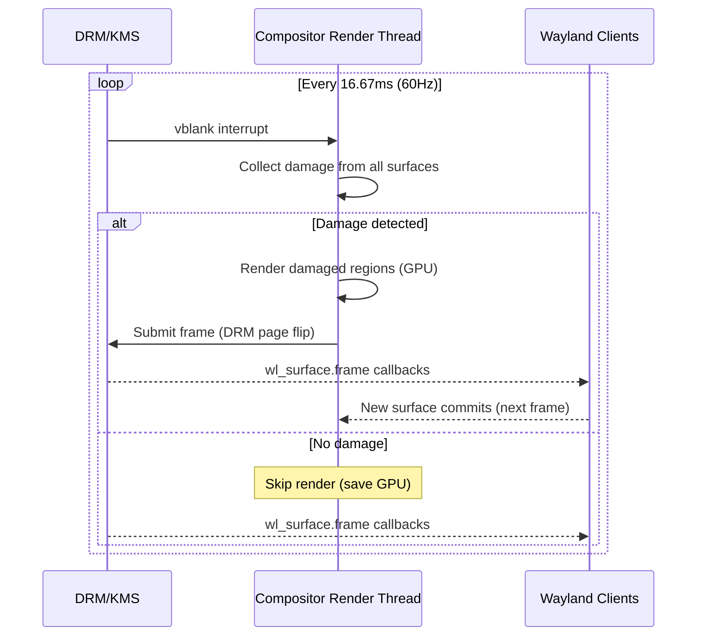

# Tinexus Shell — Performance Engineering

> **Document:** 08_PERFORMANCE.md  
> **Version:** 1.0.0  
> **Status:** FROZEN  
> **Classification:** Public — Open Source  
> **Depends on:** 02_REQUIREMENTS.md, 03_SYSTEM_ARCHITECTURE.md

---

## Table of Contents

1. [Performance Philosophy](#1-performance-philosophy)
2. [Reference Hardware](#2-reference-hardware)
3. [Target Frame Rate and Frame Budget](#3-target-frame-rate-and-frame-budget)
4. [Boot Time Targets](#4-boot-time-targets)
5. [Memory Budget](#5-memory-budget)
6. [CPU Budget](#6-cpu-budget)
7. [GPU Budget](#7-gpu-budget)
8. [Search Latency Targets](#8-search-latency-targets)
9. [Animation Performance Budget](#9-animation-performance-budget)
10. [Application Launch Targets](#10-application-launch-targets)
11. [Performance Optimization Strategy](#11-performance-optimization-strategy)
12. [Frame Timing Architecture](#12-frame-timing-architecture)
13. [Memory Optimization Techniques](#13-memory-optimization-techniques)
14. [Rendering Optimization](#14-rendering-optimization)
15. [Performance Measurement Infrastructure](#15-performance-measurement-infrastructure)
16. [Performance Regression Policy](#16-performance-regression-policy)
17. [Benchmarks and Tooling](#17-benchmarks-and-tooling)

---

## 1. Performance Philosophy

> "Performance is a feature. Latency is disrespect."

Tinexus Shell treats every millisecond as a design decision. The performance targets in this document are not aspirational — they are hard requirements that block release.

### 1.1 The Performance Hierarchy

When there is a conflict between features and performance, performance wins. In priority order:

1. **Frame rate never drops below 60fps** — Above everything else
2. **Launcher opens in ≤100ms** — Primary user interaction
3. **No memory leaks** — Long-running stability
4. **Search results in ≤50ms** — Productivity
5. **Boot time ≤3s** — First impression
6. **Feature richness** — Always last

### 1.2 What "60fps Butter Smooth" Actually Means

A 60Hz display refreshes every **16.67 milliseconds**. For Tinexus Shell to feel "butter smooth":
- The compositor must produce a frame **every 16.67ms** without exception
- **Jank** is defined as: any frame that takes longer than 16.67ms to render
- **Target jank rate:** < 0.01% of frames (1 in 10,000)
- **Hard limit jank rate:** < 0.1% of frames (1 in 1,000)

---

## 2. Reference Hardware

### 2.1 Target Hardware Tiers

All performance targets are defined relative to these hardware tiers:

| Tier | CPU | GPU | RAM | Disk |
|---|---|---|---|---|
| **T1 (High-end)** | AMD Ryzen 7 / Intel i7 (12th gen+) | RX 6600 / RTX 3060 | 16GB+ | NVMe SSD |
| **T2 (Mid-range)** | AMD Ryzen 5 / Intel i5 (10th gen+) | Integrated: AMD 780M / Intel Iris Xe | 8GB | SATA SSD |
| **T3 (Low-end)** | Intel Core i3 (8th gen) / ARM Cortex-A72 | Intel UHD 620 | 4GB | SATA SSD |
| **T4 (Minimum)** | Intel Celeron / Raspberry Pi 4 | VideoCore VI | 2GB | MicroSD |

### 2.2 Performance Target Matrix

All targets below are for **T2 hardware** (mid-range integrated GPU + SSD). T1 hardware is expected to exceed all targets.

| Metric | T2 Target | T3 Target | T4 Target (Best effort) |
|---|---|---|---|
| Compositor FPS (60Hz display) | 60fps | 60fps | 60fps |
| Compositor FPS (120Hz display) | 120fps | 60fps (capped) | 60fps (capped) |
| Launcher open time | 80ms | 100ms | 150ms |
| Search latency (first result) | 30ms | 50ms | 80ms |
| Session boot time | 2.0s | 2.5s | 4.0s |
| Idle RAM (all daemons) | ≤150MB | ≤150MB | ≤120MB |
| App launch (terminal) | 150ms | 300ms | 500ms |

---

## 3. Target Frame Rate and Frame Budget

### 3.1 Frame Budget Breakdown (60Hz = 16.67ms)

```
┌─────────────────────────────────────────────────────────────────┐
│                  COMPOSITOR FRAME BUDGET: 16.67ms               │
├─────────────────────────────────────────────────────────────────┤
│                                                                 │
│  Input processing (libinput events)         0.2ms  ███          │
│  Damage accumulation (dirty rect scan)      0.5ms  ████████     │
│  Scene graph traversal                      0.5ms  ████████     │
│  GPU command recording                      2.0ms  ████████████ │
│  GPU execution (parallel with next frame)   8.0ms  — (async)   │
│  Buffer swap + DRM page flip submission     1.0ms  ████████████ │
│  Frame callback dispatch to clients         0.5ms  ████████     │
│  Safety margin                              3.97ms ████████████ │
│                                                                 │
│  Total CPU time per frame:  ≤8.7ms                             │
│  Total GPU time per frame:  ≤14.67ms (pipelined)              │
└─────────────────────────────────────────────────────────────────┘
```

### 3.2 Frame Budget Breakdown (120Hz = 8.33ms)

```
┌─────────────────────────────────────────────────────────────────┐
│                  COMPOSITOR FRAME BUDGET: 8.33ms                │
├─────────────────────────────────────────────────────────────────┤
│  Input processing                           0.1ms               │
│  Damage accumulation                        0.3ms               │
│  Scene graph traversal                      0.3ms               │
│  GPU command recording                      1.5ms               │
│  GPU execution (async, pipelined)           6.0ms               │
│  Buffer swap + page flip                    0.5ms               │
│  Safety margin                              1.63ms              │
│                                                                 │
│  Total CPU time per frame:  ≤4.7ms                             │
└─────────────────────────────────────────────────────────────────┘
```

### 3.3 VRR (Variable Refresh Rate) Support

Tinexus Shell will support VRR (FreeSync/G-Sync) in v1.1:
- When VRR is enabled, the compositor renders frames as fast as possible
- Frame rate adapts to content: idle desktop → lower rate (saves power), animation → 60-120fps
- Minimum VRR rate: 40Hz (below this, fixed rate is used)

---

## 4. Boot Time Targets

### 4.1 Session Start Timeline

```
0ms       Display manager hands off session (PAM auth complete)
0ms       tinexus-session starts

    ├── tinexus-settings: start + ready          target: 100ms
    ├── tinexus-comp: start + Wayland socket up  target: 500ms (from settings ready)
    ├── tinexus-wallpaper: connected + rendering target: +200ms (wallpaper visible)
    │
    │   [User sees wallpaper at ~800ms from login]
    │
    ├── tinexus-notif: start + D-Bus registered  target: +100ms (parallel)
    ├── tinexus-clip: start + D-Bus registered   target: +100ms (parallel)
    ├── tinexus-launcher: start + ready          target: +300ms (after compositor)
    └── tinexus-indexer: start + index built     target: +500ms (background, non-blocking)

2000ms    ALL SERVICES READY (total from session handoff)

[Ctrl+K works at: ~1000ms — launcher ready before index complete]
[Index available at: ~2000ms — search fully functional]
```

### 4.2 Startup Optimization Strategies

**Compositor fast start:**
- wlroots initializes DRM backend using saved display configuration
- No display auto-detection delay (saved config is used immediately)
- Wallpaper starts rendering before launcher is ready

**Launcher fast start:**
- QML precompiled to `.qmlc` bytecode at install time
- App index loaded from disk cache (rebuilt incrementally on change)
- Layer-shell surface created hidden (no open/close latency later)

**Parallelization:**
- tinexus-notif, tinexus-clip, tinexus-indexer all start in parallel after compositor
- None of these block the compositor or launcher from being ready

---

## 5. Memory Budget

### 5.1 Per-Component Memory Budget

| Component | Idle Target | Idle Hard Limit | Active Peak |
|---|---|---|---|
| `tinexus-comp` | 45MB | 80MB | 120MB |
| `tinexus-launcher` (hidden) | 35MB | 60MB | 80MB |
| `tinexus-launcher` (open, searching) | — | — | 100MB |
| `tinexus-notif` | 12MB | 25MB | 30MB |
| `tinexus-settings` | 8MB | 20MB | 25MB |
| `tinexus-session` | 5MB | 15MB | 20MB |
| `tinexus-clip` | 8MB | 20MB | 25MB (50 entries loaded) |
| `tinexus-indexer` | 15MB | 30MB | 40MB (10K apps indexed) |
| `tinexus-wallpaper` | 20MB | 40MB | 60MB (4K texture in VRAM) |
| **Total** | **148MB** | **290MB** | — |

### 5.2 Qt/QML Memory Footprint

Qt6 shared libraries are loaded into all Qt-based processes. They are **shared** (mapped from disk), so each subsequent Qt process adds minimal additional physical RAM.

| Library | Size on Disk | Resident (first process) | Resident (shared) |
|---|---|---|---|
| libQt6Core.so | ~8MB | ~8MB | ~0MB |
| libQt6Quick.so | ~6MB | ~6MB | ~0MB |
| libQt6Qml.so | ~5MB | ~5MB | ~0MB |
| Total Qt shared | ~40MB | ~40MB | ~0MB |

**Memory Budget Note:** The 148MB idle target for all Tinexus Shell daemons is exclusive of shared library memory (which is accounted for as system overhead).

### 5.3 GPU Memory Budget

| Asset | VRAM Budget |
|---|---|
| Wallpaper texture (4K, 2 monitors) | 32MB × 2 = 64MB |
| App icon texture atlas | 32MB |
| Launcher QML scene graph | 16MB |
| Notification surfaces | 4MB |
| Compositor framebuffers (triple-buffered, 4K) | 48MB × 3 = 144MB |
| **Total GPU Budget** | **~260MB** |

This is acceptable even for integrated GPUs sharing system RAM (e.g., AMD 780M with 512MB–2GB dynamic VRAM allocation).

---

## 6. CPU Budget

### 6.1 Idle CPU Targets

At idle (no user interaction, desktop showing wallpaper), Tinexus Shell daemons collectively use:

| Time Period | CPU Target | CPU Hard Limit |
|---|---|---|
| Idle (1-minute average) | < 0.5% | 2% |
| Idle (10-second burst) | < 2% | 5% |
| During launcher close/open | < 15% | 25% |
| During workspace switch | < 20% | 30% |
| During window drag | < 10% | 20% |

### 6.2 CPU Scheduling

The compositor render thread should receive a real-time priority:

```
tinexus-comp render thread: SCHED_FIFO, priority 1
(or SCHED_OTHER with nice -5 if RT is unavailable)

Reason: Ensures vblank deadline is met even under system load
Requires: CAP_SYS_NICE capability (granted by logind, not SUID)
```

All other threads use default scheduling (SCHED_OTHER, nice 0).

---

## 7. GPU Budget

### 7.1 GPU Utilization Targets

| Scenario | GPU Util Target | GPU Util Limit |
|---|---|---|
| Idle desktop | < 1% | 5% |
| Window drag | < 15% | 30% |
| Launcher animation | < 20% | 40% |
| Workspace switch | < 30% | 50% |
| Fullscreen video | Constrained by app | — |

### 7.2 Rendering Architecture for Low GPU Usage

**Damage tracking** is the most important GPU optimization:

```
Without damage tracking:
  Every frame: Render ALL windows → GPU usage always high

With damage tracking:
  Every frame:
    1. Collect damage regions from all surfaces
    2. If no damage → no rendering (display unchanged)
    3. If damage → render ONLY damaged rectangles
    
Result: Idle desktop → 0 GPU work (no damage = no render)
        Moving mouse → tiny damage region from cursor
        Typing in terminal → small damage region (terminal text area only)
        Full-screen animation → full frame damage (max GPU usage)
```

wlroots provides built-in damage tracking. Tinexus Shell compositor must never disable it.

---

## 8. Search Latency Targets

### 8.1 Search Latency Budget

```
User keystroke received
    ↓ 0ms
Input event to launcher controller
    ↓ 2ms (event dispatch)
Search manager receives query
    ↓ 2ms (fan-out overhead)
Providers execute in parallel:
    AppProvider (trigram search):       ≤ 20ms (in-memory, cache-hot)
    SystemActionsProvider:              ≤  1ms (tiny list, linear scan)
    CalculatorProvider:                 ≤  2ms (expression parse + eval)
    ↓ ≤ 20ms (bottleneck = AppProvider)
Result collection + ranking:           ≤  5ms
Signal to QML:                         ≤  1ms
QML render (first 5 results):          ≤  8ms (one frame)
    ↓ ≤ 36ms total

Target: ≤ 50ms from keystroke to results visible
```

### 8.2 Search Cache Strategy

The app search index is maintained in RAM at all times:

```
tinexus-indexer:
  Startup: Load .desktop files → build trigram index → store in memory
  Change: inotify triggers incremental update (< 50ms per file)
  
tinexus-launcher (local cache):
  On first search: Request index snapshot from tinexus-indexer via D-Bus
  Cache in local memory: ~5MB (full index snapshot)
  Invalidate: when IndexUpdated D-Bus signal received from indexer
  
Benefit: App search does NOT require D-Bus call after first query
         → AppProvider search is purely in-process after warmup
```

### 8.3 Debouncing

Search is debounced to avoid unnecessary computation on rapid typing:

```
User types "f" → wait 50ms → if no further input → search("f")
User types "fi" within 50ms → reset timer → wait 50ms → search("fi")  
User types "fir" within 50ms → reset timer → wait 50ms → search("fir")

Debounce delay: 50ms (configurable: 20ms–200ms)
Effect: Reduces search invocations by 80%+ during normal typing
```

---

## 9. Animation Performance Budget

### 9.1 Animation Frame Budget

All Tinexus Shell animations must complete within the standard frame budget (16.67ms at 60Hz). Animations have additional constraints:

```
Animation frame budget allocation:
  QML scene graph update:    ≤  3ms
  QML animation state calc:  ≤  1ms
  QML rendering (GPU submit):≤  4ms
  Total QML:                 ≤  8ms (leaving 8.67ms for compositor)
```

### 9.2 Animation Quality Tiers

| Device | Animation Mode | Detail |
|---|---|---|
| T1/T2 (dedicated GPU) | Full | All animations, blur, stagger |
| T2 (integrated GPU) | Full (auto) | Monitor GPU frame time; reduce if needed |
| T3 (old integrated) | Reduced | Shorter durations, no stagger |
| T4 (RPi/embedded) | Minimal | No blur, instant transitions |

Auto-detection: If any of the last 60 frames exceeded 16ms, step down one tier. If 300 consecutive frames are under 14ms, step up one tier.

### 9.3 QML Performance Rules

1. **No JavaScript in render-critical paths** — Use property bindings and C++ models
2. **Avoid `anchors` in list delegates** — Use `x`, `y`, `width`, `height` directly (5× faster)
3. **Use `ListView` not `Repeater+Column`** — ListView has virtualization (only renders visible items)
4. **Icon loading is async** — Never load icons synchronously in delegates
5. **`layer.enabled: true` for animating surfaces** — Allows GPU-accelerated transform animations
6. **Clip only when necessary** — `clip: true` forces an offscreen pass

---

## 10. Application Launch Targets

### 10.1 App Launch Latency Breakdown

```
From Enter key in launcher to app window visible:

0ms     Enter pressed
1ms     Launcher closes (surface hidden)
5ms     LauncherController::activate() called
5ms     App entry fetched from index
8ms     execvp() called in child process
8ms     fork() overhead: ~2ms
10ms    Child process starts
~50ms   App runtime initialization (depends on app)
~100ms  Wayland xdg-surface commit (first frame)
~100ms  Compositor maps window
~110ms  Window appears on screen

Total: ~110ms for terminal (Alacritty)
       ~1200ms for browser (Firefox cold start)
```

### 10.2 App Launch Optimization

**Preloading (v1.1):** The most recently used apps are preloaded in the background (fork+exec to `--preload` mode if app supports it).

**Launch indicator:** Within 100ms of pressing Enter, the launcher shows a brief "launching" animation, then closes. The user knows something is happening.

---

## 11. Performance Optimization Strategy

### 11.1 Measure First, Optimize Second

> "Premature optimization is the root of all evil." — Donald Knuth

Tinexus Shell's performance optimization process:

1. **Establish baselines** — Run all performance benchmarks on reference hardware and record
2. **Identify bottlenecks** — Use profiling tools (perf, hotspot, Qt Creator profiler)
3. **Optimize the worst offender** — Fix the single largest bottleneck
4. **Measure again** — Verify improvement, check for regressions elsewhere
5. **Repeat** until all targets are met

### 11.2 Optimization Hierarchy

Apply optimizations in this order:

```
Level 1: Algorithm optimization (O(n²) → O(n log n))
          → Biggest gains, no hardware dependency
          → Example: switch from linear search to trigram index

Level 2: Data structure optimization (cache-friendly layout)
          → Cache misses are expensive (~100ns each)
          → Example: struct-of-arrays vs array-of-structs for search results

Level 3: Thread model optimization (parallelism)
          → Use multiple CPU cores for independent work
          → Example: parallel provider fan-out in search

Level 4: I/O optimization (async I/O, prefetch)
          → Avoid blocking on disk/network
          → Example: async icon loading in launcher

Level 5: GPU optimization (damage tracking, batching)
          → Reduce GPU draw calls and overdraw
          → Example: damage tracking already described

Level 6: Compiler optimization (-O2, -O3, LTO, PGO)
          → Last resort, modest gains
          → Profile-guided optimization for hot paths in indexer
```

---

## 12. Frame Timing Architecture

### 12.1 The vblank Event Loop



### 12.2 Frame Callback Discipline

Wayland clients must:
1. Request a `wl_surface.frame` callback before each commit
2. Wait for the callback before drawing the next frame
3. This ensures clients are in sync with the compositor's vblank

Tinexus Shell launcher and notification surfaces follow this protocol exactly — they never render frames faster than the display refresh rate.

### 12.3 Adaptive Frame Scheduling

For battery-powered devices:
- When the display is idle (no damage for 100ms), compositor drops to 1fps poll
- When damage is detected, compositor resumes normal vblank scheduling
- Power savings: up to 60% GPU power reduction at idle

---

## 13. Memory Optimization Techniques

### 13.1 Arena Allocation for Search Results

The search manager allocates many small `SearchResult` objects on every keystroke. Using a custom arena allocator:

```cpp
// Arena allocator for search results (reset each search cycle)
class SearchArena {
    static constexpr size_t BLOCK_SIZE = 64 * 1024;  // 64KB blocks
    std::vector<std::unique_ptr<char[]>> m_blocks;
    size_t m_offset = 0;
    
public:
    template<typename T>
    T* allocate() {
        // Bump-pointer allocation — O(1) alloc, O(1) free
        // Reset entire arena after each search cycle
        // Zero system call overhead vs. malloc/free for small objects
    }
    
    void reset() { m_offset = 0; }  // Free everything in O(1)
};
```

### 13.2 String Interning for App IDs

App IDs (e.g., `"org.mozilla.firefox"`) appear many times in the search index. String interning ensures only one copy exists per unique string:

```cpp
class StringInterner {
    std::unordered_set<std::string> m_pool;
public:
    const std::string* intern(std::string s) {
        return &*m_pool.insert(std::move(s)).first;
    }
};
```

### 13.3 Icon Cache with LRU Eviction

```
Icon cache:
  - Maximum entries: 1000 icons
  - Maximum size: 64MB (GPU VRAM resident)
  - Eviction policy: LRU (Least Recently Used)
  - Entry lifetime: session-scoped
  - Hit rate target: > 95% (icons for common apps stay loaded)
```

---

## 14. Rendering Optimization

### 14.1 Launcher Blur Optimization

Backdrop blur is computationally expensive. Strategy:

1. **Compositor provides snapshot:** When the launcher opens, the compositor takes a screenshot of the area behind the launcher (using `zwlr_screencopy_v1`) and passes it to the launcher.
2. **Launcher blurs the snapshot:** The launcher applies blur to the static snapshot, not the live compositor output.
3. **Update on significant change:** If the content behind the launcher changes significantly (e.g., a window moves), request a new snapshot.

This is more efficient than live blur (which requires the compositor to blur every frame).

### 14.2 QML Layer Optimization

For animated QML items:
```qml
Item {
    id: launcherCard
    // Enable GPU layer for this item during animation
    layer.enabled: openAnimation.running || closeAnimation.running
    layer.effect: FastBlur { radius: Theme.effects.blurRadius }
    // Disabling layer after animation = GPU memory freed
}
```

### 14.3 Texture Atlas for Icons

Instead of individual textures per icon, the launcher uses a **texture atlas**:

```
Atlas layout (2048×2048, RGBA8):
  Row 0: [32×32 icons for apps A-Z...]
  Row 1: [32×32 icons continued...]
  
Benefits:
  - Single GPU texture bind for entire icon row
  - No texture switching between result items (batch draw)
  - 10× fewer GPU state changes vs. individual textures
```

---

## 15. Performance Measurement Infrastructure

### 15.1 Built-in Metrics

Every Tinexus Shell process exposes metrics via D-Bus:

```xml
<interface name="io.Tinexus Shell.Metrics">
  <method name="GetMetrics">
    <arg name="metrics" type="a{sv}" direction="out"/>
    <!-- Includes: ram_bytes, cpu_percent_1s, cpu_percent_60s -->
  </method>
</interface>
```

The compositor exposes additional metrics:
- `frame_time_ms_avg` — Average frame time
- `frame_time_ms_p99` — 99th percentile frame time
- `dropped_frames_total` — Total dropped frames since start
- `damage_area_percent_avg` — Average percent of screen damaged per frame

### 15.2 Performance Test Suite

Located in `tests/performance/`:

| Benchmark | Measures | Target |
|---|---|---|
| `bench_search_latency` | Time from query to results | ≤50ms at P95 |
| `bench_launcher_open` | Time from signal to surface visible | ≤100ms at P95 |
| `bench_index_build` | Time to build full app index | ≤500ms |
| `bench_compositor_frame` | Frame time under load | ≤16.67ms at P99 |
| `bench_wallpaper_load` | Time to decode + display wallpaper | ≤800ms |

### 15.3 Continuous Performance Monitoring in CI

```yaml
# .github/workflows/ci.yml (performance step)
- name: Run Performance Benchmarks
  run: |
    ./build/tests/performance/bench_search_latency --benchmark_format=json > perf_results.json
    
- name: Check Performance Regression
  run: |
    python3 scripts/check_perf_regression.py \
      --baseline perf_baseline.json \
      --current perf_results.json \
      --threshold 10  # Fail if any metric regresses by >10%
```

---

## 16. Performance Regression Policy

### 16.1 Regression Severity Levels

| Severity | Definition | Action |
|---|---|---|
| **CRITICAL** | Any metric exceeds hard limit | Block merge immediately |
| **HIGH** | Any metric regresses by > 20% from baseline | Block merge, requires architect review |
| **MEDIUM** | Any metric regresses by 10–20% | Flag in PR, requires explanation |
| **LOW** | Any metric regresses by < 10% | Logged, no block |

### 16.2 Baseline Management

```
Performance baselines stored in: tests/performance/baselines/
  ├── T2_reference_baseline.json   # Mid-range hardware (CI machine)
  ├── {date}_release_baseline.json # Per-release snapshots
  └── README.md                    # Instructions for updating baselines
```

Baselines are updated only when a deliberate performance improvement is made and approved by the performance engineer.

---

## 17. Benchmarks and Tooling

### 17.1 Recommended Profiling Tools

| Tool | Use Case | How to Use |
|---|---|---|
| `perf record` + `hotspot` | CPU profiling, hotspot identification | `perf record -g ./tinexus-comp` |
| `gpuvis` | GPU frame timeline | Trace GPU events |
| `sysprof` | System-wide profiling | GUI-based, integrates with GNOME (usable standalone) |
| `heaptrack` | Memory heap profiling | `heaptrack ./tinexus-launcher` |
| `valgrind --tool=massif` | Memory usage over time | For memory budgeting |
| `qt-creator profiler` | QML animation frame profiling | Best for QML performance |
| `weston-debug` (wlroots equivalent) | Compositor frame timing | wlroots debug output |

### 17.2 Compositor Frame Profiling

Enable compositor frame timing with an environment variable:

```bash
Tinexus Shell_FRAME_DEBUG=1 tinexus-comp
# Outputs per-frame timing to stderr:
# [FRAME] 16.2ms | damage: 12% | GPU: 8.1ms | queued: 1
```

### 17.3 Search Profiling

```bash
# Launcher search profiling mode
Tinexus Shell_SEARCH_DEBUG=1 tinexus-launcher
# Output:
# [SEARCH] query="fire" total=34ms app=28ms sys=1ms calc=0ms rank=5ms
```

---

*Document End: 08_PERFORMANCE.md*  
*Next: 09_BUILD_SYSTEM.md*
