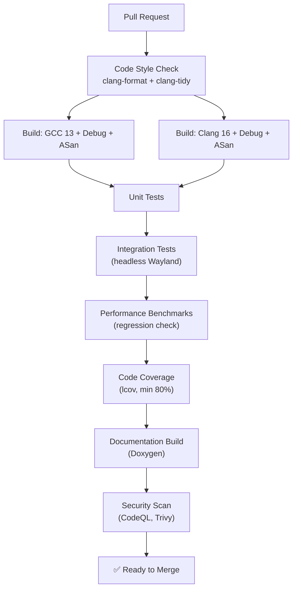

# Tinexus Shell — Build System & Development Infrastructure

> **Document:** 09_BUILD_SYSTEM.md  
> **Version:** 1.0.0  
> **Status:** FROZEN  
> **Classification:** Public — Open Source  
> **Depends on:** 03_SYSTEM_ARCHITECTURE.md, 04_FOLDER_STRUCTURE.md

---

## Table of Contents

1. [Build System Philosophy](#1-build-system-philosophy)
2. [Compiler and Language Standard](#2-compiler-and-language-standard)
3. [Qt Version and Configuration](#3-qt-version-and-configuration)
4. [CMake Layout and Organization](#4-cmake-layout-and-organization)
5. [Dependencies](#5-dependencies)
6. [Build Types and Presets](#6-build-types-and-presets)
7. [Build Configuration Options](#7-build-configuration-options)
8. [CI/CD Pipeline](#8-cicd-pipeline)
9. [Packaging and Distribution](#9-packaging-and-distribution)
10. [Installation Layout](#10-installation-layout)
11. [Versioning Strategy](#11-versioning-strategy)
12. [Developer Setup Guide](#12-developer-setup-guide)
13. [Code Quality Infrastructure](#13-code-quality-infrastructure)
14. [Documentation Generation](#14-documentation-generation)

---

## 1. Build System Philosophy

### 1.1 Principles

1. **Reproducibility** — The same source code + the same preset must produce an identical binary on any compatible machine
2. **Isolation** — Build system files and generated files never mix with source files
3. **Speed** — Developer build times must be reasonable: clean build < 10 minutes, incremental build < 60 seconds
4. **Clarity** — Every CMakeLists.txt file must be readable to any C++ developer without CMake expertise
5. **No magic** — No hidden scripts that run during build. Everything is explicit and traceable.

### 1.2 Build System Rules

- **CMake minimum version: 3.28** (first version with stable CMake Presets v6 support)
- **No Autotools.** No Meson. CMake is the single build system.
- **No `include(FetchContent)` for major dependencies** — Use system packages or submodules (vendored)
- **All targets must be namespaced:** `Tinexus Shell::comp`, `Tinexus Shell::launcher`, etc.
- **No `file(GLOB ...)` for source files** — All source files listed explicitly

---

## 2. Compiler and Language Standard

### 2.1 Required C++ Standard

**C++20** is the minimum standard. No C++17 or earlier idioms in new code.

C++20 features used actively:
- **Concepts** — For constraining template parameters in `ISearchProvider`
- **Ranges** — For result filtering and sorting in `ResultRanker`
- **Coroutines** — For async search provider queries (C++20 co_await)
- **Designated initializers** — For struct initialization
- **`std::span`** — For non-owning buffer views
- **`std::format`** — For log message formatting
- **`std::jthread`** — For automatically joined threads

### 2.2 Compiler Matrix

| Compiler | Minimum Version | Status | Notes |
|---|---|---|---|
| **GCC** | 13.0 | ✅ Primary | Full C++20 support |
| **Clang** | 16.0 | ✅ Primary | Better C++20 concepts |
| **MSVC** | — | ❌ Not supported | Linux-only project |
| **ICC** | — | ❌ Not tested | Not a target |

Both GCC and Clang are tested in CI on every PR. Releases are built with GCC (better LTO support on Linux).

### 2.3 Compiler Flags

```cmake
# cmake/warnings.cmake
target_compile_options(Tinexus Shell::warnings INTERFACE
    # Enable warnings
    -Wall
    -Wextra
    -Wpedantic
    -Wcast-align
    -Wconversion
    -Wsign-conversion
    -Wnull-dereference
    -Wdouble-promotion
    -Wformat=2
    -Wimplicit-fallthrough
    -Wshadow
    
    # Treat warnings as errors (only in CI builds)
    $<$<BOOL:${Tinexus Shell_WARNINGS_AS_ERRORS}>:-Werror>
    
    # Disable overly noisy warnings
    -Wno-unused-parameter
)

# cmake/sanitizers.cmake (Debug + CI builds only)
target_compile_options(Tinexus Shell::sanitizers INTERFACE
    $<$<CONFIG:Debug>:-fsanitize=address,undefined>
    $<$<CONFIG:Debug>:-fno-omit-frame-pointer>
)
target_link_options(Tinexus Shell::sanitizers INTERFACE
    $<$<CONFIG:Debug>:-fsanitize=address,undefined>
)
```

---

## 3. Qt Version and Configuration

### 3.1 Qt Version Requirements

| Qt Version | Status | Notes |
|---|---|---|
| **Qt 6.6+** | ✅ Required minimum | Stable Vulkan RHI, QtWayland platform plugin |
| **Qt 6.7+** | ✅ Recommended | QML declarative type registration improvements |
| **Qt 5.x** | ❌ Not supported | Qt 5 is EOL |

### 3.2 Qt Modules Used

| Module | Used In | Purpose |
|---|---|---|
| `Qt6::Core` | All components | Core utilities, signals/slots, D-Bus |
| `Qt6::Gui` | Launcher, wallpaper, lock | Window management, image loading |
| `Qt6::Quick` | Launcher, lock, settings-ui | QML scene graph, animations |
| `Qt6::Qml` | Launcher, lock, settings-ui | QML engine |
| `Qt6::DBus` | All components | D-Bus integration |
| `Qt6::Sql` | Launcher, clipboard | SQLite (usage history, clipboard history) |
| `Qt6::WaylandClient` | Launcher, wallpaper | Wayland client integration |
| `Qt6::QuickControls2` | Settings UI | Standard UI controls |
| `Qt6::Multimedia` | Wallpaper (v1.1) | Video wallpaper support |
| `Qt6::Concurrent` | Launcher, indexer | Thread pool utilities |

### 3.3 QML Import Paths

```cmake
# All Tinexus Shell QML modules use the io.Tinexus Shell namespace
qt_add_qml_module(tinexus-launcher
    URI "io.Tinexus Shell.Launcher"
    VERSION 1.0
    QML_FILES
        qml/Launcher.qml
        qml/SearchBar.qml
        qml/ResultList.qml
        # ...
)
```

### 3.4 QML Compilation

All QML is **precompiled** to native code at build time (Qt 6's `qt_add_qml_module` with `NO_CACHEGEN false`). No JIT compilation at runtime for known QML files.

---

## 4. CMake Layout and Organization

### 4.1 Root CMakeLists.txt

```cmake
cmake_minimum_required(VERSION 3.28)

project(Tinexus Shell
    VERSION 0.1.0
    DESCRIPTION "Tinexus Shell Desktop Environment"
    HOMEPAGE_URL "https://github.com/Tinexus Shell/Tinexus Shell"
    LANGUAGES C CXX
)

# C++20 standard enforcement
set(CMAKE_CXX_STANDARD 20)
set(CMAKE_CXX_STANDARD_REQUIRED ON)
set(CMAKE_CXX_EXTENSIONS OFF)  # No GNU extensions

# Out-of-source build enforcement
if(PROJECT_SOURCE_DIR STREQUAL PROJECT_BINARY_DIR)
    message(FATAL_ERROR
        "In-source builds are not allowed. "
        "Please create a build directory and run CMake from there."
    )
endif()

# Load cmake modules
include(cmake/options.cmake)
include(cmake/version.cmake)
include(cmake/warnings.cmake)
include(cmake/sanitizers.cmake)

# Find packages
find_package(Qt6 6.6 REQUIRED COMPONENTS Core Gui Quick Qml DBus Sql WaylandClient)
find_package(PkgConfig REQUIRED)
pkg_check_modules(WLROOTS REQUIRED IMPORTED_TARGET wlroots>=0.17)
pkg_check_modules(WAYLAND REQUIRED IMPORTED_TARGET wayland-client wayland-server)

# Create interface targets for common settings
add_library(Tinexus Shell::warnings INTERFACE IMPORTED)
add_library(Tinexus Shell::sanitizers INTERFACE IMPORTED)

# Subdirectories
add_subdirectory(src/common)
add_subdirectory(src/comp)
add_subdirectory(src/session)
add_subdirectory(src/settings)
add_subdirectory(src/notifications)
add_subdirectory(src/clipboard)
add_subdirectory(src/indexer)
add_subdirectory(src/wallpaper)
add_subdirectory(src/launcher)
add_subdirectory(src/lock)
add_subdirectory(src/settings-ui)

if(BUILD_TESTING)
    enable_testing()
    add_subdirectory(tests)
endif()
```

### 4.2 Component CMakeLists.txt Pattern

Each component follows this template:

```cmake
# src/launcher/CMakeLists.txt

set(LAUNCHER_SOURCES
    main.cpp
    controller/launcher_controller.cpp
    search/search_manager.cpp
    search/providers/app_provider.cpp
    search/providers/system_actions_provider.cpp
    search/providers/calculator_provider.cpp
    search/providers/clipboard_provider.cpp
    ranker/result_ranker.cpp
    history/usage_history.cpp
    ipc/launcher_dbus.cpp
)

qt_add_executable(tinexus-launcher ${LAUNCHER_SOURCES})

qt_add_qml_module(tinexus-launcher
    URI "io.Tinexus Shell.Launcher"
    VERSION 1.0
    QML_FILES
        qml/Launcher.qml
        qml/SearchBar.qml
        qml/ResultList.qml
        qml/ResultItem.qml
)

target_include_directories(tinexus-launcher PRIVATE
    ${CMAKE_CURRENT_SOURCE_DIR}/include
    ${CMAKE_CURRENT_SOURCE_DIR}
)

target_link_libraries(tinexus-launcher PRIVATE
    Tinexus Shell::common         # Shared library
    Tinexus Shell::warnings       # Compiler warnings
    Tinexus Shell::sanitizers     # ASan/UBSan (Debug only)
    Qt6::Core
    Qt6::Quick
    Qt6::Qml
    Qt6::DBus
    Qt6::Sql
    Qt6::WaylandClient
)

install(TARGETS tinexus-launcher
    RUNTIME DESTINATION ${CMAKE_INSTALL_LIBDIR}/Tinexus Shell
)
```

---

## 5. Dependencies

### 5.1 System Dependencies (Required)

| Dependency | Package Name (Debian) | Version | Purpose |
|---|---|---|---|
| wlroots | `libwlroots-dev` | ≥ 0.17 | Compositor foundation |
| Wayland | `libwayland-dev` | ≥ 1.22 | Wayland protocol |
| wayland-protocols | `wayland-protocols` | ≥ 1.32 | Standard Wayland protocol XMLs |
| libinput | `libinput-dev` | ≥ 1.24 | Input device handling |
| libseat | `libseat-dev` | ≥ 0.8 | Session/seat management (used by wlroots) |
| libdrm | `libdrm-dev` | ≥ 2.4.115 | DRM/KMS GPU access |
| Mesa / EGL | `libegl-dev` | ≥ 22.0 | OpenGL ES / EGL |
| libpam | `libpam0g-dev` | ≥ 1.5 | PAM authentication (lock screen) |
| libsystemd | `libsystemd-dev` | ≥ 251 | systemd-logind integration |
| Qt6 | `qt6-base-dev` + modules | ≥ 6.6 | UI framework |
| CMake | `cmake` | ≥ 3.28 | Build system |
| pkg-config | `pkg-config` | any | Dependency discovery |

### 5.2 System Dependencies (Optional)

| Dependency | Package | Purpose |
|---|---|---|
| xwayland | `xwayland` | X11 app compatibility (runtime, not build-time) |
| pipewire | `libpipewire-0.3-dev` | Screen cast / audio (v1.1) |
| libgbm | `libgbm-dev` | GBM buffer allocator (usually with Mesa) |

### 5.3 Vendored Dependencies (in `third_party/`)

| Library | Version | Purpose | Vendored Rationale |
|---|---|---|---|
| `tinyexpr` | 2.0 | Calculator expression evaluation | Single-file, no system package |
| `toml++` | 3.4 | TOML config parsing | Modern C++17/20 API, header-only option |
| `spdlog` | 1.13 | Structured logging | Header-only option, consistent API |
| `nlohmann/json` | 3.11 | JSON parsing for plugin IPC | Header-only, ubiquitous |

**Rule:** Only single-file or header-only libraries may be vendored. Libraries requiring their own build system must be system packages.

### 5.4 Development Dependencies (Not Shipped)

| Tool | Purpose |
|---|---|
| clang-format (16+) | Code formatting |
| clang-tidy (16+) | Static analysis |
| doxygen (1.9+) | API documentation |
| graphviz | Doxygen diagram generation |
| googletest | Unit testing framework |
| benchmark (Google) | Microbenchmark library |
| lcov / gcovr | Coverage reporting |

---

## 6. Build Types and Presets

### 6.1 CMakePresets.json

```json
{
  "version": 6,
  "configurePresets": [
    {
      "name": "base",
      "hidden": true,
      "binaryDir": "${sourceDir}/build/${presetName}",
      "cacheVariables": {
        "CMAKE_EXPORT_COMPILE_COMMANDS": "ON",
        "BUILD_TESTING": "ON"
      }
    },
    {
      "name": "debug",
      "displayName": "Debug",
      "description": "Debug build with ASan/UBSan",
      "inherits": "base",
      "cacheVariables": {
        "CMAKE_BUILD_TYPE": "Debug",
        "Tinexus Shell_ENABLE_SANITIZERS": "ON",
        "Tinexus Shell_WARNINGS_AS_ERRORS": "ON"
      }
    },
    {
      "name": "release",
      "displayName": "Release",
      "description": "Optimized release build",
      "inherits": "base",
      "cacheVariables": {
        "CMAKE_BUILD_TYPE": "Release",
        "Tinexus Shell_ENABLE_LTO": "ON",
        "BUILD_TESTING": "OFF"
      }
    },
    {
      "name": "relwithdebinfo",
      "displayName": "Release with Debug Info",
      "description": "Release build with debug symbols (for profiling)",
      "inherits": "base",
      "cacheVariables": {
        "CMAKE_BUILD_TYPE": "RelWithDebInfo"
      }
    },
    {
      "name": "ci",
      "displayName": "CI Build",
      "description": "Strict build for continuous integration",
      "inherits": "base",
      "cacheVariables": {
        "CMAKE_BUILD_TYPE": "Debug",
        "Tinexus Shell_ENABLE_SANITIZERS": "ON",
        "Tinexus Shell_WARNINGS_AS_ERRORS": "ON",
        "BUILD_TESTING": "ON"
      }
    }
  ],
  "buildPresets": [
    {
      "name": "debug",
      "configurePreset": "debug",
      "jobs": 0
    },
    {
      "name": "release",
      "configurePreset": "release",
      "jobs": 0
    },
    {
      "name": "ci",
      "configurePreset": "ci",
      "jobs": 4
    }
  ],
  "testPresets": [
    {
      "name": "unit",
      "configurePreset": "debug",
      "filter": { "include": { "name": "unit_.*" } }
    },
    {
      "name": "integration",
      "configurePreset": "debug",
      "filter": { "include": { "name": "integration_.*" } }
    }
  ]
}
```

### 6.2 Build Commands

```bash
# Configure debug build
cmake --preset debug

# Build all targets
cmake --build --preset debug

# Run all tests
ctest --preset unit

# Build release
cmake --preset release && cmake --build --preset release
```

---

## 7. Build Configuration Options

All CMake options are declared in `cmake/options.cmake`:

```cmake
# cmake/options.cmake

option(Tinexus Shell_ENABLE_SANITIZERS
    "Enable Address Sanitizer and UBSan (Debug builds)" OFF)

option(Tinexus Shell_WARNINGS_AS_ERRORS
    "Treat all compiler warnings as errors" OFF)

option(Tinexus Shell_ENABLE_LTO
    "Enable Link-Time Optimization (Release builds only)" OFF)

option(Tinexus Shell_ENABLE_XWAYLAND
    "Build with XWayland support" ON)

option(Tinexus Shell_ENABLE_VULKAN
    "Enable Vulkan rendering backend" ON)

option(Tinexus Shell_ENABLE_PIPEWIRE
    "Enable PipeWire integration (screen cast, v1.1)" OFF)

option(Tinexus Shell_BUILD_TESTS
    "Build test targets" ON)

option(Tinexus Shell_BUILD_DOCS
    "Build Doxygen documentation" OFF)

option(Tinexus Shell_INSTALL_SYSTEMD_UNITS
    "Install systemd user service files" ON)

option(Tinexus Shell_DEVELOPER_MODE
    "Enable developer mode (extra logging, debug tools)" OFF)
```

---

## 8. CI/CD Pipeline

### 8.1 CI Pipeline Overview



### 8.2 GitHub Actions Workflow (Main CI)

```yaml
# .github/workflows/ci.yml
name: CI

on:
  push:
    branches: [main, develop]
  pull_request:
    branches: [main]

jobs:
  style-check:
    name: Code Style
    runs-on: ubuntu-24.04
    steps:
      - uses: actions/checkout@v4
      - name: Install clang-format
        run: sudo apt-get install -y clang-format-16
      - name: Check formatting
        run: |
          find src tests -name "*.cpp" -o -name "*.hpp" | \
          xargs clang-format-16 --dry-run --Werror

  build-gcc:
    name: Build (GCC 13)
    runs-on: ubuntu-24.04
    steps:
      - uses: actions/checkout@v4
      - name: Install dependencies
        run: |
          sudo apt-get update
          sudo apt-get install -y \
            gcc-13 g++-13 cmake \
            qt6-base-dev qt6-declarative-dev qt6-wayland-dev \
            libwlroots-dev libwayland-dev wayland-protocols \
            libinput-dev libseat-dev libdrm-dev libegl-dev \
            libpam0g-dev libsystemd-dev
      - name: Configure
        run: cmake --preset ci -DCMAKE_C_COMPILER=gcc-13 -DCMAKE_CXX_COMPILER=g++-13
      - name: Build
        run: cmake --build --preset ci
      - name: Test
        run: ctest --preset unit --output-on-failure

  build-clang:
    name: Build (Clang 16)
    runs-on: ubuntu-24.04
    steps:
      - uses: actions/checkout@v4
      - name: Install dependencies
        run: |
          sudo apt-get update
          sudo apt-get install -y \
            clang-16 clang-tidy-16 cmake \
            qt6-base-dev qt6-declarative-dev qt6-wayland-dev \
            libwlroots-dev libwayland-dev wayland-protocols \
            libinput-dev libseat-dev libdrm-dev libegl-dev \
            libpam0g-dev libsystemd-dev
      - name: Configure
        run: cmake --preset ci -DCMAKE_C_COMPILER=clang-16 -DCMAKE_CXX_COMPILER=clang++-16
      - name: Build
        run: cmake --build --preset ci
      - name: Run clang-tidy
        run: |
          run-clang-tidy-16 -p build/ci \
            -header-filter='src/.*' \
            $(find src -name "*.cpp")

  coverage:
    name: Code Coverage
    runs-on: ubuntu-24.04
    needs: [build-gcc]
    steps:
      - uses: actions/checkout@v4
      - name: Build with coverage
        run: |
          cmake --preset ci -DCMAKE_CXX_FLAGS="--coverage"
          cmake --build --preset ci
          ctest --preset unit
      - name: Generate report
        run: |
          gcovr --xml --output coverage.xml --root src/
      - name: Check coverage threshold
        run: |
          python3 scripts/check_coverage.py coverage.xml --min 80

  security-scan:
    name: Security Scan
    runs-on: ubuntu-24.04
    permissions:
      security-events: write
    steps:
      - uses: actions/checkout@v4
      - name: Initialize CodeQL
        uses: github/codeql-action/init@v3
        with:
          languages: cpp
      - name: Build
        run: cmake --preset ci && cmake --build --preset ci
      - name: Perform CodeQL Analysis
        uses: github/codeql-action/analyze@v3
```

### 8.3 Release Pipeline

```yaml
# .github/workflows/release.yml
# Triggered on: git tag v*

on:
  push:
    tags:
      - 'v[0-9]+.[0-9]+.[0-9]+'

jobs:
  release-build:
    runs-on: ubuntu-24.04
    steps:
      - uses: actions/checkout@v4
      - name: Build release
        run: cmake --preset release && cmake --build --preset release
      - name: Package .deb
        run: scripts/create-deb-package.sh
      - name: Package .rpm
        run: scripts/create-rpm-package.sh
      - name: Create GitHub Release
        uses: softprops/action-gh-release@v1
        with:
          files: |
            dist/*.deb
            dist/*.rpm
            dist/CHANGELOG.md
```

---

## 9. Packaging and Distribution

### 9.1 Debian/Ubuntu Package

```
Package: Tinexus Shell
Version: 0.1.0
Architecture: amd64
Depends:
  libwlroots0.17 (>= 0.17.0),
  libwayland-client0 (>= 1.22.0),
  libinput10 (>= 1.24.0),
  libpam0g (>= 1.5.0),
  libsystemd0 (>= 251),
  qt6-base (>= 6.6.0),
  libqt6quick6 (>= 6.6.0),
  libqt6qml6 (>= 6.6.0)

Recommends:
  xwayland,
  pipewire

Conflicts:
  gnome-shell,
  plasma-workspace
  
Description: Tinexus Shell Desktop Environment
 A minimal, performance-first Wayland-native desktop environment
 featuring a command-palette-first interaction model.
```

### 9.2 Flatpak (Launcher only)

The Launcher can be distributed as a Flatpak for use alongside other compositors. This requires a running `tinexus-comp` or compatible compositor.

```yaml
# packaging/flatpak/io.Tinexus Shell.Launcher.yaml
app-id: io.Tinexus Shell.Launcher
runtime: org.kde.Platform
runtime-version: '6.6'
sdk: org.kde.Sdk//6.6
command: tinexus-launcher

finish-args:
  - --socket=wayland
  - --socket=session-dbus
  - --env=QT_QPA_PLATFORM=wayland
  - --talk-name=io.Tinexus Shell.Compositor
  - --talk-name=io.Tinexus Shell.Indexer
```

### 9.3 Arch Linux (AUR)

```bash
# packaging/arch/PKGBUILD
pkgname=Tinexus Shell
pkgver=0.1.0
pkgrel=1
pkgdesc='Tinexus Shell Desktop Environment'
arch=('x86_64' 'aarch64')
url='https://github.com/Tinexus Shell/Tinexus Shell'
license=('GPL2' 'Apache')
depends=(
    'wlroots>=0.17'
    'wayland>=1.22'
    'libinput>=1.24'
    'qt6-base>=6.6'
    'qt6-declarative>=6.6'
    'pam'
    'systemd'
)
build() {
    cmake --preset release -DCMAKE_INSTALL_PREFIX=/usr
    cmake --build --preset release
}
package() {
    DESTDIR="$pkgdir" cmake --install build/release
}
```

---

## 10. Installation Layout

### 10.1 File System Layout After Installation

```
/usr/
├── lib/Tinexus Shell/              # Daemon binaries (not in PATH)
│   ├── tinexus-comp
│   ├── tinexus-session
│   ├── tinexus-launcher
│   ├── tinexus-notif
│   ├── tinexus-settings
│   ├── tinexus-settings-ui
│   ├── tinexus-clip
│   ├── tinexus-indexer
│   ├── tinexus-wallpaper
│   └── tinexus-lock
│
├── bin/                        # User-facing CLI tools
│   └── tinexus-settings-cli    # Command-line settings tool
│
├── share/
│   ├── Tinexus Shell/
│   │   ├── qml/               # Installed QML files
│   │   ├── themes/            # Built-in themes
│   │   └── wayland-protocols/ # Custom protocol XMLs
│   │
│   ├── applications/
│   │   └── io.Tinexus Shell.SettingsUI.desktop
│   │
│   ├── icons/Tinexus Shell/       # Tinexus Shell icon theme
│   │
│   └── wayland-sessions/
│       └── Tinexus Shell.desktop  # Wayland session entry for display managers
│
└── lib/systemd/user/           # systemd user service files
    ├── Tinexus Shell-session.service
    ├── Tinexus Shell-comp.service
    ├── Tinexus Shell-notif.service
    ├── Tinexus Shell-settings.service
    ├── Tinexus Shell-clip.service
    ├── Tinexus Shell-indexer.service
    └── Tinexus Shell-wallpaper.service

/etc/
└── Tinexus Shell/
    ├── defaults/               # Default config files
    │   ├── compositor.toml
    │   ├── launcher.toml
    │   ├── theme.toml
    │   └── notifications.toml
    └── pam.d/
        └── Tinexus Shell-lock

~/.config/Tinexus Shell/            # User configuration (created on first run)
~/.local/share/Tinexus Shell/       # User data
~/.cache/Tinexus Shell/             # Cache (purgeable)
/run/user/{uid}/Tinexus Shell/      # Runtime sockets
```

### 10.2 Wayland Session File

```ini
# /usr/share/wayland-sessions/Tinexus Shell.desktop
[Desktop Entry]
Name=Tinexus Shell
Comment=Tinexus Shell Desktop Environment
Exec=/usr/lib/Tinexus Shell/tinexus-session
Type=Application
DesktopNames=Tinexus Shell
```

---

## 11. Versioning Strategy

### 11.1 Semantic Versioning

Tinexus Shell uses **Semantic Versioning 2.0.0**:

```
MAJOR.MINOR.PATCH[-PRERELEASE][+BUILD]
Examples:
  0.1.0          First public development release
  0.1.1          Patch release (bug fix)
  0.2.0          Minor release (new features, backward compatible)
  1.0.0          First stable release (API frozen)
  1.0.0-alpha.1  Pre-release
  1.0.0-beta.1   Beta pre-release
  1.0.0-rc.1     Release candidate
```

### 11.2 Version Source of Truth

The canonical version is in the `VERSION` file at the repository root:

```
0.1.0
```

CMake reads this file and generates `src/common/include/common/version.hpp`:

```cpp
// Generated by CMake — DO NOT EDIT
namespace Tinexus Shell {
    constexpr int VERSION_MAJOR = 0;
    constexpr int VERSION_MINOR = 1;
    constexpr int VERSION_PATCH = 0;
    constexpr const char* VERSION_STRING = "0.1.0";
    constexpr const char* BUILD_DATE = "2026-07-25";
    constexpr const char* GIT_COMMIT = "abc1234";
}
```

### 11.3 API Stability Policy

| Version Range | API Status |
|---|---|
| 0.x.y | UNSTABLE — APIs may change without notice |
| 1.0.0 | STABLE — Breaking changes require MAJOR version bump |
| 1.x.y | STABLE D-Bus interfaces (MINOR may add, not remove) |
| 2.0.0 | New stable API baseline (may break 1.x) |

### 11.4 Git Branching Strategy

```
main            ← Always release-ready. CI must pass.
develop         ← Integration branch for features
feature/xyz     ← Feature branches (from develop)
fix/xyz         ← Bug fix branches (from main or develop)
release/v1.0    ← Release branches (from develop)
```

---

## 12. Developer Setup Guide

### 12.1 Quick Start (Ubuntu 24.04 / Debian Sid)

```bash
# 1. Install build dependencies
sudo apt-get update && sudo apt-get install -y \
    gcc-13 g++-13 cmake ninja-build \
    qt6-base-dev qt6-declarative-dev qt6-wayland-dev \
    libwlroots-dev libwayland-dev wayland-protocols \
    libinput-dev libseat-dev libdrm-dev libegl-dev libegl-mesa0 \
    libpam0g-dev libsystemd-dev \
    clang-format-16 clang-tidy-16 \
    doxygen graphviz \
    libgtest-dev libbenchmark-dev

# 2. Clone repository
git clone https://github.com/Tinexus Shell/Tinexus Shell.git
cd Tinexus Shell
git submodule update --init --recursive

# 3. Configure + build (debug)
cmake --preset debug
cmake --build --preset debug -j$(nproc)

# 4. Run tests
ctest --preset unit --output-on-failure

# 5. Run style check
./scripts/check-style.sh
```

### 12.2 IDE Setup

**Recommended: CLion or VSCode with clangd**

For VSCode + clangd:
```json
// .vscode/settings.json
{
    "clangd.arguments": [
        "--compile-commands-dir=${workspaceFolder}/build/debug",
        "--clang-tidy",
        "--suggest-missing-includes"
    ]
}
```

The `cmake --preset debug` command generates `build/debug/compile_commands.json` which clangd uses for accurate code intelligence.

---

## 13. Code Quality Infrastructure

### 13.1 clang-format Configuration

```yaml
# .clang-format
BasedOnStyle: LLVM
Language: Cpp
Standard: c++20

# Indentation
IndentWidth: 4
TabWidth: 4
UseTab: Never

# Line length
ColumnLimit: 100

# Pointers
PointerAlignment: Left
ReferenceAlignment: Left

# Braces
BraceWrapping:
  AfterClass: true
  AfterFunction: true
  AfterNamespace: false
  AfterEnum: false
  AfterStruct: false

# Includes
IncludeBlocks: Regroup
IncludeCategories:
  # System headers
  - Regex: '^<.*>'
    Priority: 3
  # Qt headers
  - Regex: '^<Q.*>'
    Priority: 2
  # Project headers
  - Regex: '^".*"'
    Priority: 1

# Spacing
SpaceBeforeParens: ControlStatements
SpacesInAngles: false
AllowShortFunctionsOnASingleLine: None
AllowShortIfStatementsOnASingleLine: Never
```

### 13.2 clang-tidy Configuration

```yaml
# .clang-tidy
Checks: >
    -*, 
    cppcoreguidelines-*,
    -cppcoreguidelines-avoid-magic-numbers,
    modernize-*,
    -modernize-use-trailing-return-type,
    performance-*,
    readability-*,
    -readability-magic-numbers,
    -readability-named-parameter,
    bugprone-*,
    -bugprone-easily-swappable-parameters

WarningsAsErrors: '*'

CheckOptions:
  - key: cppcoreguidelines-special-member-functions.AllowSoleDefaultDtor
    value: true
  - key: modernize-use-default-member-init.UseAssignment
    value: true
```

### 13.3 Pre-commit Hook

```bash
# scripts/pre-commit (install: cp scripts/pre-commit .git/hooks/)
#!/bin/bash
set -e

echo "Running clang-format check..."
CHANGED=$(git diff --cached --name-only --diff-filter=ACMR | grep -E '\.(cpp|hpp)$' || true)
if [ -n "$CHANGED" ]; then
    echo "$CHANGED" | xargs clang-format-16 --dry-run --Werror
fi

echo "Pre-commit checks passed."
```

---

## 14. Documentation Generation

### 14.1 Doxygen Configuration

```ini
# Doxyfile
PROJECT_NAME           = "Tinexus Shell"
PROJECT_NUMBER         = @VERSION_STRING@  # Injected by CMake
OUTPUT_DIRECTORY       = docs/api
EXTRACT_ALL            = YES
EXTRACT_PRIVATE        = NO
RECURSIVE              = YES
INPUT                  = src/
FILE_PATTERNS          = *.cpp *.hpp
EXCLUDE_PATTERNS       = */third_party/* */tests/*
GENERATE_HTML          = YES
GENERATE_XML           = YES
HAVE_DOT               = YES
CALL_GRAPH             = YES
CALLER_GRAPH           = YES
DOT_IMAGE_FORMAT       = svg
MERMAID_CLASS_DIAGRAM  = YES
```

### 14.2 Documentation Build

```bash
# Build API documentation
cmake --preset debug -DTinexus Shell_BUILD_DOCS=ON
cmake --build --preset debug --target docs

# Output: build/debug/docs/api/html/index.html
```

---

*Document End: 09_BUILD_SYSTEM.md*  
*Next: 10_ROADMAP.md*
