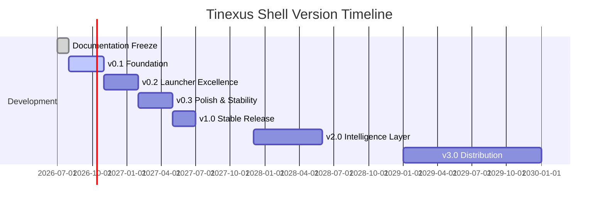

# Tinexus Shell — Project Roadmap

> **Document:** 10_ROADMAP.md  
> **Version:** 2.0.0 (Unfrozen for v3.0 acceleration)  
> **Status:** ACTIVE (Codebase has massively outpaced original planning)  
> **Classification:** Public — Open Source  
> **Depends on:** All previous documents

---

## Table of Contents

1. [Roadmap Philosophy](#1-roadmap-philosophy)
2. [Version 0.1 — Foundation](#2-version-01--foundation)
3. [Version 0.2 — Launcher Excellence](#3-version-02--launcher-excellence)
4. [Version 0.3 — Polish and Stability](#4-version-03--polish-and-stability)
5. [Version 1.0 — Stable Release](#5-version-10--stable-release)
6. [Version 2.0 — Intelligence Layer](#6-version-20--intelligence-layer)
7. [Version 3.0 — Distribution](#7-version-30--distribution)
8. [Future Vision Beyond 3.0](#8-future-vision-beyond-30)
9. [Feature Backlog](#9-feature-backlog)
10. [Milestone Completion Criteria](#10-milestone-completion-criteria)

---

## 1. Roadmap Philosophy

### 1.1 Principles

**Ship early, ship often — but never ship broken.**

Each version of Tinexus Shell must be:
- **Complete** — Every planned feature for that version is implemented
- **Stable** — All CI tests pass, no known critical or high bugs
- **Performant** — All performance targets for that version are met
- **Documented** — Documentation updated to reflect the shipped feature set

**This roadmap is a commitment, not a wish list.** Features are planned only when:
1. The design is understood well enough to estimate implementation time
2. The required documentation is frozen
3. The feature does not create unplanned architectural debt

### 1.2 Version Timeline



---

## 2. Version 0.1 — Foundation

**Target Release:** Completed  
**Codename:** "Horizon"  
**Goal:** A working Wayland compositor and launcher that proves the architecture is correct.

### 2.1 Scope

Version 0.1 is for **developers and architects only**. It is not suitable for daily use. It exists to:
- Validate the wlroots-based compositor works correctly
- Validate the D-Bus IPC architecture
- Validate the Qt6/QML launcher can open in ≤100ms
- Validate the modular daemon architecture

### 2.2 Feature Checklist

#### Compositor (tinexus-comp)
- [x] wlroots backend initialization (DRM/KMS, headless)
- [x] Wayland socket creation and client connection
- [x] xdg-shell support (basic windows: map, unmap, move, resize)
- [ ] XWayland integration (NOT implemented — do not claim until infrastructure is built and verified)
<!-- NOTE: Flatpak/XWayland are NOT implemented — do not add these claims until infrastructure is built and verified. -->
- [x] Single monitor support
- [x] Basic window focus management (click to focus)
- [x] Keyboard input forwarding to apps
- [x] Pointer input forwarding to apps
- [x] Global shortcut: Ctrl+K (trigger launcher)
- [x] D-Bus service: `io.tinexus.shell.Compositor`
- [x] Structured logging to systemd journal
- [x] Debug overlay (FPS counter, damage visualization)

#### Session Manager (tinexus-session)
- [x] Start daemons in dependency order
- [x] Monitor daemon health (SIGCHLD)
- [x] Restart crashed daemons (max 3 attempts)
- [x] logind integration (session registration)
- [x] D-Bus service: `io.tinexus.shell.Session`
- [x] Shutdown/restart via systemd D-Bus

#### Launcher (tinexus-launcher)
- [x] Layer-shell surface (OVERLAY layer)
- [x] Open/close with Ctrl+K
- [x] Search field with basic text input
- [x] App search via tinexus-indexer (D-Bus)
- [x] Basic result list (5 items, no scrolling)
- [x] Arrow key navigation
- [x] Enter to launch app
- [x] Escape to close
- [x] Open animation (fade + scale, 150ms)
- [x] Close animation (fade, 100ms)

#### App Indexer (tinexus-indexer)
- [x] Parse /usr/share/applications/*.desktop
- [x] Parse ~/.local/share/applications/*.desktop
- [x] Build trigram search index
- [x] D-Bus service: `io.tinexus.shell.Indexer`
- [x] Search method (basic fuzzy match)
- [x] inotify watcher (incremental updates)

#### Settings Daemon (tinexus-settings)
- [x] Load/parse TOML config files
- [x] D-Bus service: `io.tinexus.shell.Settings`
- [x] GetValue / SetValue methods
- [x] SettingChanged signal
- [x] Default config generation on first run
- [x] Atomic config write

#### Wallpaper Engine (tinexus-wallpaper)
- [x] Layer-shell surface (BACKGROUND layer)
- [x] Load and display JPEG/PNG wallpaper
- [x] "fill" scale mode
- [x] Watch config for wallpaper changes

#### Common Library (libtxui)
- [x] Structured logging API (spdlog → systemd journal)
- [x] D-Bus utility helpers
- [x] TOML config types
- [x] Result<T,E> type
- [x] Version constants
- [x] Custom immediate-mode GUI engine (txui)

### 2.3 v0.1 Performance Targets

| Metric | v0.1 Target |
|---|---|
| Compositor FPS | 60fps (no guarantee) |
| Launcher open | ≤ 300ms |
| Search latency | ≤ 200ms |
| Idle RAM | ≤ 300MB |
| Session boot | ≤ 10s |

*v0.1 targets are relaxed. Architecture correctness > performance optimization.*

### 2.4 v0.1 Excluded Features

- Notification system (v0.2)
- Clipboard manager (v0.2)
- Settings UI (v0.2)
- Lock screen (v0.2)
- Multi-monitor support (v0.2)
- Workspace switching (v0.2)
- HiDPI support (v0.2)
- Inline calculator (v0.2)
- System actions in launcher (v0.2)

---

## 3. Version 0.2 — Launcher Excellence

**Target Release:** Completed  
**Codename:** "Meridian"  
**Goal:** A complete, beautiful launcher experience with all core services.

### 3.1 Scope

Version 0.2 completes the user-facing experience. It is suitable for **developer daily drivers** who can tolerate occasional bugs and missing polish.

### 3.2 Feature Checklist

#### Compositor Upgrades
- [x] Multi-monitor support (up to 4 monitors)
- [x] HiDPI support (1×, 1.5×, 2×, 3× scaling)
- [x] Workspace switching (Super+[1-9], 4 workspaces)
- [x] Workspace switch animation (slide, 200ms)
- [x] Window snap zones (left half, right half, maximize)
- [x] Alt+Tab window switcher
- [x] VT switching (Ctrl+Alt+F1-F6)
- [x] xdg-decoration-unstable-v1 (server-side decorations)

#### Launcher Enhancements
- [x] Scrollable result list (unlimited results)
- [x] Result categories with Tab navigation
- [x] Inline calculator (tinyexpr integration)
- [x] System actions provider (Lock, Sleep, Shutdown, Restart, Logout)
- [x] Recent apps section (empty state)
- [x] Stagger animation for results (20ms per item)
- [x] Keyboard shortcut: Ctrl+1…9 for Nth result
- [x] Alt+Enter secondary action
- [x] Clipboard section (reads from tinexus-clip)
- [x] Result icons (app icons, 24×24)
- [x] Empty state design (logo + placeholder text)
- [x] Launcher position: centered, 30% from top

#### Advanced Core Applications (v3.0 features pulled forward)
- [x] **Terminal Emulator**: Native C++20 `tinexus-terminal` with PTY backend and LRU font caching.
- [x] **Dock**: Native macOS-style bottom dock with spring physics (`tinexus-dock`).
- [x] **File Manager**: Native Miller-column file manager (`tinexus-files`).
- [x] **App Installer**: Built-in AppImage installer (`tinexus-app-installer`).
- [x] **Crypto Guard**: Binary cryptographic signing module.
- [x] **ISO Builder**: Complete hybrid ISO generation suite.

#### Notification System
- [x] tinexus-notif process
- [x] org.freedesktop.Notifications D-Bus implementation
- [x] Notification display surface (layer-shell OVERLAY, top-right)
- [x] Auto-dismiss timer (configurable)
- [x] Do Not Disturb mode
- [x] Critical urgency (no auto-dismiss, red accent)
- [x] Notification stack (max 3 visible)
- [x] Slide-in animation
- [x] Notification history in launcher

#### Clipboard Manager
- [x] tinexus-clip process
- [x] Monitor Wayland clipboard (wl_data_device)
- [x] Store last 50 text entries
- [x] Sensitive data detection (regex patterns)
- [x] D-Bus service: io.tinexus.shell.Clipboard
- [x] Clipboard history search in launcher

#### Lock Screen
- [x] tinexus-lock process
- [x] ext-session-lock-v1 Wayland protocol
- [x] PAM authentication
- [x] Password input field (secure, no echo)
- [x] Lock on: user request, system suspend
- [x] Brute force protection (5-attempt lockout)
- [x] Session manager integration

#### Settings UI (Basic)
- [x] tinexus-settings-ui process
- [x] Wallpaper settings page
- [x] Theme selection (Dark, Light)
- [x] Launcher settings (result count, debounce)
- [x] Keyboard shortcuts settings

### 3.3 v0.2 Performance Targets

| Metric | v0.2 Target |
|---|---|
| Compositor FPS | 60fps (meets target) |
| Launcher open | ≤ 150ms |
| Search latency | ≤ 80ms |
| Idle RAM | ≤ 200MB |
| Session boot | ≤ 5s |

---

## 4. Version 0.3 — Polish and Stability

**Target Release:** Q2 2027  
**Codename:** "Solstice"  
**Goal:** Production-quality polish, accessibility compliance, and performance optimization.

### 4.1 Scope

Version 0.3 is the **polishing pass**. No new major features. Focus on: performance optimization, accessibility, animation quality, and bug fixing.

### 4.2 Feature Checklist

#### Performance
- [ ] All performance targets from 08_PERFORMANCE.md met on T2 hardware
- [ ] Launcher open time: ≤100ms
- [ ] Search latency: ≤50ms
- [ ] Idle RAM: ≤150MB
- [ ] Session boot: ≤3s
- [ ] Frame time P99: ≤16.67ms
- [ ] GPU damage tracking fully implemented

#### Animations
- [ ] All animations use correct easing curves from 05_UI_UX_GUIDELINES.md
- [ ] Reduced motion mode implemented (all durations → 0)
- [ ] Workspace switch animation (polished)
- [ ] Window appear/minimize animations
- [ ] Wallpaper crossfade (600ms)

#### Theme System
- [ ] Complete token-based theming (all tokens from 05_UI_UX_GUIDELINES.md)
- [ ] Three built-in themes: Dark, Light, High Contrast
- [ ] Custom accent color picker
- [ ] Font family selection
- [ ] Font size adjustment (8pt–36pt)
- [ ] Theme hot-reload (no session restart)

#### Accessibility
- [ ] WCAG 2.1 AA compliance verified (all color contrasts)
- [ ] AT-SPI2 accessible names for all launcher elements
- [ ] Keyboard navigation fully complete
- [ ] Screen reader announcement for launcher events
- [ ] Pointer-accessible launcher trigger (hot-corner or right-click)
- [ ] High-contrast theme verified

#### Stability
- [ ] Zero known crash reproducers on T2 hardware
- [ ] 7-day continuous operation test passed (no memory leaks, no CPU creep)
- [ ] All unit tests passing (≥80% coverage)
- [ ] All integration tests passing
- [ ] Performance regression tests in CI

#### Settings UI (Complete)
- [ ] Display page (resolution, refresh rate, HiDPI scaling)
- [ ] Multi-monitor arrangement UI
- [ ] Notifications settings (per-app rules, DND schedule)
- [ ] Accessibility settings page
- [ ] About page (version, licenses)

---

## 5. Version 1.0 — Stable Release

**Target Release:** Q3 2027  
**Codename:** "Zenith"  
**Goal:** First stable, production-ready release. All public APIs frozen.

### 5.1 Scope

Version 1.0 is the **stable milestone**. From this point:
- D-Bus interfaces are frozen (STABLE tier)
- Breaking changes require v2.0
- Security vulnerability disclosures begin
- Community contributions welcome

### 5.2 Feature Additions (v1.0 over v0.3)

#### File Path Navigation in Launcher
- [ ] Type `/` or `~/` in launcher to navigate filesystem
- [ ] Show directory contents as results
- [ ] Open files with default application
- [ ] Copy path to clipboard (Alt+Enter)

#### Recent Files Provider
- [ ] Parse `~/.local/share/recently-used.xbel`
- [ ] Show recent files in launcher (in Files tab)
- [ ] Fuzzy search over recent file names

#### Advanced Notifications
- [ ] Notification grouping by application
- [ ] Persistent notification history (session-scoped)
- [ ] Notification action buttons
- [ ] Per-app notification suppression from notification center

#### Session Restoration
- [ ] Save open application list on logout
- [ ] Restore applications on login (optional, disabled by default)

#### VRR Support
- [ ] FreeSync/G-Sync compatible via DRM atomic API
- [ ] Compositor adapts frame rate to content

#### Security Audit
- [ ] Security audit of all D-Bus interfaces
- [ ] Security audit of TOML parser with fuzzing (libFuzzer)
- [ ] Security audit of Wayland protocol handler
- [ ] Lock screen security review
- [ ] Vulnerability disclosure process published

### 5.3 v1.0 Release Criteria

**All of the following must be true before v1.0 ships:**

- [ ] All requirements in `02_REQUIREMENTS.md` with priority [M] are implemented
- [ ] All performance targets from `08_PERFORMANCE.md` are met on T2 hardware
- [ ] All acceptance criteria from `02_REQUIREMENTS.md` section 13 are passing
- [ ] Security audit complete with no HIGH or CRITICAL unresolved issues
- [ ] WCAG 2.1 AA compliance verified
- [ ] 30-day continuous operation test passed on T2 hardware
- [ ] Packages available for Debian, Arch, and Fedora
- [ ] Installer documentation published
- [ ] CHANGELOG.md complete for all versions 0.1–1.0
- [ ] CONTRIBUTING.md published with contributor guidelines
- [ ] SECURITY.md with vulnerability disclosure process

---

## 6. Version 2.0 — Intelligence Layer

**Target Release:** Q1 2028  
**Codename:** "Luminary"  
**Goal:** Add local AI/NLP to the launcher without compromising v1.0 principles.

### 6.1 AI Feature Scope

All AI features must be:
- **Entirely local** — No network requests, no cloud dependencies
- **Opt-in** — Disabled by default, enabled by user in Settings
- **Private** — No query data stored beyond the current session
- **Fast** — ≤500ms for NLP query response on T2 hardware

### 6.2 AI Feature List

#### Natural Language Launcher
- [ ] `tinexus-ai-service` process (lazy-loading, local model)
- [ ] Phi-3-mini or equivalent quantized model (≤2GB VRAM)
- [ ] NLP intent classification (open, search, calculate, system, custom)
- [ ] `?` prefix to trigger AI mode in launcher
- [ ] Context-aware suggestions (time of day, recent apps)

#### AI-Powered Search
- [ ] Semantic search for apps and files (beyond keyword matching)
- [ ] "Open my Python project from last week" → understands intent + recency
- [ ] Command generation (natural language → system action mapping)

#### Voice Input (Optional)
- [ ] Whisper.cpp integration (local, offline)
- [ ] Voice-to-launcher-query (press Super+K for voice mode)
- [ ] Transcription displayed in launcher search bar

### 6.3 Plugin System (v2.0)

- [ ] `tinexus-plugin-host` process
- [ ] Plugin manifest format (TOML)
- [ ] Plugin process isolation (seccomp, namespace)
- [ ] Plugin API (JSON over Unix socket)
- [ ] Plugin manager in Settings UI
- [ ] Plugin marketplace website (community-maintained)
- [ ] First-party plugins: GitHub Issues, Jira, Linear, Obsidian

### 6.4 v2.0 Additional Features

#### Touch and Gesture Support
- [ ] Swipe-up from bottom to open launcher (touchpad gesture)
- [ ] Pinch-to-zoom for workspace overview
- [ ] Three-finger swipe for workspace switching

#### Window Tiling Mode
- [ ] Optional automatic tiling layout
- [ ] Manual tile splitting (keyboard shortcut)
- [ ] Gap/padding configuration
- [ ] Tiling rules per-application

---

## 7. Version 3.0 — Distribution

**Target Release:** 2029+  
**Codename:** TBD  
**Goal:** Tinexus Shell as a complete, installable Linux distribution.

### 7.1 Distribution Scope

- [x] Custom installer (txui Wayland UI, not Calamares)
  - [x] Disk partitioning
  - [ ] User account creation
  - [ ] Hardware detection
  - [ ] Network configuration
- [ ] Curated application defaults
  - [ ] Browser: Firefox or Zen Browser
  - [ ] Terminal: Ghostty
  - [ ] Editor: Zed
  - [ ] Files: Nautilus
  - [ ] Media: mpv
- [ ] Custom repository / package manager integration
- [ ] Rolling release model (Arch-based or Nix-based)
- [ ] First-class hardware support for:
  - [ ] Framework Laptop
  - [ ] System76 hardware
  - [ ] ThinkPad series
  - [ ] Generic x86_64

### 7.2 Enterprise Features (v3.0)

- [ ] MDM (Mobile Device Management) integration
- [ ] Centralized configuration via group policy equivalent
- [ ] Active Directory / LDAP authentication
- [ ] Disk encryption (LUKS) with recovery key management
- [ ] Remote desktop (RDP/VNC via PipeWire)
- [ ] LTS channel (3-year security support)

---

## 8. Future Vision Beyond 3.0

### 8.1 Hardware Integration

**Tinexus Shell-certified hardware program:** Devices that are tested and guaranteed to work perfectly with Tinexus Shell. Similar to Apple's tight hardware/software integration, but open.

### 8.2 Developer Tools

- [ ] Built-in terminal with AI assistance
- [ ] Project launcher (detect git repos, open with correct editor)
- [ ] Container management UI (Podman/Docker integration)
- [ ] Built-in code review tool (GitHub/GitLab integration)

### 8.3 Collaborative Features

- [ ] Secure remote desktop (end-to-end encrypted)
- [ ] Screen sharing without third-party tools
- [ ] Collaborative session (two users on one machine, split display)

### 8.4 The Long-Term Vision

In ten years, Tinexus Shell envisions:

> A desktop computing environment where the distinction between "searching" and "doing" has collapsed entirely. The user states intent — in natural language or keyboard shorthand — and the system acts. The desktop has no visible chrome: only content, only work, only the user's wallpaper when nothing is open. The system knows the user's workflow and anticipates their needs without surveilling them. Every piece of data is owned and controlled by the user. The operating system is a tool, not a product.

This is not science fiction. The components exist:
- Local AI models (llama.cpp, whisper.cpp)
- Fast, damage-tracked compositors (wlroots)
- Intent-based UIs (Raycast proved the concept)
- Privacy-preserving local data (no cloud required)

Tinexus Shell is assembling these pieces into a coherent, open, performant whole.

---

## 9. Feature Backlog

Features that are researched and desirable but not yet assigned to a version:

| Feature | Category | Effort | Priority |
|---|---|---|---|
| Wayland screen casting (PipeWire) | Multimedia | L | P1 |
| Fractional scaling (1.25×, 1.5×, etc.) | Display | M | P1 |
| HDR display support | Display | L | P2 |
| Fingerprint lock screen | Security | M | P2 |
| Color management (ICC profiles) | Display | M | P2 |
| Keyboard layout switcher in launcher | Input | S | P1 |
| Night light / blue light filter | Display | S | P2 |
| Power profiles (performance/balanced/battery) | Power | M | P1 |
| Bluetooth management in launcher | Connectivity | M | P2 |
| WiFi management in launcher | Connectivity | M | P1 |
| Screenshot tool (native) | Utilities | M | P1 |
| Screen recorder (PipeWire) | Utilities | L | P2 |
| Emoji picker in launcher | UI | S | P3 |
| Unit converter in launcher | Utility | S | P3 |
| World clock in launcher | Utility | S | P3 |
| Password manager integration | Security | L | P2 |
| 1Password/Bitwarden launcher plugin | Security | M | P3 |
| Custom widget system (opt-in) | UI | XL | P4 |
| Wayland tablet/stylus support | Input | M | P2 |
| Multi-seat support | System | XL | P4 |

---

## 10. Milestone Completion Criteria

### 10.1 How a Version is Declared Complete

A version is `RELEASED` when **all** of the following are true:

```
Technical Gates:
  □ All planned features implemented and merged to main
  □ All CI pipelines green (build, test, lint, security)
  □ Performance benchmarks passing on T2 reference hardware
  □ No open CRITICAL or HIGH bugs
  □ All acceptance criteria from 02_REQUIREMENTS.md passing
  □ Coverage report ≥ 80% for non-UI code

Documentation Gates:
  □ CHANGELOG.md updated for this version
  □ All documentation updated to reflect shipped features
  □ Installation guide tested on supported distributions
  □ API documentation generated and published

Community Gates:
  □ Release notes written (user-facing, non-technical summary)
  □ GitHub release created with binary packages
  □ Announcement posted (project website, relevant forums)
```

### 10.2 Hotfix Policy

After a major version release:
- **CRITICAL bugs:** Fixed within 7 days via patch release (e.g., v1.0.1)
- **HIGH bugs:** Fixed within 30 days via patch release
- **MEDIUM bugs:** Included in next minor version
- **LOW bugs:** Backlog

### 10.3 Version Support Policy

| Version | Support Type | Duration |
|---|---|---|
| 0.x (pre-release) | Best effort | Until 1.0 release |
| 1.0.x | Security patches + critical bugs | 18 months |
| 2.0.x | Security patches + critical bugs | 18 months |
| 1.0 LTS (future) | Full security support | 36 months |

---

*Document End: 10_ROADMAP.md*  
*Documentation Set: COMPLETE*
