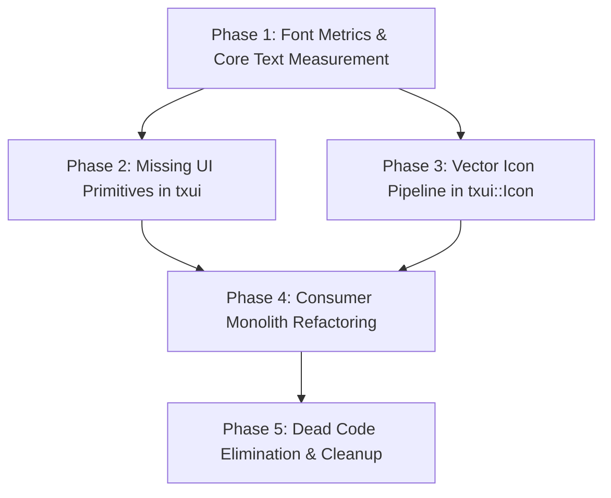

# libtxui Comprehensive Architectural Audit & Consumer Inventory Report
**Document ID:** `TXUI_AUDIT_2026-09`  
**Date:** September 7, 2026  
**Status:** DRAFT / PENDING REVIEW  
**Scope:** `libtxui` toolkit core, render backends, and all 9 consumer applications (`tinexus-shell`, `tinexus-files`, `tinexus-settings-ui`, `tinexus-lock`, `tinexus-about`, `tinexus-terminal`, `tinexus-dock`, `tinexus-notifications`, `tinexus-installer`).

---

## 1. Executive Summary & Findings Table

### 1.1 Overview
`libtxui` is designed to be the foundational UI toolkit for the Tinexus platform, providing a Wayland-native, software-rasterized (Pixman / FreeType 2) Measure → Layout → Paint pipeline. The goal is total visual consistency, deterministic frame budgets, zero external UI runtime bloat, and clean component composition.

However, an exhaustive audit reveals an architectural chasm between the **intent** of `libtxui` and the **reality** of consumer application code. Because `libtxui` currently lacks standard interactive widget primitives (such as `Button`, `TextInput`, `SegmentedControl`, `Slider`, and `ToggleSwitch`) and critically lacks a public `measure_text()` / font metrics API, almost every consumer application bypassed widget composition. Developers wrote monolithic 500–2000 line widgets that hand-paint screens imperatively via `Painter` and implement ad-hoc bounding-box hit-testing inside `handle_event()`.

### 1.2 Master Findings Table

| ID | Severity | Category | File(s) & Line(s) | Summary Description |
|:---|:---|:---|:---|:---|
| **F-01** | **Critical** | Architectural Gap / Bug | `src/txui/render/pixman/PixmanBackend.cpp:525-620`<br>`include/txui/render/Painter.hpp:82-93` | **Total absence of text measurement API**: FreeType 2 glyph metrics exist internally in `PixmanBackend`, but neither `Painter` nor `PixmanBackend` exposes `measure_text()` / `text_extents()`. |
| **F-02** | **Critical** | Bug / Magic Heuristic | `src/txui/render/pixman/PixmanBackend.cpp:543-545`<br>`src/txui/widgets/Label.cpp:28-65` | **Dual-meaning `scale` & text calculation divergence**: `PixmanBackend` interprets `scale <= 5.0` as multiplier of 16px, and `scale > 5.0` as point size. `Label` passes font size as scale while measuring with `* 0.6`. |
| **F-03** | **Critical** | Toolkit Bypass | `src/notifications/main.cpp:170-405`<br>`src/notifications/NotificationBubble.cpp:1-268` | **Complete toolkit bypass in `tinexus-notifications`**: Bypasses `txui::Window`, directly creates `zwlr_layer_surface_v1`, runs custom poll loop, and renders bubbles imperatively with 0 widgets. |
| **F-04** | **Critical** | Toolkit Bypass | `src/settings-ui/SettingsWidget.cpp:1-1934`<br>`src/settings-ui/SettingsWidget.hpp:1-120` | **1934-line imperative monolith in Settings**: 0 child widgets across 7 pages; hand-paints custom buttons, switches, sliders, text inputs, modal dialogs, and invented its own 20-line text estimator. |
| **F-05** | **Critical** | Toolkit Bypass | `src/shell/DesktopShellWidget.cpp:1-1158`<br>`src/shell/DesktopShellWidget.hpp:1-102` | **1158-line imperative monolith in Desktop Shell**: 0 child widgets; hand-paints top bar, trapezoid notch, menus, calendar, notifications, search bar, and command palette results. |
| **F-06** | **Critical** | Toolkit Bypass | `src/files/ui/ColumnBrowserWidget.cpp:1-1937` | **1937-line imperative monolith in Files**: Bypasses `txui::ListView` to hand-roll custom table list, icon grid, sidebar, breadcrumbs, search field, quick look modal, and context menu. |
| **F-07** | **High** | Bug / Concurrency | `src/txui/widgets/ListView.cpp:146-147` | **Shared process-global state in `ListView`**: Function-local `static int32 last_clicked` and `static auto last_time` corrupt double-click detection across multiple `ListView` instances in the same process. |
| **F-08** | **High** | Placeholder / Bypass | `src/txui/widgets/Icon.cpp:28-77`<br>`src/dock/ui/DockWidget.cpp:179-246` | **Placeholder `Icon` & app bypass**: `Icon.cpp` only draws crude shapes (circle/rect). `DockWidget` bypassed `Icon` to draw custom vector shapes (`>_`, cog, bar chart, folder). |
| **F-09** | **High** | Dead Code | `include/txui/window/WindowDecorator.hpp:1-45`<br>`src/txui/window/WindowDecorator.cpp:1-42` | **Dead code in `WindowDecorator`**: Empty stub methods (`pre_paint`, `post_paint`). Never referenced by any app; `ChromeWidget` handles decorations independently. |
| **F-10** | **High** | Dead Code / Duplication | `include/txui/widgets/TextWidget.hpp:1-75`<br>`include/txui/widgets/Label.hpp:1-55` | **Redundant `TextWidget` header**: Duplicates `Label` with conflicting measurement heuristic (`* 8 * scale`); included once in `launcher` and never constructed. |
| **F-11** | **High** | Dead Code | `src/files/ui/FilesWindow.hpp:1-25`<br>`src/files/ui/FilesWindow.cpp:1-25` | **Dead `FilesWindow` class**: Subclasses `txui::Window` but is completely unused. `files/main.cpp` instantiates `txui::Window::create()` directly. |
| **F-12** | **High** | Dead Code / Stubs | `src/installer/ui/InstallerWindow.cpp:81-85` | **Empty placeholder rendering functions**: Five empty stub functions (`render_welcome_screen()`, etc.) in `InstallerWidget`. |
| **F-13** | **High** | Duplication | 7 consumer files (see Sec. 3.2) | **Repeated Button hover/click hit-testing**: Reimplemented from scratch in TitleBar, Settings, Files, About, Shell, Notifications, and Dock because `txui` lacks a `Button` widget. |
| **F-14** | **High** | Duplication | 5 consumer files (see Sec. 3.2) | **Repeated Text Input / Caret logic**: Reimplemented from scratch in Settings, Files, Shell, Lock, and Launcher because `txui` lacks a `TextInput` widget. |
| **F-15** | **High** | Duplication | 3 consumer files (see Sec. 3.2) | **Repeated Segmented Control logic**: Reimplemented from scratch in About (5 tabs), Files (4 view modes), and Settings (options) because `txui` lacks a `SegmentedControl` widget. |
| **F-16** | **High** | Magic Constants | 8 files (see Sec. 2.5) | **Widespread magic text width multipliers**: Proliferation of hardcoded constants (`* 0.6`, `* 5.5`, `* 6.6`, `* 6.8`, `* 7.0`, `* 7.2`, `* 7.4`, `* 8.0`, `* 10.5`) across all UI layers. |
| **F-17** | **Medium** | Duplication | `src/launcher/main.cpp:30-81`<br>`src/shell/DesktopShellWidget.hpp:17-26` | **Identical AppItem / spawn_app logic**: `enum ResultKind`, `struct AppItem`, and `spawn_app()` duplicated verbatim between Launcher and Shell. |
| **F-18** | **Medium** | Architectural Violation | `include/txui/widgets/DockWidget.hpp:1-85`<br>`src/dock/ui/DockWidget.cpp:1-367` | **Header placement violation**: Application-specific `DockWidget.hpp` is placed in core `txui/widgets/` header directory instead of `src/dock/`. |
| **F-19** | **Medium** | Magic Constants | `src/terminal/TerminalWidget.hpp:32`<br>`src/terminal/TerminalWidget.cpp:32, 66` | **Hardcoded terminal cell dimensions**: Cell width (`10.0`) and height (`20.0`) hardcoded regardless of font face or scaling. |
| **F-20** | **Low** | Policy / Comment Cleanup | `src/txui/widgets/ChromeWidget.cpp:70`<br>`include/txui/widgets/ChromeWidget.hpp:11` | **Prohibited external OS references in comments**: Code comments refer to external desktop designs violating project rules. |

---

## 2. Detailed Findings & Analysis

### 2.1 Text Measurement / Rendering Mismatch (Finding F-01, F-02, F-16)

#### The Root Problem
In `libtxui`, the rendering backend (`PixmanBackend.cpp`) initializes FreeType 2, loads vector font files (`Inter-Regular.ttf` for UI, `DejaVuSansMono.ttf` for Monospace), and caches rasterized glyphs in `CachedGlyph`. Every `CachedGlyph` contains exact metrics:
```cpp
// PixmanBackend.cpp line 515:
glyph.advance_x = static_cast<int32>(slot->advance.x >> 6);
glyph.width = slot->bitmap.width;
glyph.rows = slot->bitmap.rows;
```
However, **neither `PixmanBackend` nor `Painter` exposes any text measurement function** to the rest of the toolkit or consumer applications.
- There is NO `Painter::measure_text()`.
- There is NO `PixmanBackend::measure_text()`.
- There is NO `txui::FontMetrics` or `txui::TextMeasurer`.

#### Consequences in the Codebase
Because widgets cannot query the true width or height of rendered text, developers resorted to crude heuristic formulas:

1. **`txui::Label` (`src/txui/widgets/Label.cpp:31, 41, 49`):**
   ```cpp
   double width = static_cast<double>(m_text.length()) * (m_font_size * 0.6);
   double height = m_font_size * 1.2;
   ```
   Furthermore, `Label::paint_override` attempts text truncation via binary search using the exact same fake `* 0.6` heuristic:
   ```cpp
   double test_w = static_cast<double>(test.length()) * (m_font_size * 0.6);
   ```
2. **`txui::TitleBarWidget` (`src/txui/widgets/TitleBarWidget.cpp:75`):**
   ```cpp
   const double text_w = static_cast<double>(m_title.length()) * 5.5; // approx at scale 1.0
   Point title_pos{f.x() + (f.width() - text_w) / 2.0, f.y() + (f.height() - 14.0) * 0.5};
   ```
   At scale `1.0` (which is 16px in `PixmanBackend`), an average glyph in `Inter-Regular` is ~8.5px wide. Estimating `5.5px` underestimates title width by ~35%, causing window titles to be noticeably off-center.
3. **`txui::TextWidget` (`include/txui/widgets/TextWidget.hpp:19`):**
   ```cpp
   double width = static_cast<double>(m_text.size() * 8) * m_scale;
   ```
4. **`SettingsWidget` (`src/settings-ui/SettingsWidget.cpp:69-89`):**
   `SettingsWidget` invented an entire 20-line fake metric table:
   ```cpp
   inline float64 estimate_text_width(const std::string& text, float64 font_scale = 1.0, bool bold = true) {
       float64 size = (font_scale <= 5.0) ? (16.0 * font_scale) : font_scale;
       float64 total_w = 0.0;
       for (char c : text) {
           if (c == '*') total_w += std::round(size * 0.533);
           else if (c == ' ' || c == '.' || c == ':') total_w += size * 0.32;
           else if (c == 'i' || c == 'l' || c == 't') total_w += size * 0.36;
           else if (c == 'm' || c == 'w' || c == 'M') total_w += size * 0.85;
           else if (c >= 'A' && c <= 'Z') total_w += size * 0.65;
           else total_w += size * 0.54;
       }
       if (bold && text.find('*') == std::string::npos) total_w *= 1.10;
       return std::ceil(total_w);
   }
   ```
5. **Consumer Heuristics:**
   - `LockWidget.cpp:123`: `time_char_w = 8.0 * TIME_SCALE;`
   - `LockWidget.cpp:207`: `hint.size() * 7.2;`
   - `AboutWidget.cpp:283`: `tab_names[i].size() * 7.4;`
   - `AboutWidget.cpp:312`: `brand_title.size() * 10.5;`
   - `AboutWidget.cpp:322`: `rel_tag.size() * 6.6;`
   - `ColumnBrowserWidget.cpp:1306`: `s_info.size() * 7.0;`
   - `NotificationBubble.cpp:126`: `m_item.actions[i].label.size() * 8.0 + 20.0;`

#### The Dual-Meaning `scale` Trap
In `PixmanBackend.cpp:543-545`:
```cpp
// Handle both old scale multipliers (e.g. 1.0, 2.0) and new explicit point sizes (e.g. 14, 15)
int size = (scale <= 5.0) ? static_cast<int>(std::round(16.0 * scale)) : static_cast<int>(std::round(scale));
```
This is a critical latent bug:
- If caller passes `1.0`, font size = `16px`.
- If caller passes `2.0`, font size = `32px`.
- If caller passes `6.0`, font size = `6px`!
- In `Label.cpp`: `m_font_size` defaults to `14.0`. When passed to `painter.draw_text(..., m_font_size)`, `PixmanBackend` uses `14px`. BUT in `Label::measure_override`, `m_font_size * 0.6 = 8.4px per char`. If someone sets `m_font_size = 2.0` (thinking scale multiplier), `measure_override` computes `2.0 * 0.6 = 1.2px per char` while `PixmanBackend` renders at `32px`!

#### Proposed Correct Solution
1. Add `FontMetrics` struct and `measure_text()` method to `PixmanBackend`:
   ```cpp
   struct TextExtents {
       double width{0.0};
       double height{0.0};
       double ascent{0.0};
       double descent{0.0};
   };
   TextExtents PixmanBackend::measure_text(std::string_view text, double font_size,
                                          bool bold = false, FontFamily family = FontFamily::UI);
   ```
2. Expose a static or context-backed `TextMeasurer` / `FontMetrics` service in `txui`:
   `txui::FontMetrics::measure(text, font_size, bold, family)` accessible in any `measure_override()`.
3. Discontinue the ambiguous `scale <= 5.0` heuristic in `PixmanBackend`. Parameterize `draw_text` with explicit point/pixel size `font_size` (e.g. `14.0`).
4. Update `Label::measure_override()`, `Label::paint_override()`, and all consumers to use exact FreeType measurements.

---

### 2.2 Icon.cpp Placeholder Status & App Workarounds (Finding F-08)

#### The Problem
`txui::Icon` (`src/txui/widgets/Icon.cpp:28-77`) contains MVP placeholder geometry marked with comments:
```cpp
// MVP Placeholder Shapes
case IconType::Home:
    painter.fill_circle(..., Color(0, 122, 255, 255));
    painter.fill_rect(..., Color(255, 255, 255, 255));
    break;
case IconType::Folder:
    painter.fill_rounded_rect(f, m_size * 0.2, Color(50, 150, 250, 255)); // Literally just a rounded rectangle!
    break;
case IconType::Executable:
    painter.fill_circle(..., Color(50, 200, 100, 255)); // Literally just a green circle!
    break;
```
Because `txui::Icon` produced unacceptable visual output for a desktop platform, apps avoided it:
1. **`DockWidget.cpp:179-246`** implemented its own complete icon renderer `draw_icon_symbol`:
   - `tinexus-terminal`: Renders vector `>` chevron and `_` underscore cursor.
   - `tinexus-files`: Renders folder tab, folder body, and recessed darker inner card.
   - `tinexus-settings`: Renders central wheel with inner hole and 8 radial gear teeth using trigonometric offsets.
   - `tinexus-monitor`: Renders 4-bar dynamic graph with varying heights and green peak.
   - Generic: Renders 3D package box with lid and vertical tape stripe.
2. **`ColumnBrowserWidget.cpp:788-794 & 957-970`** bypassed `txui::Icon` in both its sidebar and list table, drawing ad-hoc circles, rounded rectangles, and document sheets directly via `Painter`.

#### Proposed Correct Solution
1. Upgrade `txui::Icon` into a robust vector-path or pre-rendered icon asset renderer:
   - Provide standard system glyph definitions directly in `Icon.cpp` (or an icon atlas / SVG path renderer).
   - Support standard MIME icons, folder icons with proper tabs, and file-type badges.
2. Deprecate and remove ad-hoc icon drawing functions in `DockWidget` and `ColumnBrowserWidget`, replacing them with `txui::Icon`.

---

### 2.3 ListView Double-Click State Bug & Static Variables (Finding F-07)

#### The Problem
In `src/txui/widgets/ListView.cpp:146-157`:
```cpp
// Handle double click logic? Since txui doesn't have double-click event yet, we could mock it.
// For MVP, maybe we'll use a specific event or time-based logic.
// For now, if it's already selected and clicked again, treat as double click!
// Not ideal, but works for MVP navigation.
static int32 last_clicked = -1;
static auto last_time = std::chrono::steady_clock::now();
auto now = std::chrono::steady_clock::now();
auto diff = std::chrono::duration_cast<std::chrono::milliseconds>(now - last_time).count();

if (i == last_clicked && diff < 500) {
    if (m_on_double_clicked) m_on_double_clicked(i);
    last_clicked = -1;
} else {
    last_clicked = i;
    last_time = now;
}
return true;
```

#### Why It Fails
Because `last_clicked` and `last_time` are declared `static` inside a member function:
1. Every `ListView` instance in the same process shares this single pair of variables.
2. If an application contains two `ListView` widgets (e.g. sidebar list + main directory list), clicking item index 2 in ListView A, then clicking item index 2 in ListView B within 500ms will trigger a double-click activation in ListView B!
3. Even in a single list, clicking item 0, having the list contents change, and clicking item 0 again within 500ms triggers false double clicks.

#### Other Static Variables in UI Functions
A full scan across `src/txui` and all consumer code revealed:
- `src/shell/DesktopShellWidget.cpp:251-253`: `s_cached_bars`, `s_cached_conn`, `s_last_check` inside `read_network_status()` (caches network status for 5 seconds — acceptable helper cache, but belongs in a service class).
- `src/txui/widgets/ListView.cpp:146-147`: The **only** widget state bug of this class in `txui`.

#### Proposed Correct Solution
1. Move `m_last_clicked_index` and `m_last_click_time` into `ListView` private member variables (`ListView.hpp`).
2. Add a formal double-click event or explicit timestamp tracking in `txui::Event` / `txui::PointerEvent`.

---

### 2.4 WindowDecorator Dead / Empty Code (Finding F-09)

#### The Problem
`include/txui/window/WindowDecorator.hpp` and `src/txui/window/WindowDecorator.cpp`:
```cpp
void WindowDecorator::pre_paint() {
    if (!m_window) return;
    // For v0.1 placeholder: We would obtain the PixmanBackend from the Window
    // and draw the shadow shapes.
}
void WindowDecorator::post_paint() {
    if (!m_window) return;
    // In a full implementation, this draws the border and handles corner clipping.
}
```
`WindowDecorator` is 100% dead code:
- It is never instantiated anywhere in the repository.
- `txui::Window` does not contain a `WindowDecorator` member.
- Meanwhile, `ChromeWidget::paint_override` (`src/txui/widgets/ChromeWidget.cpp:52-78`) already renders window drop shadows and rounded backgrounds directly.

#### Recommendation
Delete `include/txui/window/WindowDecorator.hpp` and `src/txui/window/WindowDecorator.cpp`, and remove them from `src/txui/CMakeLists.txt`.

---

### 2.5 Dead & Abandoned Files Inventory (Findings F-10, F-11, F-12)

1. **`include/txui/widgets/TextWidget.hpp` (Finding F-10):**
   - 75 lines of code defining `class TextWidget : public Widget`.
   - Redundant with `Label.hpp`.
   - Included only in `src/launcher/main.cpp:4` but never instantiated.
   - *Action:* Delete `TextWidget.hpp` and remove `#include <txui/widgets/TextWidget.hpp>` from `launcher/main.cpp`.
2. **`src/files/ui/FilesWindow.hpp` & `FilesWindow.cpp` (Finding F-11):**
   - 25 lines of legacy scaffolding defining `class FilesWindow : public txui::Window`.
   - `src/files/main.cpp` creates a window via `txui::Window::create(1000, 620, "tinexus-files")` and wraps `ColumnBrowserWidget` in `ChromeWidget`. `FilesWindow` is never compiled into the executable or linked.
   - *Action:* Delete `FilesWindow.hpp` and `FilesWindow.cpp`.
3. **`src/installer/ui/InstallerWindow.cpp:81-85` (Finding F-12):**
   - Stubs: `render_welcome_screen() const {}`, `render_disk_selection() const {}`, etc.
   - *Action:* Document as incomplete subsystem scaffolding.

---

## 3. Toolkit Bypass Inventory (Exhaustive)

This section documents every file where applications bypass `libtxui`'s widget tree, layout system, or window abstractions.

```
+----------------------------------------------------------------------------------------------------+
|                                      THE TOOLKIT BYPASS REALITY                                     |
|                                                                                                    |
|   Intended Architecture:                                                                           |
|   Window -> RootWidget (Layout) -> Containers (HBox/VBox) -> Leaf Widgets (Label, Button, Icon...) |
|                                                                                                    |
|   Actual Architecture in Consumers:                                                                |
|   Window -> Single Massive Monolith Widget -> paint_override(Painter) [500-2000 lines]             |
|             └── Imperative painter.fill_rect(), painter.draw_text(), manual click math             |
+----------------------------------------------------------------------------------------------------+
```

### 3.1 Consumer-by-Consumer Bypass Audit

#### 1. `tinexus-notifications` (`src/notifications/`) — Severity: Critical (Total Bypass)
- **Files:** `src/notifications/main.cpp:170-405`, `src/notifications/NotificationBubble.cpp:1-268`
- **What it does:**
  - Does NOT use `txui::Window` or `txui::WaylandWindow`.
  - Directly calls `zwlr_layer_shell_v1_get_layer_surface()`.
  - Directly instantiates `txui::CommandBuffer cmd_buf` and `txui::PixmanBackend backend`.
  - Directly instantiates `txui::WaylandRenderTarget`.
  - Implements its own event loop with `poll()` on `wl_display_get_fd` and D-Bus fd.
  - `NotificationBubble` is a plain C++ class, NOT a `txui::Widget`.
  - Hand-paints bubbles via `b.paint(painter, ...)` inside `main.cpp:394`.
  - Implements manual click hit-testing in `NotificationBubble::hit_test_close` (line 111) and `NotificationBubble::hit_test_action` (line 118).
- **Child widgets used:** **0**.

#### 2. `tinexus-settings-ui` (`src/settings-ui/`) — Severity: Critical
- **Files:** `src/settings-ui/SettingsWidget.cpp:1-1934`, `SettingsWidget.hpp:1-120`
- **What it does:**
  - Subclasses `txui::Widget` as a single 1934-line monolith.
  - 0 child widgets across 7 distinct settings sections (Wi-Fi, Bluetooth, Displays, Sound, Appearance, Power, System Info).
  - Hand-paints sidebar navigation items (lines 1020-1060).
  - Hand-paints toggle switches (`draw_toggle_switch`, lines 110-140) with manual toggle ball coordinates.
  - Hand-paints sliders (`draw_slider_control`, lines 180-220).
  - Hand-paints badge pills (`draw_badge_pill`, lines 91-98).
  - Hand-paints Wi-Fi connect modal dialog overlay (`paint_wifi_modal`, lines 1570-1670) with manual keyboard character buffering, backspace, and cursor rendering.
  - Hand-paints accent color circles with selection rings (lines 1320-1335).
  - Implements an ad-hoc text estimation table (`estimate_text_width`, lines 69-89).
  - Implements 300 lines of manual coordinate hit-testing in `handle_event` (lines 500-800).
- **Child widgets used:** **0**.

#### 3. `tinexus-shell` (`src/shell/`) — Severity: Critical
- **Files:** `src/shell/DesktopShellWidget.cpp:1-1158`, `DesktopShellWidget.hpp:1-102`
- **What it does:**
  - Subclasses `txui::Widget` as a single 1158-line monolith.
  - 0 child widgets for the top bar, flyout menus, calendar, notifications, or command palette.
  - Hand-paints system status bar with trapezoid notch geometry (lines 310-390).
  - Hand-paints logo dropdown menu (lines 400-450) and active application menu (lines 460-510).
  - Hand-paints 31-day interactive calendar grid with month navigation (lines 520-670).
  - Hand-paints notification banner stack and clear buttons (lines 680-850).
  - Hand-paints Pulse command palette search pill, search results table, and selection highlight (lines 860-1050).
  - Implements 350 lines of manual bounding-box hit testing in `handle_event` (lines 1060-1158).
- **Child widgets used:** **0**.

#### 4. `tinexus-files` (`src/files/`) — Severity: High
- **Files:** `src/files/ui/ColumnBrowserWidget.cpp:1-1937`
- **What it does:**
  - Uses `FlexLayout` and `ScrollArea` for column browser mode, but:
  - Bypasses `txui::ListView` to implement its own 70-line `paint_list_view` table with multi-column headers and sort indicators (lines 910-1000).
  - Bypasses `txui::Icon` to draw circles and rects for icons in sidebar and file items (lines 788-794, 957-970).
  - Hand-paints toolbar navigation buttons (`<`, `>`), action button (`+`), breadcrumb pills, and search field (lines 653-756).
  - Hand-paints icon grid mode with thumbnail loading and culling (lines 801-905).
  - Hand-paints Quick Look inspection modal card (lines 1260-1340).
  - Hand-paints right-click context menu (lines 1350-1410).
- **Child widgets used:** Only `ScrollArea` and `FlexLayout` for column view; all other 5 view modes and chrome are 100% hand-painted.

#### 5. `tinexus-about` (`src/about/`) — Severity: High
- **Files:** `src/about/AboutWidget.cpp:1-582`
- **What it does:**
  - Subclasses `txui::Widget` as a single 582-line monolith.
  - 0 child widgets.
  - Hand-paints segmented control tab bar (Overview, Displays, Storage, Support, Service) with active pill and hover dividers (lines 254-288).
  - Hand-paints hardware specification cards and progress bars (lines 340-490).
  - Hand-paints Action buttons ("System Report...", "Check for Updates...") (lines 241-245).
  - Implements manual tab and button hit-testing in `handle_event` (lines 510-580).
- **Child widgets used:** **0**.

#### 6. `tinexus-lock` (`src/lock/`) — Severity: Medium
- **Files:** `src/lock/LockWidget.cpp:1-220`
- **What it does:**
  - Subclasses `txui::Widget` as a single 220-line monolith.
  - 0 child widgets.
  - Hand-paints time clock, date subtitle, frosted glass card, brand avatar, user greeting, password input pill with blinking caret, dot indicators, and lockout status (lines 102-217).
  - Implements manual character entry, backspace, and shake physics (lines 42-95).
- **Child widgets used:** **0**.

#### 7. `tinexus-launcher` (`src/launcher/`) — Severity: Medium
- **Files:** `src/launcher/main.cpp:370-550`
- **What it does:**
  - Subclasses `txui::Widget` (`LauncherWidget`) as a single monolith.
  - Hand-paints dimmed backdrop, glassmorphism panel, header bar, search row, and result rows.
  - Includes `TextWidget.hpp`, `SolidColorWidget.hpp`, `SizedBox.hpp`, `FlexLayout.hpp` but instantiates none of them.
- **Child widgets used:** **0**.

#### 8. `tinexus-dock` (`src/dock/`) — Severity: Medium
- **Files:** `src/dock/ui/DockWidget.cpp:1-367`
- **What it does:**
  - Subclasses `txui::Widget` (`DockWidget`).
  - Hand-paints dock pill background, running dot indicators, parabolic scale magnification, and custom icon vector glyphs.
  - Bypassed `txui::Icon` entirely (lines 179-246).
- **Child widgets used:** **0**.

---

### 3.2 Duplicated Logic Across Applications (Finding F-13, F-14, F-15, F-17)

The table below lists UI logic that has been re-implemented independently across multiple apps due to the lack of shared widgets in `libtxui`:

| Duplicated Logic | Occurrences (File & Line) | Why It Should Live in `libtxui` |
|:---|:---|:---|
| **Button Hover & Click State** | • `TitleBarWidget.cpp:58-72, 87-140`<br>• `SettingsWidget.cpp:1020-1060, 1410-1425, 1640-1670`<br>• `ColumnBrowserWidget.cpp:668-676, 697-701, 718-730`<br>• `AboutWidget.cpp:241-245, 560-575`<br>• `DesktopShellWidget.cpp:400-450, 650-670`<br>• `NotificationBubble.cpp:111-132, 230-260` | Every app manually tracks hover state boolean, checks cursor coordinates against bounding rect in `handle_event`, and draws rounded rect with hover color. This is the definition of a `txui::Button` widget. |
| **Text Input / Field with Caret** | • `SettingsWidget.cpp:525-545, 1610-1640`<br>• `ColumnBrowserWidget.cpp:731-749, 1420-1460`<br>• `DesktopShellWidget.cpp:880-920, 220-255`<br>• `LockWidget.cpp:42-60, 170-209`<br>• `launcher/main.cpp:430-450, 210-240` | Every text field manually tracks string buffer, caret blink timer, backspace handling, character append, placeholder rendering, and focus border glow. Belongs in `txui::TextInput`. |
| **Segmented Control / Tab Bar** | • `AboutWidget.cpp:254-288, 545-560`<br>• `ColumnBrowserWidget.cpp:678-696, 1550-1580`<br>• `SettingsWidget.cpp:145-160, 680-720` | Identical pattern: container pill, active segment rounded rect with elevation, inactive segments with dividers, hover states, and click index dispatch. Belongs in `txui::SegmentedControl`. |
| **Toggle Switch** | • `SettingsWidget.cpp:110-140, 640-660` | Track pill, animated sliding thumb ball, active/inactive color transition. Belongs in `txui::ToggleSwitch`. |
| **Slider / Range Bar** | • `SettingsWidget.cpp:180-220, 720-760` | Track rect, active fill rect, draggable thumb circle, value mapping (`0.0` to `1.0`). Belongs in `txui::Slider`. |
| **Table / List Rendering** | • `ColumnBrowserWidget.cpp:935-1000`<br>• `DesktopShellWidget.cpp:940-1020`<br>• `launcher/main.cpp:451-500`<br>• `txui/widgets/ListView.cpp:40-165` | Header columns, alternating row background colors, row culling, selection tracking, and scroll offset. Belongs in an enhanced `txui::ListView` / `txui::TableView`. |
| **Application Launching (`spawn_app`)** | • `src/launcher/main.cpp:30-81`<br>• `src/shell/DesktopShellWidget.hpp:17-26, DesktopShellWidget.cpp:49-79` | Exact verbatim duplicate of `enum class ResultKind`, `struct AppItem`, and `pid_t spawn_app()`. Belongs in `common/` or `sdk/`. |

---

## 4. Root Cause of Reported Interactive Issues

In addition to the static audit, investigation into the two specific runtime symptoms reported:

### 4.1 Root Cause: `Ctrl+K` Pulse Launcher Failure
1. **Shortcut Interception in Compositor:** `ShortcutEngine` in `src/comp/input/shortcut_engine.cpp:55-62` successfully intercepts `Ctrl+K` and fires `launcher_toggle`.
2. **Server Dispatch:** `src/comp/server/server.cpp:153-181` attempts to send `SHORTCUT_ACTIVATED` over the persistent IPC socket `m_ipc_socket` to `ipcd`.
3. **The IPC Socket Disconnect Bug:**
   - In `server.cpp:305-311`, `m_ipc_socket` is created as non-blocking: `socket(AF_UNIX, SOCK_STREAM | SOCK_NONBLOCK, 0)`.
   - When connecting, if `connect()` returns `EINPROGRESS`, the socket is **not yet connected**.
   - `server.cpp:171` calls `send(m_ipc_socket, &msg1, ...)` which fails with `EAGAIN` / `ENOTCONN`.
   - The failure branch calls `setup_ipc_connection()`, which immediately creates another non-blocking socket in `EINPROGRESS` and immediately tries to `send()`, failing again.
   - Furthermore, `DesktopShellWidget` in top-bar idle mode disables layer-shell keyboard interactivity (`window->set_keyboard_interactivity(false)`), meaning `DesktopShellWidget` cannot receive direct keyboard events from Wayland; it relies 100% on the `ipcd` broadcast reaching its listener thread.

### 4.2 Root Cause: Duplicate Window Controls (Traffic Lights) & Unresponsive Buttons
1. **Duplicate Controls:** `AboutWidget.cpp` previously contained its own hand-painted window control circles at lines 251–285 in addition to `ChromeWidget`'s `TitleBarWidget`. (Commit `4fe86d6` removed the duplicate drawing from `AboutWidget.cpp`).
2. **Unresponsive Buttons:** In `TitleBarWidget.cpp`, click hit-testing previously subtracted `frame().left()` twice when testing coordinates against `button_rect(i)`, causing click events to miss the traffic light buttons entirely unless clicked at an offset. (Commit `4fe86d6` corrected the coordinate space using `std::hypot` from button centers).

---

## 5. Proposed Fix Order & Implementation Plan

To prevent piecemeal patches and avoid regressions, fixes must proceed in strict dependency order:



### Phase 1: Core Font Metrics & Text Measurement API (BLOCKER)
*Blocks all widget layout, label sizing, and text centering.*
1. **`txui::PixmanBackend`:**
   - Implement `PixmanBackend::measure_text(text, font_size, bold, family)` querying FreeType's `glyph->advance.x`, `face->size->metrics.ascender`, and `face->size->metrics.descender`.
   - Cache text layout extents or utilize glyph LRU metrics.
   - Fix `scale` handling: Discard the `< 5.0` multiplier magic. Support clean point sizes.
2. **`txui::Painter`:**
   - Expose `Painter::measure_text(text, font_size, bold, family)`.
3. **`txui::FontMetrics`:**
   - Provide a lightweight static font metrics interface so `Widget::measure_override()` can query metrics without needing a `Painter` instance.
4. **Fix `Label.cpp` & `TitleBarWidget.cpp`:**
   - Replace `text.length() * (m_font_size * 0.6)` with exact `FontMetrics::measure()`.
   - Replace `5.5` magic width in `TitleBarWidget.cpp` with exact measurement.

### Phase 2: Missing UI Primitives in `libtxui`
*Build the foundational widgets so consumers stop hand-painting screens.*
1. **`txui::Button` (`include/txui/widgets/Button.hpp`, `src/txui/widgets/Button.cpp`):**
   - Reusable button with text label, optional icon, normal/hover/active background colors, corner radius, and `on_click` callback.
2. **`txui::TextInput` (`include/txui/widgets/TextInput.hpp`, `src/txui/widgets/TextInput.cpp`):**
   - Single-line text input with placeholder, text buffer, caret blinking, character insertion/deletion, selection, focus styling, and submit callback.
3. **`txui::SegmentedControl` (`include/txui/widgets/SegmentedControl.hpp`, `src/txui/widgets/SegmentedControl.cpp`):**
   - Multi-segment pill switcher with active sliding indicator, text labels, and `on_segment_selected` callback.
4. **`txui::ToggleSwitch` (`include/txui/widgets/ToggleSwitch.hpp`, `src/txui/widgets/ToggleSwitch.cpp`):**
   - Smooth animated boolean switch with active accent color.
5. **`txui::Slider` (`include/txui/widgets/Slider.hpp`, `src/txui/widgets/Slider.cpp`):**
   - Continuous or stepped range slider with track, fill, and interactive thumb grab.
6. **Fix `ListView.cpp`:**
   - Move `last_clicked` and `last_time` from function-local static variables to `ListView` private member variables.

### Phase 3: Vector Icon Pipeline (`txui::Icon`)
1. **Upgrade `txui::Icon`:**
   - Implement clean vector geometry in `Icon.cpp` for core system types (`Folder` with tab, `Terminal` chevron, `Settings` gear, `Downloads` arrow, `Document`, `Archive`, `Trash`, `AppGrid`).
2. **Deprecate Dock and Files Ad-Hoc Icons:**
   - Replace `draw_icon_symbol` in `DockWidget.cpp` and sidebar icon painting in `ColumnBrowserWidget.cpp` with `txui::Icon`.

### Phase 4: Consumer Monolith Refactoring
*Migrate monolithic `paint_override` implementations to widget composition.*
1. **`tinexus-about`:**
   - Replace custom tab drawing with `txui::SegmentedControl`.
   - Replace action buttons with `txui::Button`.
2. **`tinexus-lock`:**
   - Replace custom password pill with `txui::TextInput` in password mode.
3. **`tinexus-settings-ui`:**
   - Replace custom switches, sliders, segment pills, and Wi-Fi password modal with `txui::ToggleSwitch`, `txui::Slider`, `txui::SegmentedControl`, and `txui::TextInput`.
   - Eliminate `estimate_text_width()`.
4. **`tinexus-files` (`ColumnBrowserWidget`):**
   - Replace toolbar search field with `txui::TextInput`.
   - Replace view mode switcher with `txui::SegmentedControl`.
   - Replace navigation buttons with `txui::Button`.
5. **`tinexus-notifications`:**
   - Refactor `NotificationBubble` to be a proper `txui::Widget`.
   - Wrap the notification stack in a standard `txui::Window(..., layer_shell=true)`.

### Phase 5: Dead Code Elimination & Cleanup
1. Delete `WindowDecorator.hpp` and `WindowDecorator.cpp`.
2. Delete `TextWidget.hpp`.
3. Delete `FilesWindow.hpp` and `FilesWindow.cpp`.
4. Move `DockWidget.hpp` from `include/txui/widgets/` to `src/dock/include/dock/`.
5. Deduplicate `spawn_app`, `AppItem`, and `ResultKind` from `launcher` and `shell` into `src/common/include/common/AppLauncher.hpp`.
6. Clean up prohibited external OS references in comments (`ChromeWidget.cpp:70`, `ChromeWidget.hpp:11`).

---

## 6. Open Questions for Decision

Before proceeding to implementation, the following architectural decisions require approval:

1. **`WindowDecorator` Deletion vs Completion:**
   - *Recommendation:* **Delete it.** `ChromeWidget` already provides working client-side decorations (shadow, title bar, rounded corners) seamlessly within the layout tree. A separate `WindowDecorator` that attempts to hook into window buffer margins adds unnecessary complexity.
   - *Alternative:* Keep `WindowDecorator` if server-side or compositor-assisted decorations are planned for v1.1.
2. **Font Metrics Architecture:**
   - Should `txui::FontMetrics` be a globally accessible singleton initialized once with the default UI font face, or should it always be queried through `Painter`?
   - *Recommendation:* Provide both: a static `txui::FontMetrics::measure(...)` that widgets can call during `measure_override()` (where no `Painter` is available), and convenience overloads on `Painter`.
3. **`tinexus-notifications` Window Architecture:**
   - Should `tinexus-notifications` be migrated to use `txui::Window(..., layer_shell=true)`?
   - *Recommendation:* **Yes.** Currently, it hand-rolls Wayland protocols and Pixman rendering independently, duplicating 250 lines of boilerplate and bypassing the entire toolkit.
4. **`DockWidget.hpp` Placement:**
   - Should `DockWidget.hpp` be removed from `include/txui/widgets/` and moved to `src/dock/`?
   - *Recommendation:* **Yes.** Core toolkit headers should only contain generic, reusable widgets.
